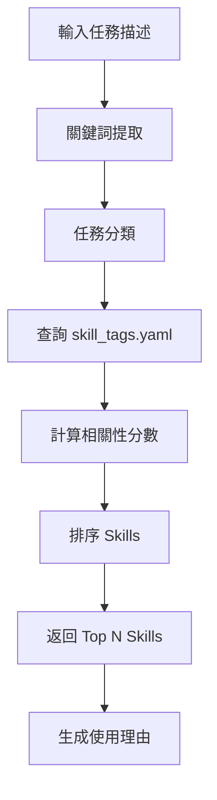

# Skill Selector Workflow

自動化 Skill 選擇工作流程，基於任務分類和 `skill_tags.yaml` 分類系統。

**目標**: 根據任務描述自動推薦最合適的 Skills

---

## 概述

本工作流程實作智能 Skill 選擇算法，可以：

1. **解析任務描述**，提取關鍵詞和分類標籤
2. **查詢 skill_tags.yaml**，找到相關的 Skill 類別
3. **排序 Skills**，根據相關性分數排序
4. **返回推薦**，提供 Top N Skills 和使用理由

---

## 算法流程



---

## 實作細節

### 1. 關鍵詞提取

```python
from collections import Counter
import re

def extract_keywords(task_description: str) -> list[str]:
    """提取任務描述中的關鍵詞."""
    # 移除標點符號，轉小寫
    cleaned = re.sub(r'[^\w\s]', '', task_description.lower())
    
    # 分詞
    words = cleaned.split()
    
    # 移除停用詞
    stop_words = {"the", "a", "an", "and", "or", "but", "in", "on", "at", "to", "for"}
    keywords = [w for w in words if w not in stop_words and len(w) > 2]
    
    # 計算詞頻，返回前 10 個
    freq = Counter(keywords)
    return [word for word, count in freq.most_common(10)]
```

### 2. 任務分類

基於關鍵詞映射到 skill_tags.yaml 類別：

```python
# 關鍵詞 → 類別映射表
KEYWORD_TO_CATEGORY = {
    # Planning
    "plan": "Planning",
    "strategy": "Planning",
    "roadmap": "Planning",
    "brainstorm": "Planning",
    
    # Design
    "design": "Architecture",
    "architecture": "Architecture",
    "schema": "Database Design",
    "api": "API Design",
    
    # Coding
    "code": "Coding",
    "implement": "Coding",
    "develop": "Development",
    "refactor": "Refactoring",
    
    # Testing
    "test": "Testing",
    "debug": "Debugging",
    "fix": "Debugging",
    
    # Deployment
    "deploy": "Deployment",
    "release": "Deployment",
    "ci/cd": "CI/CD",
    
    # Security
    "security": "Security",
    "vulnerability": "Security",
    "audit": "Security Audit",
}

def classify_task(keywords: list[str]) -> list[str]:
    """將關鍵詞映射到 Skill 類別."""
    categories = []
    for keyword in keywords:
        if category := KEYWORD_TO_CATEGORY.get(keyword):
            categories.append(category)
    
    # 返回唯一類別
    return list(set(categories))
```

### 3. 查詢 skill_tags.yaml

```python
import yaml

def load_skill_tags(path: str = ".agent/skill_tags.yaml") -> dict:
    """載入 skill_tags.yaml."""
    with open(path, "r", encoding="utf-8") as f:
        return yaml.safe_load(f)

def query_skills_by_category(
    categories: list[str], 
    skill_tags: dict
) -> list[tuple[str, str, list[str]]]:
    """
    根據類別查詢 Skills.
    
    Returns:
        List of (skill_name, skill_category, skill_tags)
    """
    results = []
    
    for category in categories:
        if category in skill_tags:
            for skill_entry in skill_tags[category]:
                results.append((
                    skill_entry["name"],
                    category,
                    skill_entry.get("tags", [])
                ))
    
    return results
```

### 4. 計算相關性分數

```python
def calculate_relevance_score(
    keywords: list[str],
    skill_name: str,
    skill_tags: list[str]
) -> float:
    """
    計算 Skill 與任務的相關性分數.
    
    評分標準:
    - Skill 名稱包含關鍵詞: +2 分
    - Skill 標籤包含關鍵詞: +1 分
    """
    score = 0.0
    skill_name_lower = skill_name.lower()
    skill_tags_lower = [t.lower() for t in skill_tags]
    
    for keyword in keywords:
        # 名稱匹配
        if keyword in skill_name_lower:
            score += 2.0
        
        # 標籤匹配
        if keyword in skill_tags_lower:
            score += 1.0
    
    return score

def rank_skills(
    keywords: list[str],
    skills: list[tuple[str, str, list[str]]]
) -> list[tuple[str, float]]:
    """排序 Skills 根據相關性分數."""
    scored_skills = []
    
    for skill_name, category, tags in skills:
        score = calculate_relevance_score(keywords, skill_name, tags)
        if score > 0:
            scored_skills.append((skill_name, score))
    
    # 降序排序
    scored_skills.sort(key=lambda x: x[1], reverse=True)
    
    return scored_skills
```

### 5. 生成推薦理由

```python
def generate_rationale(
    skill_name: str,
    score: float,
    category: str
) -> str:
    """生成 Skill 推薦理由."""
    if score >= 3.0:
        confidence = "強烈推薦"
    elif score >= 2.0:
        confidence = "推薦"
    else:
        confidence = "可考慮"
    
    return (
        f"{confidence} - {skill_name} ({category} 類別，"
        f"相關性分數: {score:.1f})"
    )
```

---

## 完整範例

### Python API

```python
from pathlib import Path

def select_skills(task_description: str, top_n: int = 5) -> list[dict]:
    """
    自動選擇最相關的 Skills.
    
    Args:
        task_description: 任務描述
        top_n: 返回前 N 個推薦
    
    Returns:
        推薦的 Skills 列表
    """
    # 1. 提取關鍵詞
    keywords = extract_keywords(task_description)
    
    # 2. 分類任務
    categories = classify_task(keywords)
    
    # 3. 載入 skill_tags.yaml
    skill_tags = load_skill_tags()
    
    # 4. 查詢 Skills
    skills = query_skills_by_category(categories, skill_tags)
    
    # 5. 排序
    ranked_skills = rank_skills(keywords, skills)
    
    # 6. 返回 Top N
    recommendations = []
    for skill_name, score in ranked_skills[:top_n]:
        # 找到類別
        category = next(
            (cat for name, cat, _ in skills if name == skill_name),
            "Unknown"
        )
        
        recommendations.append({
            "skill_name": skill_name,
            "score": score,
            "category": category,
            "rationale": generate_rationale(skill_name, score, category)
        })
    
    return recommendations

# 使用範例
task = """
我需要設計一個用戶認證系統的 API，包括 JWT token 生成、
密碼加密、權限控制等功能。需要考慮安全性和可擴展性。
"""

recommended_skills = select_skills(task, top_n=5)

for rec in recommended_skills:
    print(f"- {rec['skill_name']}: {rec['rationale']}")
```

**輸出範例**:

```text
- api-design-principles: 強烈推薦 - api-design-principles (API Design 類別，相關性分數: 4.0)
- backend-security-coder: 強烈推薦 - backend-security-coder (Security 類別，相關性分數: 3.0)
- auth-implementation-patterns: 推薦 - auth-implementation-patterns (Authentication 類別，相關性分數: 2.5)
- architect-review: 推薦 - architect-review (Architecture 類別，相關性分數: 2.0)
- security-auditor: 推薦 - security-auditor (Security Audit 類別，相關性分數: 2.0)
```

---

## CLI 使用

```bash
# 基本使用
arkhon-rheo skill-select "設計用戶認證 API" --top 5

# 指定分類
arkhon-rheo skill-select "設計用戶認證 API" \
  --categories "API Design,Security" \
  --top 3

# 輸出為 JSON
arkhon-rheo skill-select "部署微服務到 K8s" \
  --format json \
  --output recommendations.json
```

---

## 進階功能

### 1. 基於專案歷史的學習

```python
class SkillSelectorWithHistory:
    """帶有歷史學習的 Skill 選擇器."""
    
    def __init__(self, history_file: str = ".agent/skill-history.json"):
        self.history_file = history_file
        self.skill_usage = self._load_history()
    
    def _load_history(self) -> dict:
        """載入歷史使用記錄."""
        if Path(self.history_file).exists():
            with open(self.history_file) as f:
                return json.load(f)
        return {}
    
    def select_skills(self, task: str, top_n: int = 5) -> list[dict]:
        """選擇 Skills，考慮歷史使用頻率."""
        # 基礎推薦
        base_recommendations = select_skills(task, top_n * 2)
        
        # 加權歷史使用頻率
        for rec in base_recommendations:
            skill_name = rec["skill_name"]
            usage_count = self.skill_usage.get(skill_name, 0)
            
            # 使用頻率加成 (最多 +1.0 分)
            rec["score"] += min(usage_count * 0.1, 1.0)
        
        # 重新排序
        base_recommendations.sort(
            key=lambda x: x["score"],
            reverse=True
        )
        
        return base_recommendations[:top_n]
    
    def record_usage(self, skill_name: str):
        """記錄 Skill 使用."""
        self.skill_usage[skill_name] = self.skill_usage.get(skill_name, 0) + 1
        
        with open(self.history_file, "w") as f:
            json.dump(self.skill_usage, f, indent=2)
```

### 2. 多語言支援

```python
# 中英文關鍵詞映射
MULTILINGUAL_KEYWORDS = {
    "設計": "design",
    "開發": "develop",
    "測試": "test",
    "部署": "deploy",
    "安全": "security",
    # ... 更多映射
}

def extract_keywords_multilingual(text: str) -> list[str]:
    """支援中英文的關鍵詞提取."""
    # 先翻譯中文關鍵詞
    for cn, en in MULTILINGUAL_KEYWORDS.items():
        text = text.replace(cn, en)
    
    # 再使用原有邏輯
    return extract_keywords(text)
```

---

## 整合到 SDLC 工作流程

在 `sdlc-state-machine.md` 中使用本 Skill Selector：

```python
from arkhon_rheo.workflow import WorkflowEngine

engine = WorkflowEngine.from_markdown(
    ".agent/workflows/sdlc-state-machine.md",
    skill_selector=select_skills  # 注入 skill selector
)

# 工作流程會自動為每個狀態推薦 Skills
result = engine.run(initial_state)
```

---

## 測試

### 單元測試

```python
import pytest

def test_extract_keywords():
    text = "Design a RESTful API for user authentication"
    keywords = extract_keywords(text)
    assert "design" in keywords
    assert "api" in keywords
    assert "authentication" in keywords

def test_classify_task():
    keywords = ["api", "design", "security"]
    categories = classify_task(keywords)
    assert "API Design" in categories
    assert "Security" in categories

def test_calculate_relevance_score():
    keywords = ["api", "design"]
    score = calculate_relevance_score(
        keywords,
        "api-design-principles",
        ["api", "rest", "design"]
    )
    assert score > 0
```

---

## 參考文件

- [WORKFLOW_AUTOMATION.md](../../WORKFLOW_AUTOMATION.md) - 工作流程系統
- [sdlc-state-machine.md](./sdlc-state-machine.md) - SDLC 工作流程
- [skill_tags.yaml](../skill_tags.yaml) - Skills 分類系統
- [skills_index.json](../skills_index.json) - Skills 索引

---

**維護者**: Arkhon-Rheo Team  
**最後更新**: 2026-02-15  
**版本**: 1.0.0
