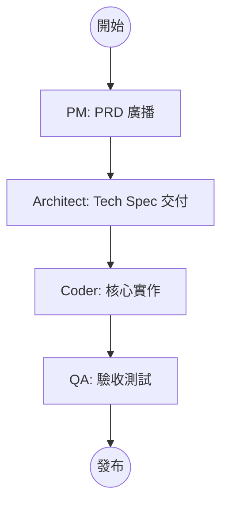
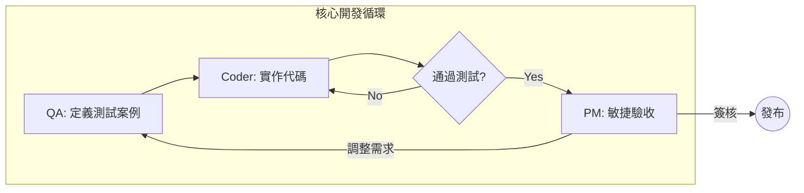
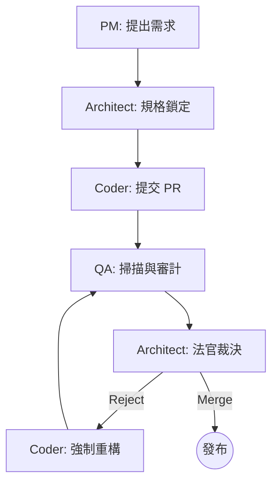

# Arkhon-Rheo 工作流與 SOP 統整指南 (SUMMARY)

本文件統整了 `.kbdocs` 目錄下的多項核心工作流規範，旨在為開發團隊與 AI Agents 提供清晰的角色定義與協作標準。

---

## 1. 核心開發角色 (Roles Definition)

| 角色 | 核心職責 | 在多代理系統中的定位 |
| :--- | :--- | :--- |
| **PM (產品經理)** | 需求拆解、定義目標、商業價值驗收。 | 需求源頭與最終簽核者。 |
| **Architect (架構師)** | 技術選型、架構規範、代碼合規裁判。 | 技術契約的守門人與裁判。 |
| **Coder (工程師)** | 核心邏輯開發、TDD 實作、代碼重構。 | 功能實作的執行主體。 |
| **QA (測試/審查者)** | 定義測試案例、掃描安全性、品質稽核。 | 品質掃描與事實檢索者。 |

---

## 2. 三大協作方案 SOP 示意圖

根據任務複雜度與風險程度，專案採用以下三種狀態機驅動的協作模式：

### 方案一：層級式瀑布流 (Scheme 1: Hierarchical)

**適用場景：** 簡單、明確、低風險功能（如：UI 文字修改）。
**特點：** 單向交付，效率至上，溝通成本最低。

### 方案二：協作迭代式 (Scheme 2: Collaborative)

**適用場景：** 複雜或探索性功能（如：新增 AI 對話組件）。
**特點：** 測試驅動 (TDD Loop)，雙向溝通，共識至上。

### 方案三：雙重驗證審查者模式 (Scheme 3: Critic/Supervisor)

**適用場景：** 核心、高風險、安全性要求極高功能（如：支付系統、核心邏輯重構）。
**特點：** 權責分立，設有裁判機制 (Tribunal)，強制處分重構。

---

## 3. RACI 核心矩陣橫向對比

| 階段 (Tasks) | 方案一 (Waterfall) | 方案二 (Agile) | 方案三 (Tribunal) |
| :--- | :---: | :---: | :---: |
| **需求定義** | PM 單向廣播 (R/A) | 多方聯合研討 (C) | Architect 規格鎖定 (R) |
| **設計開發** | 各司其職 (Pipeline) | TDD 頻繁互動 (C) | 審查迴圈制衡 (Critic) |
| **品質驗收** | QA 最終測試 (R) | PM 敏捷簽核 (A) | 多重權限裁決 (Veto) |

---

## 4. 決策執行建議 (Agent Strategy)

1. **狀態機導航**：
   - 簡單任務 $\rightarrow$ 選用 **Scheme 1** 直進狀態機。
   - 模糊任務 $\rightarrow$ 選用 **Scheme 2** 帶有 `WAIT_FOR_CONSENSUS` 的循環狀態機。
   - 核心重構 $\rightarrow$ 選用 **Scheme 3** 帶有 `VERDICT` 判決點的強一致性狀態機。

2. **記憶體管理**：
   - 使用 `.agent/skills/agent-memory-systems` 確保在 Scheme 2 & 3 中保留跨 Role 的對話上下文，避免重複溝通導緻 Token 浪費。

3. **版本控制同步**：
   - 任何方案的 `Release` 點均應觸發 git push 與版本更新。

---

> [!TIP]
> 具體文件的完整版本請參閱：
>
> - [raci-workflows.md](file:///wk2/yaochu/github/arkhon-rheo/.kbdocs/raci-workflows.md)
> - [workflow-sop.md](file:///wk2/yaochu/github/arkhon-rheo/.kbdocs/workflow-sop.md)
> - [workflow-explain.md](file:///wk2/yaochu/github/arkhon-rheo/.kbdocs/workflow-explain.md)
