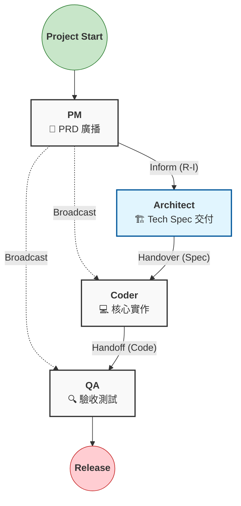
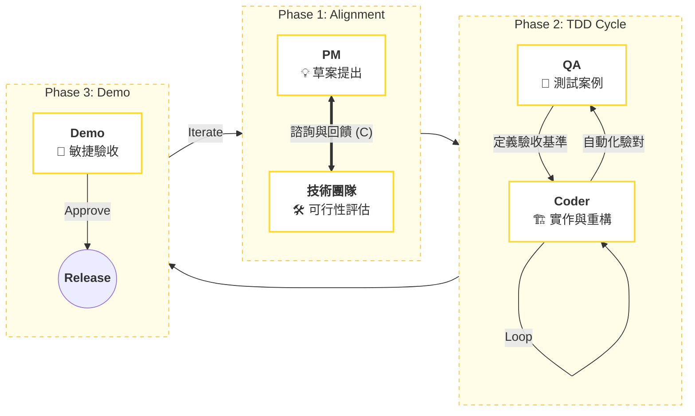
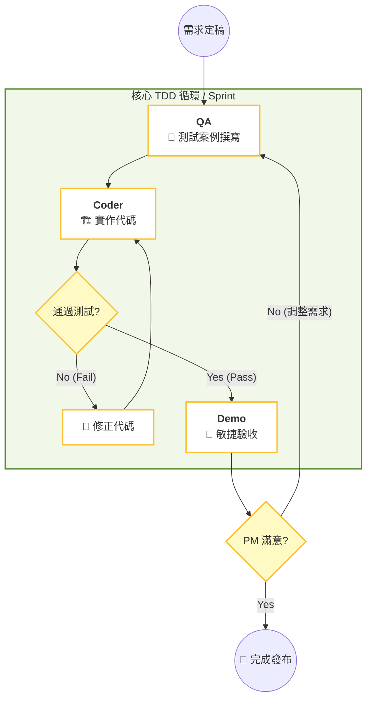
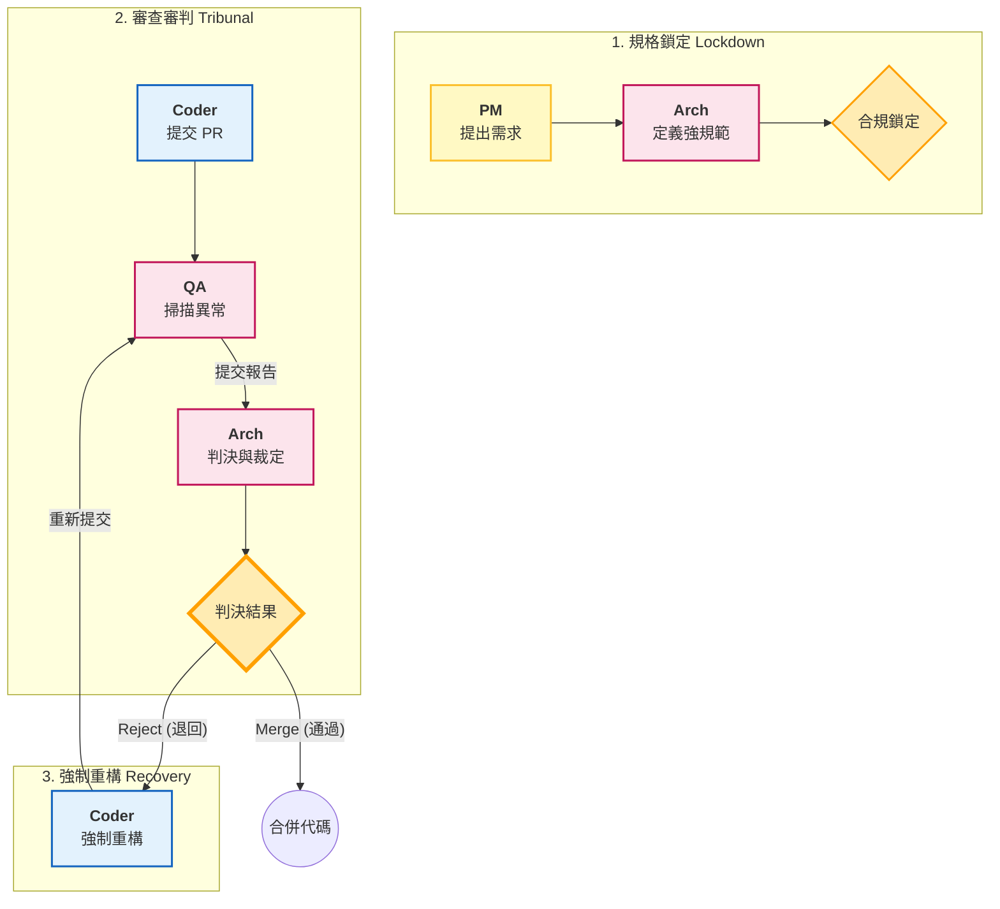

# Workflow SOP

為了將上述的文字邏輯轉化為視覺化的 SOP，我使用 **Mermaid 流程圖** 來呈現這三種方案的運作機制。這些圖表可以直接嵌入到您的技術文件（如 Notion, GitHub Markdown）中。

以下是針對三種方案的 **SOP 流程示意圖** 與 **關鍵節點說明**：

---

## 第一類：層級式瀑布流 (Scheme 1: Hierarchical)

**特徵：** 單向流動，無回頭路，強調文件交付 (Document-Driven)。

**SOP 執行重點：**

1. **觸發點：** 文件的產生（PRD, Tech Spec）。
2. **檢核點：** 無中間檢核，直到最後 QA 階段。
3. **異常處理：** 若 QA 發現嚴重錯誤，通常需重開一張 Ticket 回到起點，而非在流程內直接折返。

---

## 第二類：協作迭代式 (Scheme 2: Collaborative)

**特徵：** 雙向溝通，測試驅動，強調共識 (Consensus-Driven)。

**SOP 執行重點：**

1. **觸發點：** 對話與諮詢請求。
2. **迴圈機制：** `Flow 2-2` 是最核心的自動化迴圈，Coder 必須跑通 QA 的測試腳本才能進入下一步。
3. **異常處理：** 錯誤在開發中即時修正，不累積到最後。

---

## 第三類：雙重驗證/審查者模式 (Scheme 3: Critic/Supervisor)

**特徵：** 嚴格關卡，權責分立，強調合規 (Compliance-Driven)。

**SOP 執行重點：**

1. **觸發點：** Pull Request (PR) 提交。
2. **角色權力：** Architect 擁有絕對否決權（Veto Power）。
3. **異常處理：** `Flow 3-3` 是強制性的懲罰迴圈，必須直到 Architect 滿意為止，否則無法進入部署階段。

---

### 總結：如何將圖表轉化為 Agent 指令

在實作自動化 Agent 時，您可以根據上述流程圖設定 **State Machine (狀態機)** 的轉移條件：

* **Scheme 1 (Waterfall):** 線性狀態機。
* `State: Idle` -> `Event: Receive_Doc` -> `State: Working` -> `Event: Complete` -> `State: Handover`.

* **Scheme 2 (Collaborative):** 帶有通訊的狀態機。
* `State: Coding` 必須包含 `Action: Request_Test_Case`。
* 轉移條件是 `Pass_Rate == 100%`。

* **Scheme 3 (Supervisor):** 條件判斷狀態機。
* 核心在於 `Verdict` 節點。
* `If (QA_Score < Threshold) OR (Arch_Review == Reject)` THEN `Goto: Refactor_State`.
