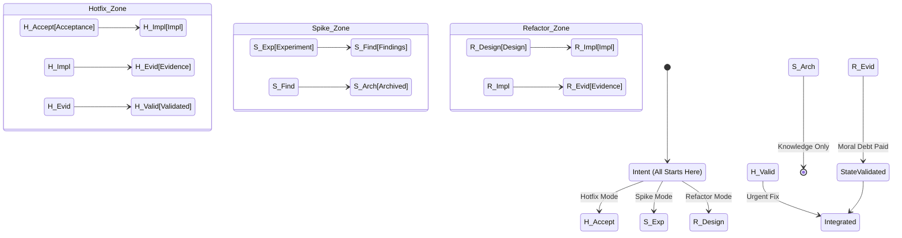

# Agent Workflows & Procedures

## 1. 核心哲學：狀態主權 (State Sovereignty)

在 Arkhon-Rheo 中，Agent 並非自由協作的實體，而是 **被狀態機 (State Machine) 依序喚醒的責任承擔者**。
所有的工作流設計，目的只有一個：**確保責任密度的守恆與證據鏈的完整**。

---

## 2. 標準開發流程 (Standard Development Flow)

這是系統的主幹路徑，適用於絕大多數的功能開發 (Feature Development)。

### 2.1 標準流程圖 (Mermaid)

```mermaid
stateDiagram-v2
    direction LR
    
    %% States
    S0 : S0 IntentDefined\n(需求固定)
    S1 : S1 DesignBounded\n(設計鎖定)
    S2 : S2 AcceptanceSpecified\n(完成定義)
    S3 : S3 ImplementationProposed\n(實作提案)
    S4 : S4 EvidenceCollected\n(證據收集)
    S5 : S5 StateValidated\n(裁決)
    S6 : S6 Integrated\n(整合)

    %% Flows
    [*] --> S0
    S0 --> S1 : ProductManager
    S1 --> S2 : Designer
    S2 --> S3 : ReviewDesigner
    S3 --> S4 : CodeWriter
    S4 --> S5 : TestExecutor
    S5 --> ValidationCheck : StateValidater
    
    state ValidationCheck <<choice>>
    ValidationCheck --> S6 : PASS
    ValidationCheck --> S3 : FAIL (Loop w/ Feedback)
    
    S6 --> [*] : SystemIntegrator
```

### 2.2 階段詳細定義

#### S0 · IntentDefined (需求已被固定)

* **負責 Agent**: **ProductManager**
* **核心目標**: 把「模糊需求」變成「不可再爭論的意圖」。
* **產物**:
  * 功能目標 (Goal)
  * 非目標 (Non-goals/Out of Scope)
  * 成功條件 (Success Criteria)
* **為什麼不能省**: 消除「你以為 vs 我以為」的認知落差。

#### S1 · DesignBounded (設計邊界已鎖定)

* **負責 Agent**: **Designer**
* **核心目標**: 把「可以怎麼做」縮減為「只能這樣做」。
* **義務**:
  * 澄清功能意圖。
  * 定義設計邊界與模組責任。
  * **禁止**: 寫程式碼、寫測試。
* **產物**:
  * 模組邊界 (Boundaries)
  * 資料流/控制流 (Data/Control Flow)
  * 任務描述 (Task Description for APE)

#### S2 · AcceptanceSpecified (完成定義已形式化)

* **負責 Agent**: **ReviewDesigner** (APE Core)
* **核心目標**: 將「完成」轉成 **機器可判斷** 的標準。
* **義務**:
  * 打包全域上下文 (Git/State/Deps)。
  * 生成本次專屬的審查指引。
* **產物**:
  * Review Checklist (Machine-readable YAML)
  * 測試期望 (隱性 DoD)
  * 禁止行為列表

#### S3 · ImplementationProposed (實作被提出)

* **負責 Agent**: **CodeWriter**
* **核心目標**: 提出「我想這樣實作」。
* **義務**:
  * **TDD (Test-Driven Development)**: 必須先有測試。
  * 嚴格遵守 Review Checklist。
* **限制**:
  * **不可 Commit**。
  * **不可宣告完成**。
* **產物**:
  * `src/*.py`
  * `tests/*.py`

#### S4 · EvidenceCollected (證據齊備)

* **負責 Agent**: **TestExecutor**
* **核心目標**: 把「我覺得可以」變成「這是證據」。
* **產物**:
  * 測試執行報告 (Test Results)
  * 覆蓋率報告 (Coverage Report)
  * 靜態分析報告 (Linting/Type Check)

#### S5 · StateValidated (裁決完成)

* **負責 Agent**: **StateValidater** (Gatekeeper)
* **核心目標**: 對「這次轉移是否合法」做出 **不可逆裁決**。
* **義務**:
  * 執行所有 Gate 檢查 (Tests, Coverage, Checklist, ACL)。
  * 簽署狀態轉移 (Sign Verdict)。
* **產物**:
  * `verdict: PASS/FAIL`
  * Evidence Bundle Hash

#### S6 · Integrated (進入系統歷史)

* **負責 Agent**: **SystemIntegrator**
* **核心目標**: 變更生效。
* **動作**:
  * Git Commit (原子操作)。
  * 更新 `project_state.yaml`。

---

## 3. 非標準開發流程 (Defined Non-Standard Flows)

非標準流程並非「例外」，而是 **受憲法約束的替代路徑**。標準流程追求效率，非標準流程追求 **風險控制與靈活性**。

### 3.1 非標準流程總圖 (Mermaid)

### 3.2 流程變體定義

#### 1️⃣ 快速修補流程 (Hotfix Loop)

* **使用時機**:
  * 生產環境緊急問題 (Production Issue)。
  * 明確的 Bug，解法已知且低設計風險。
* **變更點**: **跳過 S1 DesignBounded** (設計階段)。
* **流程**: S0 → S2 → S3 → S4 → S5 → S6
* **憲法限制**:
  * 必須標記 `mode: hotfix`。
  * **絕對不可跳過 S5 驗證**。
  * 事後必須補齊文檔。

#### 2️⃣ 探索性實驗流程 (Spike / Research)

* **使用時機**:
  * 技術可行性不明。
  * API 行為測試或模型效果驗證。
* **變更點**: **不產生功能，只產生知識**。
* **流程**: S0 → ExperimentExecuted → FindingsRecorded → Archived
* **憲法限制**:
  * **絕不進入 S6 Integrated** (不汙染主分支)。
  * 產物僅為報告或實驗代碼。

#### 3️⃣ 純重構流程 (Refactor-only)

* **使用時機**:
  * 處理技術債。
  * 調整程式結構但不改變外部行為。
* **變更點**: **固定 S2 Acceptance** (沿用既有測試與驗收標準)。
* **流程**: S1 → S3 → S4 → S5 → S6
* **憲法限制**:
  * 行為測試數量 **不得減少**。
  * Code Coverage **不得下降**。

#### 4️⃣ 回退與修復流程 (Recovery / Rollback)

* **使用時機**:
  * S5 驗證嚴重失敗。
  * State 狀態損毀。
* **變更點**: **目標是恢復一致性，而非新功能**。
* **流程**: S5(Fail) → RecoveryProposed → EvidenceCollected → S5
* **憲法限制**: 必須能夠證明狀態已回復至一致 (Consistent)。

---

---

## 4. 資訊隔離架構 (Information Barriers / Chinese Walls)

為了避免「球員兼裁判」或「先射箭再畫靶」的弊端，Arkhon-Rheo 在憲法層級定義了 **負向 ACL (Negative ACL)**，即「Agent 禁止知道的事」。

### 4.1 核心隔離牆

| 隔離牆名稱 | 位於 Agent 之間 | 禁止流通資訊 (Forbidden Knowledge) | 設定目的 (Rationale) |
| :--- | :--- | :--- | :--- |
| **需求純度牆** (Solution Bias Wall) | ProductManager ⇋ CodeWriter | **技術實作的困難度或細節** | 防止 PM 因為技術限制而自行閹割使用者價值 (Premature Optimization)，確保需求聚焦於「價值」而非「可行性」。 |
| **歷史偏見牆** (History Bias Wall) | Designer ⇋ Repo History | **過去的失敗嘗試 (部分)** | 防止 Designer 因為過去失敗而不敢提出正確的創新設計 (Learned Helplessness)。 |
| **實作盲測牆** (Blind Test Wall) | ReviewDesigner ⇋ CodeWriter | **CodeWriter 的任何構想或草稿** | 防止 Reviewer 為了「好寫測試」而降低驗收標準 (Accommodating Tests)，確保驗收標準獨立於實作。 |
| **黑箱測試牆** (Black-Box Wall) | TestExecutor ⇋ CodeWriter | **原始碼的內部邏輯 (Private Methods)** | 確保測試是針對「行為 (Behavior)」而非「實作 (Implementation)」，避免測試與實作過度耦合 (Brittle Tests)。 |
| **裁決獨立牆** (Verdict Independence Wall) | StateValidater ⇋ Discussion | **Agent 的對話紀錄 / 藉口 / 苦勞** | 防止 Gatekeeper 被 Agent 的情緒或解釋性文字影響，強迫只看 Evidence (測試報告與數據)。 |
| **貨物中立牆** (Cargo Neutrality Wall) | SystemIntegrator ⇋ Codebase | **程式碼的具體邏輯或內容** | Integrator 僅驗證 StateValidater 的數位簽章 (Signature)，不應對程式碼內容有任何判斷，確保提交過程的機械性與原子性。 |

### 4.2 實作手段

* **System Prompt Truncation**: 在 Prompt 構建時，主動過濾掉特定 artifact。
* **Ephemeral Workspace**: 某些 Agent (如 ReviewDesigner) 在乾淨的、無 `src/` 的沙盒中運行。

---

## 5. Agent 義務與權限 (Obligations & ACL)

| Agent | 角色定位 | 核心義務 (Obligations) | 權限 (ACL) |
| :--- | :--- | :--- | :--- |
| **ProductManager** | 需求擁有者 | 定義 Goal, Non-goals, Success Criteria | **Write**: Intent Docs (S0) |
| **Designer** | 架構師 | 澄清意圖、定義邊界、**不寫 Code** | **Read**: Codebase **Write**: Design Docs |
| **ReviewDesigner** | APE 引擎 | 生成機器可讀 Checklist、定義 DoD | **Read**: All Context **Write**: Checklists (YAML) |
| **CodeWriter** | 開發者 | **TDD** (先寫測再寫 Code)、嚴守 Checklist | **Read**: Design, Checklists **Write**: `src/*`, `tests/*` ❌ **NO COMMIT** |
| **TestExecutor** | 測試執行者 | 運行測試、生成 Coverage/Lint 報告 | **Read**: `src/*`, `tests/*` **Write**: Test Reports (Evidence) |
| **StateValidater** | 守門員 | 執行測試、計算 Coverage、簽署 Verdict | **Read**: Evidence Bundle **Write**: Verdicts, Signatures ✅ **COMMIT via Sign** |
| **SystemIntegrator**| 整合者 | 執行 Git Commit 與 State 更新 | **Read**: Signed Verdict **Write**: Git Repo, `project_state.yaml` |
| **SelfHealer** | 修復者 | 當 S5 失敗時嘗試自動修復 | **Read**: Errors **Write**: Patches (Draft) |

### 關鍵原則 (Key Principles)

1. **Repo Lock**: 除 StateValidater 外，沒有任何 Agent 可以直接對 Git Repo 進行 Commit。
2. **Explicit Handover**: Agent 之間不直接對話，透過 State Artifacts (Design, Checklist, Code) 進行交接。
3. **No Evidence, No Pass**: 沒有經過 S4 收集證據的 S3 產物，S5 一律拒收。
