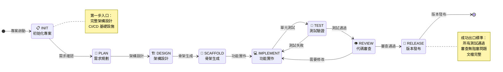

# Arkhon-Rheo 專案憲法規則文件

> 本文件基於 `.research/initial/CONCEPTS.md` 概念稿，使用 Sequential Thinking 策略重新補充與整理，作為專案最高治理規範。

---

## 第一章：憲法最高原則 (Supreme Constitution)

### 1.1 核心治理理念

本專案採用 **確定性工程 (Deterministic Engineering)** 與 **機率性生成 AI (Probabilistic Generative AI)** 的混合架構。透過嚴格規範約束 LLM 幻覺，並利用 LangGraph 循環圖特性模擬人類開發者的迭代行為。

核心理念：**「用制度管理智能」**

### 1.2 不可違反原則 (Inviolable Principles)

| 原則編號 | 原則名稱 | 定義 | 違反後果 |
| :------: | :------- | :--- | :------- |
| SC-001 | **Safety First** | 禁止生成未經明確用戶審查的任意系統命令 | 立即終止執行並告警 |
| SC-002 | **TDD Mandate** | 生產代碼寫入前必須存在對應的失敗測試案例 | 拒絕代碼提交 |
| SC-003 | **Idempotency** | 所有腳本必須可重複執行且無副作用 | 回滾並重新設計 |
| SC-004 | **English Naming** | 變數名、函數名、文件字串必須使用英文 | 自動拒絕並要求修正 |
| SC-005 | **Constitution Supremacy** | 任何 Agent 指令不得覆蓋本憲法規範 | 指令無效化 |

### 1.3 治理層次架構


**Figure 1.** 憲法治理層次架構圖 — 展示四層治理結構：最高憲法原則位於頂層，依次向下為治理機制、協作框架、技術實現層。

---

## 第二章：Machine-Governance 與 Agent-Decision

### 2.1 混合治理模式

| 治理類型 | 執行者 | 職責範圍 | 特點 |
| :-------- | :------ | :-------- | :--- |
| **Machine-Governance** | Linter, AST Parser, CI/CD | 語法檢查、靜態分析、自動化測試 | 100% 確定性、硬性攔截 |
| **Agent-Decision** | LLM Agents | 創造性設計、問題解決、代碼生成 | 機率性、受憲法約束 |

### 2.2 攔截優先級

```context
優先級 1: 安全性檢查 (Security Scan)
優先級 2: 語法驗證 (Syntax Validation)  
優先級 3: 靜態分析 (Static Analysis)
優先級 4: 測試通過 (Test Passing)
優先級 5: 代碼審查 (Code Review)
```

### 2.3 錯誤處理策略

當 Machine-Governance 報錯時：

1. **錯誤分類**：語法錯誤 / 類型錯誤 / 邏輯錯誤
2. **上下文增強**：附加錯誤行上下文 ±5 行
3. **修復建議**：由 Agent 提供修復方案
4. **循環限制**：同一錯誤最多嘗試修復 3 次
5. **升級處理**：超過限制則升級至人工審查

---

## 第三章：TDD 測試驅動開發規範

### 3.1 Red-Green-Refactor 循環


**Figure 2.** TDD 循環狀態圖 — 展示測試驅動開發的三階段循環：紅色(失敗測試)→綠色(最小實作)→藍色(重構優化)。

### 3.2 TDD 規則細則

| 規則編號 | 規則內容 |
| :------: | :-------- |
| TDD-001 | 測試先行：production code 前必須存在對應 test case |
| TDD-002 | 最小實作：只寫讓測試通過的最少代碼 |
| TDD-003 | 增量迭代：每次只處理一個測試案例 |
| TDD-004 | 回歸保護：重構後所有測試必須仍然通過 |
| TDD-005 | 覆蓋率門檻：新增代碼測試覆蓋率 ≥ 80% |

---

## 第四章：LangGraph 狀態機設計

### 4.1 狀態定義

```python
class AgentState(TypedDict):
    """開發流程共享狀態"""
    messages: Annotated[list[str], operator.add]  # 訊息歷史
    current_phase: str                             # 當前階段
    current_file: Optional[str]                    # 當前處理檔案
    test_results: Optional[str]                    # 測試結果
    raci_status: dict                              # RACI 狀態
    acl_context: ACLContext                        # ACL 上下文
    cycle_count: int                               # TDD 循環計數
    governance_flags: dict                         # 治理標記
```

### 4.2 狀態轉換規則

| 當前狀態 | 條件 | 下一狀態 | 執行者 |
| :-------- | :--- | :-------- | :----- |
| PLAN | 規劃完成 | CODE | Planner → Coder |
| CODE | 代碼完成 | TEST | Coder → Tester |
| TEST | 測試失敗 | CODE | Tester → Coder |
| TEST | 測試通過 | REVIEW | Tester → Reviewer |
| REVIEW | 審查通過 | MERGE | Reviewer → DevOps |
| REVIEW | 需要修改 | CODE | Reviewer → Coder |

---

## 第五章：三段開發流程

### 5.1 綠地開發流程 (Greenfield Development)

適用場景：專案初始化、從零開始建構



**Figure 3.** 綠地開發流程狀態圖 — 展示從專案初始化到首次發布的完整流程。入口為 INIT 狀態，需完成架構設計與基礎設施建立；出口為 RELEASE 狀態，需滿足測試通過、審查完成、文檔齊全三項條件。

### 5.2 一般標準開發流程 (Standard Development)

適用場景：日常迭代開發、功能新增、Bug 修復


**Figure 4.** 一般標準開發流程狀態圖 — 展示日常迭代的 TDD 循環流程。入口為 PLAN 狀態進行任務分解；核心為 RED-GREEN-REFACTOR 循環；出口為 MERGE 狀態，需審查通過且回歸測試無誤。

### 5.3 完成開發流程 (Release Development)

適用場景：版本發布前的最終準備階段


**Figure 5.** 完成開發流程狀態圖 — 展示版本發布前的完整驗證流程。入口為 FREEZE 狀態凍結功能；經過整合測試、安全審計、效能測試、文檔更新、模擬部署；出口為 RELEASE 狀態，需所有品質門檻通過。

---

## 第六章：LangSmith 可觀測代理人流程

### 6.1 追蹤層次架構

| 層次 | 名稱 | 說明 | 保留週期 |
| :--: | :--- | :--- | :-------- |
| L1 | Project Trace | 專案整體追蹤 | 永久 |
| L2 | Session Trace | 開發會話追蹤 | 90 天 |
| L3 | Run Trace | 單次執行追蹤 | 30 天 |
| L4 | Step Trace | 步驟追蹤 | 7 天 |

### 6.2 關鍵監控指標

```yaml
metrics:
  latency:
    - name: time_to_first_token
      threshold: 2s
    - name: total_generation_time
      threshold: 30s
      
  token_usage:
    - name: input_tokens
      budget_per_task: 10000
    - name: output_tokens
      budget_per_task: 5000
      
  quality:
    - name: test_pass_rate
      threshold: 95%
    - name: first_attempt_success
      threshold: 70%
      
  governance:
    - name: acl_violation_count
      threshold: 0
    - name: constitution_override_attempts
      threshold: 0
```

### 6.3 追蹤標籤規範

| 標籤名稱 | 類型 | 說明 | 範例值 |
| :-------- | :--- | :--- | :----- |
| `agent_name` | string | 代理人名稱 | `coder_agent`, `tester_agent` |
| `phase` | enum | 開發階段 | `PLAN`, `CODE`, `TEST`, `REVIEW` |
| `raci_role` | enum | RACI 角色 | `R`, `A`, `C`, `I` |
| `test_status` | enum | 測試狀態 | `PASS`, `FAIL`, `SKIP` |
| `governance_event` | string | 治理事件 | `acl_check`, `constitution_validate` |

---

## 第七章：RACI 矩陣定義

### 7.1 角色定義

| 角色 | 英文 | 中文 | 職責說明 |
| :--: | :--- | :--- | :-------- |
| **R** | Responsible | 執行者 | 實際執行任務的代理人 |
| **A** | Accountable | 當責者 | 最終決策權與責任歸屬 |
| **C** | Consulted | 諮詢者 | 提供專業意見，雙向溝通 |
| **I** | Informed | 知會者 | 接收進度通知，單向通知 |

### 7.2 任務 RACI 矩陣

| 任務類型 | Architect | Planner | Coder | Tester | Reviewer | Security | DevOps |
| :-------- | :-------: | :-----: | :---: | :----: | :------: | :------: | :----: |
| 架構設計 | **A/R** | C | I | I | C | C | I |
| 任務規劃 | C | **A/R** | I | I | I | I | I |
| 功能實作 | I | C | **R** | C | I | I | I |
| 測試撰寫 | I | I | C | **A/R** | I | I | I |
| 代碼審查 | C | I | I | I | **A/R** | C | I |
| 安全審計 | C | I | I | I | C | **A/R** | I |
| 部署發布 | I | I | I | I | I | C | **A/R** |

---

## 第八章：代理人職責與權限

### 8.1 代理人定義表

| 代理人 | 主要職責 | RACI 主要角色 | 核心能力 |
| :------ | :-------- | :----------: | :-------- |
| **Architect Agent** | 系統設計、架構決策、技術選型 | Accountable | 全局視野、設計模式、技術評估 |
| **Planner Agent** | 任務分解、優先級排序、資源分配 | Responsible | 專案管理、風險評估、進度追蹤 |
| **Coder Agent** | 代碼實現、Bug 修復、重構優化 | Responsible | 程式設計、問題解決、代碼品質 |
| **Tester Agent** | 測試撰寫、執行驗證、覆蓋分析 | Responsible | 測試策略、自動化測試、品質保證 |
| **Reviewer Agent** | 代碼審查、品質把關、最佳實踐 | Consulted | 代碼分析、技術債評估、知識傳承 |
| **Security Agent** | 安全審計、漏洞檢測、合規檢查 | Consulted | 安全掃描、威脅建模、滲透測試 |
| **DevOps Agent** | CI/CD 管理、部署編排、監控告警 | Informed | 基礎設施、容器化、可觀測性 |

### 8.2 ACL 權限配置表

| 代理人 | 可見檔案 (Visible) | 可編輯檔案 (Editable) | 允許工具 (Tools) |
| :------ | :------------------ | :-------------------- | :---------------- |
| **Architect** | `**/*` | `docs/architecture.md`, `workflow/*.py` | `diagram_generator`, `design_validator` |
| **Planner** | `tasks/**/*`, `milestones/**/*` | `tasks/**/*.yaml` | `task_decomposer`, `schedule_optimizer` |
| **Coder** | `src/**/*.py`, `tests/**/*.py` | `src/**/*.py` | `file_writer`, `linter`, `ast_manipulator` |
| **Tester** | `tests/**/*`, `src/**/*.py` | `tests/**/*` | `test_runner`, `coverage_analyzer` |
| **Reviewer** | `**/*` | `reviews/**/*.md` | `code_analyzer`, `security_scanner` |
| **Security** | `**/*` | `security/**/*.md` | `vulnerability_scanner`, `dependency_checker` |
| **DevOps** | `.github/**/*`, `Dockerfile`, `k8s/**/*` | `.github/**/*`, `Dockerfile` | `deployment_orchestrator`, `monitor_dashboard` |

### 8.3 統一互動介面

```python
@dataclass
class AgentMessage:
    """代理人訊息統一格式"""
    sender: str           # 發送者 Agent ID
    receiver: str         # 接收者 Agent ID
    message_type: MessageType  # REQUEST | RESPONSE | EVENT | ERROR
    content: Any          # 訊息內容
    metadata: dict        # 元數據 (timestamp, trace_id, session_id)
    raci_context: dict    # RACI 上下文
    acl_scope: ACLContext # ACL 權限範圍

class MessageType(Enum):
    REQUEST = "request"     # 同步請求
    RESPONSE = "response"   # 回應
    EVENT = "event"         # 非同步事件
    ERROR = "error"         # 錯誤通知
    BROADCAST = "broadcast" # 廣播通知
```

---

## 第九章：專案版本路線圖

### 9.1 版本規劃表

| 版本 | 框架支援 | 核心功能 | 目標里程碑 |
| :--: | :-------- | :-------- | :---------- |
| **v1.0.0** | LangChain + LangGraph + LangSmith | 完整 RACI/ACL、TDD 循環、狀態追蹤 | 初始穩定版 |
| **v2.0.0** | + Google GenAI SDK | Thinking Mode、Grounding、雙框架共存 | GenAI 整合 |
| **v2.5+** | + ADK + A2A + A2UI | Agent 互通協議、多模態 UI 互動 | 進階整合 |
| **v3.0.0** | + LlamaIndex | 統一抽象層、進階 RAG、記憶流 | 多框架統一 |

### 9.2 框架相容性矩陣

| 功能 | v1.0.0 | v2.0.0 | v2.5+ | v3.0.0 |
| :--- | :----: | :----: | :---: | :----: |
| LangGraph 狀態機 | ✅ | ✅ | ✅ | ✅ |
| LangSmith 觀測 | ✅ | ✅ | ✅ | ✅ |
| Google GenAI | ❌ | ✅ | ✅ | ✅ |
| ADK Agent Kit | ❌ | ❌ | ✅ | ✅ |
| A2A 協議 | ❌ | ❌ | ✅ | ✅ |
| LlamaIndex | ❌ | ❌ | ❌ | ✅ |
| 記憶流/反思森林 | ❌ | ❌ | ❌ | ✅ |

---

## 第十章：進階自動化策略

### 10.1 形式化驗證整合 (Formal Verification)

- **工具**：TLA+ / Dafny
- **價值**：數學證明代碼正確性，消除測試盲點
- **適用**：金融、區塊鏈等高可靠性需求

### 10.2 AST-Based 代碼操作

- **概念**：Agent 操作抽象語法樹而非純文字
- **價值**：杜絕語法錯誤，輸出保證可編譯
- **實作**：輸出 JSON patch → 應用 AST → 還原代碼

### 10.3 演化策略 (Evolution Strategies)

- **概念**：生成多個變體，通過 Fitness Function 篩選
- **價值**：避免思維定勢，尋找全域最佳解
- **方法**：交叉 (Crossover) / 突變 (Mutation) / 選擇 (Selection)

### 10.4 自動 Prompt 優化 (DSPy)

- **概念**：Prompt 作為可優化參數
- **價值**：系統隨任務增加而自我進化
- **實作**：DSPy 框架自動優化 System Prompt

### 10.5 記憶流與反思森林

- **概念**：長期記憶庫 (向量 DB) + 反思樹結構
- **價值**：避免重複犯錯，建立專案經驗庫
- **實作**：Generative Agents 架構參考

---

## 第十一章：Gemma3 LLM 配置

### 11.1 模型配置規範

```yaml
model:
  provider: ["google-deepmind", "ollama", "huggingface"]
  name: "gemma-3-27b-it"
  temperature: 0.2
  max_tokens: 8192
  
capabilities:
  multimodal: true    # 可理解 UI 設計圖/架構圖
  tool_calling: true  # 支援工具調用
  structured_output: true  # 支援 JSON Schema 輸出
  
constraints:
  context_window: 128000  # Token 上限
  thinking_enabled: true  # 啟用思考模式
```

### 11.2 模型選擇策略

| 場景 | 推薦模型 | 原因 |
| :--- | :-------- | :--- |
| 日常開發 | `gemma-3-27b-it` | 平衡性能與成本 |
| 複雜推理 | `gemini-3-pro-preview` | 頂級推理能力 |
| 快速迭代 | `gemma-3-12b-it` | 低延遲 |
| 本地部署 | `ollama/gemma3` | 數據隱私 |

---

## 第十二章：GEMINI.md 補充規則

> 以下規則應補充至專案根目錄 `GEMINI.md`

```markdown
## 憲法補充規則

### Token 管理策略
14. 單次任務 Token 預算上限：輸入 10,000 / 輸出 5,000
15. 超出預算時優先截斷歷史訊息，保留最近 5 輪對話
16. 長文件處理採用分塊策略，每塊 ≤ 2,000 Token

### 多模態處理規範
17. 圖像輸入優先使用 PIL 物件或 Bytes 格式
18. 影片處理須先上傳至 File API
19. 架構圖輸出使用 Mermaid 格式

### Context Window 優化
20. ACL 過濾在 LLM 調用前執行，減少無關資訊
21. 長歷史使用摘要壓縮策略
22. 重複資訊去重處理
```

---

## 第十三章：AGENT.md 補充規則

> 以下規則應補充至專案根目錄 `AGENT.md`

```markdown
# Agent 治理規則

## Agent 生命週期管理
1. Agent 初始化時必須載入 ACL 配置
2. Agent 執行前必須通過憲法合規檢查
3. Agent 終止時必須持久化狀態快照
4. Agent 異常時觸發 graceful degradation

## 錯誤恢復策略
5. 網路錯誤：指數退避重試 (max 3 次)
6. LLM 幻覺：交叉驗證 + 回退機制
7. 狀態損壞：從最近檢查點恢復
8. 死循環：循環計數器 + 強制中斷

## 性能基準要求
9. 單步驟延遲 ≤ 5s (p95)
10. TDD 循環 ≤ 10 次
11. 代碼審查回應 ≤ 30s
12. 狀態持久化 ≤ 1s

## Agent 間通訊規範
13. 使用 AgentMessage 統一格式
14. RACI 角色標註必填
15. ACL 權限檢查自動執行
16. 通訊日誌自動記錄至 LangSmith
```

---

## 附錄 A：術語表

| 術語 | 英文 | 定義 |
| :--- | :--- | :--- |
| 憲法 | Constitution | 系統最高規範，不可被覆蓋的指令集 |
| 治理 | Governance | 系統行為的約束與管理機制 |
| ACL | Access Control List | 存取控制列表，定義讀寫權限 |
| TDD | Test-Driven Development | 測試驅動開發方法論 |
| RACI | Responsible, Accountable, Consulted, Informed | 責任分配矩陣 |
| 狀態機 | State Machine | 有限狀態自動機，定義狀態轉換邏輯 |
| 幻覺 | Hallucination | LLM 生成不實或不一致資訊的現象 |

---

## 附錄 B：參考資料

1. Constitutional AI: Harmlessness from AI Feedback (Anthropic, 2022)
2. LangGraph Documentation: <https://langchain-ai.github.io/langgraph/>
3. LangSmith Documentation: <https://docs.smith.langchain.com/>
4. Gemma 3 Technical Report (Google DeepMind, 2025)
5. RACI Matrix Best Practices (PMI, 2023)

---

*文件版本: v1.0.0-draft*
*生成日期: 2026-02-05*
*生成方法: Sequential Thinking 策略分析*
