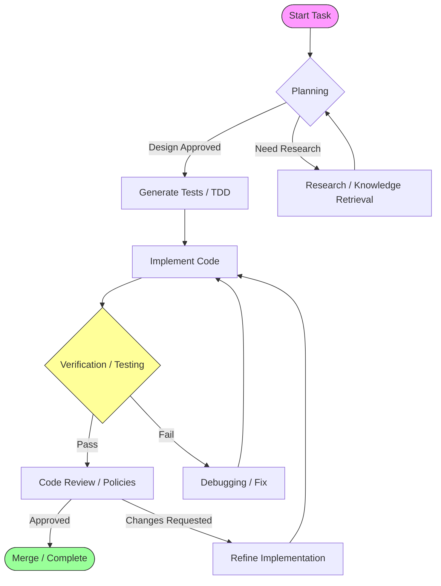
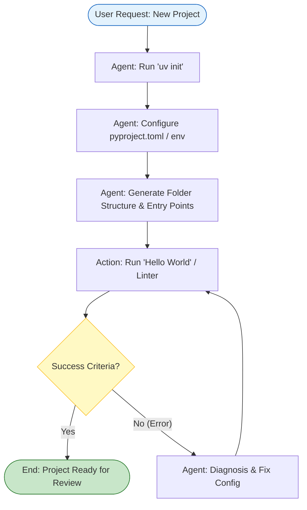
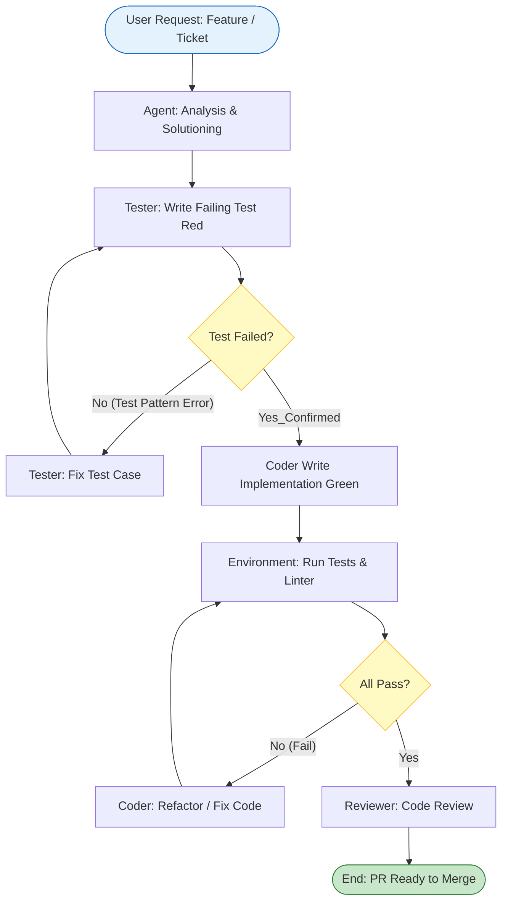
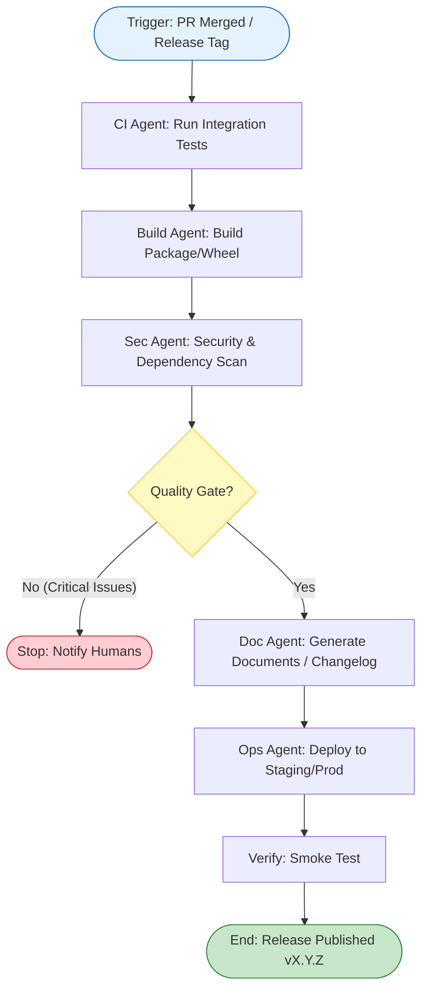

# Project Constitution & Architecture Report (Gemini 3 Pro Edition)

本報告基於先前的概念文件稿 (`CONCEPTS.md`) 與專案規則 (`GEMINI.md`)，結合 **Sequential Thinking** 策略，重新定義本專案的最終憲法規則、治理架構與標準開發流程。

## 1. 最高憲法原則 (Supreme Constitution)

本專案採用 **Deterministic Engineering (確定性工程)** 與 **Probabilistic Generative AI (機率性生成 AI)** 的高階混合架構。為確保 Agent 的行為可控且符合預期，制定以下不可覆蓋的最高原則：

### 1.1 核心原則

1. **Safety First (安全優先)**: 禁止生成或執行任何未經授權的破壞性系統指令 (如 `rm -rf /`)。涉及檔案刪除、環境變更的操作必須經過 ACL 權限檢查或人工審核。
2. **TDD Mandate (測試驅動開發)**:
    * **No Code Without Test**: 在撰寫任何功能代碼之前，必須先存在一個失敗的測試案例 (Red-Green-Refactor)。
    * **Reward Function**: 測試通過與否是 Agent 獲得 Reward 的唯一標準。
3. **Machine Governance (機器治理)**:
    * **Linting as Law**: 所有代碼必須通過 Linter (Ruff/Ty) 與 AST Parser 的靜態分析。
    * **Agent-Decision**: 在機器治理的硬性邊界內，Agent 擁有實現邏輯的自主決策權。
4. **Idempotency (冪等性)**: 所有自動化腳本與工具調用必須是冪等的，重複執行不應導致副作用或錯誤堆疊。
5. **Observability (可觀測性)**: 所有的 Agent 思考過程 (Chain of Thought) 與工具調用必須被完整記錄於 LangSmith。

### 1.2 技術標準 (Technical Standards)

* **LLM Model**: 首選 **Gemma 3** 系列 (Google DeepMind)，支援 `google-deepmind`、`ollama`、`huggingface` 工具調用。
* **Framework**:
  * Flow: `langchain-langgraph`
  * Observability: `langsmith`
  * SDK: `google-genai` (Unified Standard)
  * Data/RAG: `llamaIndex`
* **Infrastructure**:
  * Python Manager: `uv` (Project), `micromamba` (Env).
  * Protocol: `adk-a2a` (Agent-to-Agent Communication).

---

## 2. 專案近期願景 (Project Vision & Roadmap)

本專案致力於構建一個 **100% Fully Agentic Automation** 的開發環境，並制定以下釋出版本路徑：

| Version | 核心目標 (Core Objective) | 關鍵技術棧 (Key Stack) | 描述 |
| :--- | :--- | :--- | :--- |
| **v1.0.0** | **基礎架構確立** | `langchain`, `langgraph`, `langsmith` | 建立基於圖的狀態機代理人，實現基礎的觀測性與循環控制。 |
| **v2.0.0** | **原生 SDK 整合** | `google-genai` (Official SDK) | 引入 Google 官方標準 SDK，優化對 Gemini/Gemma 模型的原生支援與多模態能力。 |
| **v2.5+** | **多代理人協作** | `adk-a2a`, `a2ui` | 實現 Agent-to-Agent 通訊協議與 Agent-to-UI 互動，支援分佈式智能體協作。 |
| **v3.0.0** | **知識增強與記憶** | `llamaIndex` | 整合 RAG 框架，建立專案長期記憶庫 (Deep Memory) 與結構化知識索引。 |

---

## 3. 代理人職責與權限 (Agent Roles & Governance)

採用 **RACI Matrix** 與 **ACL (Access Control List)** 相結合的治理模式，定義各類 Agent 的職責邊界。

### 3.1 角色定義表

| 角色 (Role) | 職責 (Responsibilities) | 權限 (Permissions / ACL) | 工具集 (Tools) |
| :--- | :--- | :--- | :--- |
| **Architect** | 系統設計、架構決策、技術選型 | **Read**: All. **Write**: `docs/`, `config/`, `pyproject.toml` | `search_web`, `view_file`, `diagram_gen` |
| **Coder** | 功能實作、Refactoring、Bug Fix | **Read**: `src/`, `tests/`, `docs/`. **Write**: `src/` | `view_file`, `write_file`, `lsp_diagnostics` |
| **Tester** | TDD 測試案例撰寫、QA 驗證 | **Read**: `src/`, `tests/`. **Write**: `tests/` | `run_test`, `write_file`, `coverage_report` |
| **Reviewer** | 代碼審查、安全性檢查、規範驗證 | **Read**: All. **Write**: `reviews/`, `PR comments` | `linter_check`, `security_scan`, `github_api` |
| **Manager** | 任務分配、進度追蹤 (PM) | **Read**: `task.md`, Reports. **Write**: `task.md`, `notifications` | `update_task`, `notify_user` |

### 3.2 互動介面 (Interaction Interface)

所有 Agent 必須遵循統一的 I/O 結構：

* **Input**: `TaskDescription`, `Context (File/Diff)`, `Constraints`
* **Thinking**: `SequentialThinking` (required for complex tasks)
* **Output**: `Artifacts (Code/Doc)`, `ExecutionResult (Pass/Fail)`, `NextAction`

---

## 4. 開發流程狀態機 (Development State Machines)

使用 LangGraph 定義的核心開發循環。

### 4.1 核心開發循環 (Core Dev Loop)

**Figure 1: Core Agentic Development Loop.**  
展示了從規劃、TDD、實作到驗證的閉環流程。Verifier 節點是關鍵的 Machine-Governance 檢查點。

---

## 5. 標準開發標準作業程序 (Standard Operating Procedures)

以下定義三種標準開發流程圖。為確保一致性，皆採用 **Flowchart (流程圖)** 格式，明確標示「起始觸發」、「執行過程」與「成功判定條件」。

### 5.1 最初的標準開發流程 (Initial Pipeline)

**適用場景**：Greenfield Development (從零開始的專案初始化)。

**Figure 2: Initial Project Bootstrap Process.**  
流程重點在於環境配置的自我驗證。只有當基礎代碼能通過執行與 Lint 檢查時，才視為初始化成功。

### 5.2 一般的標準開發流程 (General Pipeline)

**適用場景**：Feature Development / Bug Fix (日常開發循環)。

**Figure 3: General Feature Development Process (TDD).**  
嚴格遵循 Red-Green-Refactor 流程。有兩個關鍵判定點：1. 確認測試有效失敗 (避免無效測試)。2. 確認實作通過測試與 Lint (功能與規範皆達標)。

### 5.3 完成的標準開發流程 (Complete Pipeline)

**適用場景**：Completion / Release (交付與釋出)。

**Figure 4: Complete Release & Delivery Process.**  
此階段的重點在於 Quality Gate 的把關。任何測試、構建或安全掃描的失敗都應立即中止發布流程。
