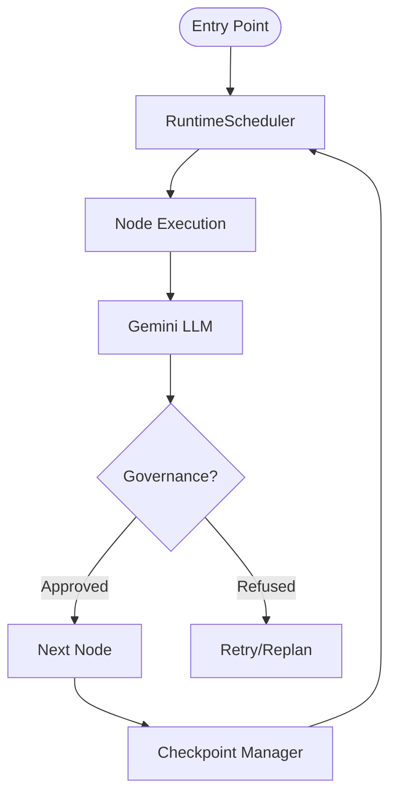

# Arkhon-Rheo

Arkhon-Rheo is an advanced, high-security agentic workflow framework designed for complex, multi-turn AI reasoning and governance. Built on top of the LangChain and LangGraph ecosystems, it integrates rigorous RACI-based decision-making, flexible memory systems, and robust checkpointing for production-grade AI agents.

## Key Features

- **State-of-the-Art Core**: Leveraging `AgentState` and `Graph` for highly predictable execution flows.
- **RACI Governance**: Native support for Responsible, Accountable, Consulted, and Informed role assignments within agentic graphs.
- **Async-First Execution**: Fully asynchronous runtime scheduler with high-performance checkpointing.
- **Pluggable Memory**: Advanced context window management, summarization, and vector store integration.
- **Security & Validation**: Integrated `RuleEngine` for real-time state validation and guardrails.

## Tech Stack

- **Language**: Python 3.12+ (managed by `uv`)
- **AI Ecosystem**: [Google GenAI SDK](https://github.com/google/generative-ai-python), [LangChain](https://python.langchain.com/), [LangGraph](https://langchain-ai.github.io/langgraph/)
- **Core Libraries**: Pydantic v2, Click (CLI), Prometheus (Metrics), Structured Logging (structlog)
- **Validation**: [Ty](https://github.com/yamadashy/ty) (Type checking), Ruff (Linting)

## Prerequisites

- **Python 3.12** or higher.
- **[uv](https://github.com/astral-sh/uv)**: The recommended Python package manager.
- **Gemini API Key**: Required for LLM operations (set as `GOOGLE_API_KEY` or `GEMINI_API_KEY`).

## Getting Started

### 1. Clone & Install

```bash
git clone https://github.com/YaoChuDoSomething/arkhon-rheo.git
cd arkhon-rheo
uv sync
```

### 2. Environment Setup

Copy the example environment file:

```bash
cp .env.example .env
```

Configure your API keys in `.env`:

```bash
GOOGLE_API_KEY=your_gemini_api_key_here
```

### 3. Run a Sample Workflow

Initialize the project dependencies and run the example:

```bash
uv run arkhon-rheo run --config examples/simple_agent/workflow.yaml
```

## Architecture Overview

### Directory Structure

```text
src/arkhon_rheo/
├── cli/              # CLI interface (Click-based)
├── core/             # Core engine components
│   ├── graph.py      # Execution graph definition
│   ├── state.py      # AgentState & TypedDicts
│   ├── runtime/      # Scheduler & Checkpointing
│   └── memory/       # Vector Store & Context Window
├── nodes/            # ReAct node implementations
│   ├── action_node.py
│   ├── thought_node.py
│   └── governance.py # RACI Decision/Inform nodes
├── tools/            # Tool definitions & Registry
└── rules/            # Guardrails & Rule Engine
```

### High-Level Data Flow



### Key Components

- **RuntimeScheduler**: Orchestrates node executions, handles state transitions, and persists checkpoints.
- **AgentState**: The "source of truth" containing message history, shared context, and RACI configuration.
- **GovernanceNode**: Evaluates task results against RACI matrices to ensure accountability and informed status updates.
- **VectorStore**: Abstracted interface for semantic search and long-term memory retrieval.

## Available Scripts

| Command | Description |
|---------|-------------|
| `uv run arkhon-rheo init <name>` | Initialize a new project structure |
| `uv run arkhon-rheo run` | Execute an agentic workflow from config |
| `uv run arkhon-rheo migrate` | Migrate legacy LangGraph components |
| `uv run pytest` | Run the full test suite (68+ tests) |
| `uv run ruff check .` | Perform linting and code quality checks |

## Testing

Arkhon-Rheo emphasizes high test coverage for reliability.

```bash
# Run all tests
uv run pytest

# Run tests with coverage report
uv run pytest --cov=arkhon_rheo
```

## Deployment

### Docker (Recommended)

```bash
docker build -t arkhon-rheo .
docker run -e GOOGLE_API_KEY=$GOOGLE_API_KEY arkhon-rheo
```

## Troubleshooting

### LLM Connectivity

If you encounter `401 Unauthorized`, ensure your `GOOGLE_API_KEY` is exported correctly.

### Dependency Issues

If `uv sync` fails, ensure you are using Python 3.12. Older versions are not supported for core typing features.

---
*Arkhon-Rheo: Flowing order into the chaos of autonomous agents.*
