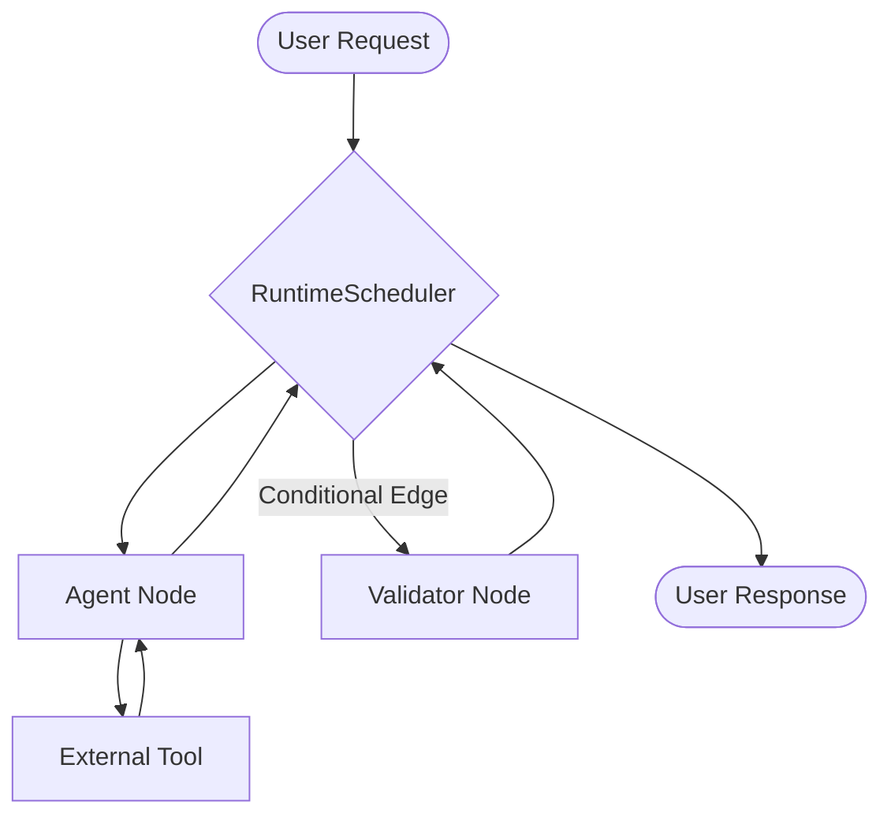

# Architecture

Arkhon-Rheo is built on a foundation of **Event Sourcing** and **State Machines**, leveraging the power of **LangGraph** for orchestration and **Google GenAI** for reasoning.

## Core Components

### 1. The Message Bus

All communication between agents is asynchronous and event-driven. Messages are immutable records containing sender, receiver, and content payload.

### 2. Recursive Memory

Unlike simple buffers, Arkhon-Rheo implements a recursive summarization system. As conversation history grows, older segments are summarized into high-level context, preserving key information while staying within context window limits.

### 3. Graph-based Orchestration

Workflows are modeled as directed graphs using the `Graph` class. Each node in the graph represents a specialized action (single Agent or subgraph), and edges define the transition logic, including support for **Conditional Edges** that route execution based on runtime state.

### 4. Runtime Scheduler

The `RuntimeScheduler` is the central engine that drives the execution loop. It handles asynchronous node execution, state accumulation using specified operators, and integrated persistence via the `CheckpointManager`.

## Data Flow

