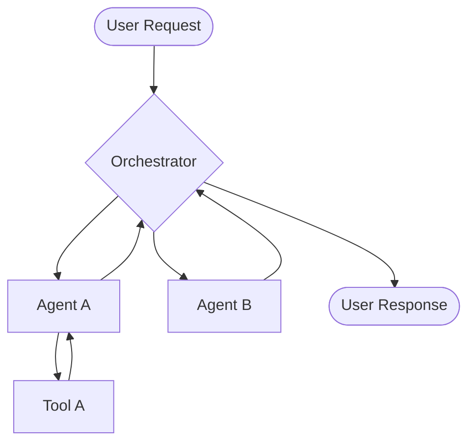

# Architecture

Arkhon-Rheo is built on a foundation of **Event Sourcing** and **State Machines**, leveraging the power of **LangGraph** for orchestration and **Google GenAI** for reasoning.

## Core Components

### 1. The Message Bus

All communication between agents is asynchronous and event-driven. Messages are immutable records containing sender, receiver, and content payload.

### 2. Recursive Memory

Unlike simple buffers, Arkhon-Rheo implements a recursive summarization system. As conversation history grows, older segments are summarized into high-level context, preserving key information while staying within context window limits.

### 3. Subgraph Orchestration

Workflows are modeled as directed graphs. Each node in the graph can be a single Agent or another Subgraph, allowing for deep nesting and hierarchical reasoning.

## Data Flow

