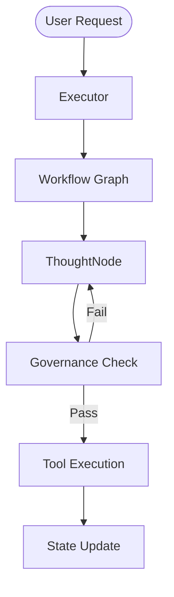

# Architecture Overview

Arkhon-Rheo follows a layered architecture designed for modularity and testability.

## System Layers

### L1: Orchestration Layer

- **Graph**: The brain of the workflow. Defines nodes and edges.
- **Executor**: The engine that drives the graph processing.
- **Registry**: Global discovery for Agents and Tools.

### L2: Node Layer (The Functional Units)

Nodes are atomic execution steps:

- **`ThoughtNode`**: Interacts with LLM to generate reasoning.
- **`ValidateNode`**: Checks thoughts/actions against the Rule Engine.
- **`ActionNode`**: Executes tools based on the validated thought.
- **`ObservationNode`**: Processes results back into the agent state.

### L3: Intelligence & Governance

- **Agents**: Specialized entities (e.g., `SpecialistAgent`, `CoordinatorAgent`).
- **Rule Engine**: Policy enforcement (Max Depth, Cost, Security).

### L4: Capability Layer

- **Tools**: Reusable functions (`FileOpsTool`, `CalculatorTool`).
- **Memory**: Context management and state hydration.

## Data Flow

