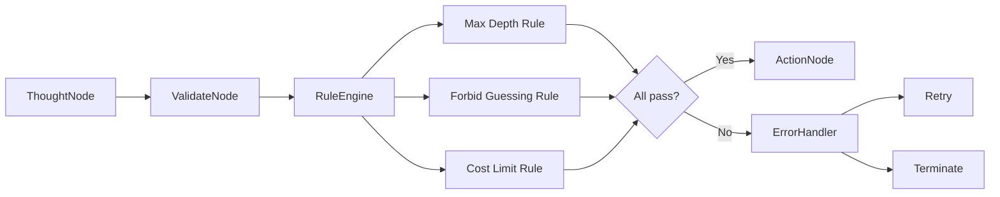

# Arkhon-Rheo + Arkhon-Rheo Governance Rules

**Version**: 1.0.0  
**Status**: Draft  
**Last Updated**: 2026-02-14  
**Code Path**: `src/arkhon-rheo/`

---

## 1. Rule Engine Architecture

### 1.1 Purpose

The Rule Engine enforces **governance constraints** on agent reasoning steps to ensure:

- **Safety**: No dangerous actions executed
- **Quality**: High-confidence reasoning only
- **Efficiency**: Cost and depth limits respected
- **Compliance**: Policy adherence

### 1.2 Rule Execution Flow



---

## 2. Built-in Rules

### 2.1 MaxDepthRule

**Purpose**: Prevent infinite reasoning loops

```python
class MaxDepthRule(Rule):
    \"\"\"Terminate execution if step count exceeds threshold.\"\"\"
    
    name = \"max_depth\"
    
    def __init__(self, max_depth: int = 20):
        self.max_depth = max_depth
        
    def check(self, step: ReasoningStep, state: AgentState) -> bool:
        return len(state.steps) <= self.max_depth
        
    @property
    def violation_message(self) -> str:
        return f\"Exceeded maximum depth of {self.max_depth} steps\"
        
    @property
    def is_terminal(self) -> bool:
        return True  # Terminates execution
```

**Configuration**:

```yaml
rules:
  - type: max_depth
    value: 20
    enabled: true
```

---

### 2.2 ForbidGuessingRule

**Purpose**: Require high-confidence reasoning

```python
class ForbidGuessingRule(Rule):
    \"\"\"Flag thoughts containing uncertainty markers.\"\"\"
    
    name = \"forbid_guessing\"
    
    UNCERTAINTY_PHRASES = [
        \"I guess\",
        \"probably\",
        \"I'm not sure\",
        \"might be\",
        \"could be\"
    ]
    
    def check(self, step: ReasoningStep, state: AgentState) -> bool:
        thought = step.thought.lower()
        
        return not any(
            phrase in thought for phrase in self.UNCERTAINTY_PHRASES
        )
        
    @property
    def violation_message(self) -> str:
        return \"Thought contains uncertainty markers (guessing)\"
        
    @property
    def is_terminal(self) -> bool:
        return False  # Retry allowed
```

**Configuration**:

```yaml
rules:
  - type: forbid_guessing
    enabled: true
    custom_phrases:
      - \"maybe\"
      - \"perhaps\"
```

---

### 2.3 CostLimitRule

**Purpose**: Cap LLM token spend per execution

```python
class CostLimitRule(Rule):
    \"\"\"Terminate if cumulative token cost exceeds budget.\"\"\"
    
    name = \"cost_limit\"
    
    def __init__(self, max_cost_usd: float = 0.50):
        self.max_cost_usd = max_cost_usd
        
   def check(self, step: ReasoningStep, state: AgentState) -> bool:
        total_cost = state.metadata.get(\"total_cost\", 0.0)
        return total_cost <= self.max_cost_usd
        
    @property
    def violation_message(self) -> str:
        return f\"Exceeded cost limit of ${self.max_cost_usd}\"
        
    @property
    def is_terminal(self) -> bool:
        return True
```

**Configuration**:

```yaml
rules:
  - type: cost_limit
    value: 0.50  # $0.50 USD
    enabled: true
```

---

### 2.4 RequireToolUseRule

**Purpose**: Ensure actions reference valid tools

```python
class RequireToolUseRule(Rule):
    \"\"\"Validate that action corresponds to a registered tool.\"\"\"
    
    name = \"require_tool_use\"
    
    def __init__(self, tool_registry: ToolRegistry):
        self.tool_registry = tool_registry
        
    def check(self, step: ReasoningStep, state: AgentState) -> bool:
        if step.action is None:
            return True  # No action yet
            
        return self.tool_registry.has(step.action)
        
    @property
    def violation_message(self) -> str:
        return \"Action does not reference a valid tool\"
        
    @property
    def is_terminal(self) -> bool:
        return False  # Retry allowed
```

---

## 3. Rule Engine Implementation

### 3.1 RuleEngine Class

```python
class RuleEngine:
    \"\"\"Executes all registered rules against reasoning steps.\"\"\"
    
    def __init__(self):
        self.rules: list[Rule] = []
        
    def add_rule(self, rule: Rule) -> None:
        \"\"\"Register a validation rule.\"\"\"
        self.rules.append(rule)
        logger.info(\"rule_added\", rule_name=rule.name)
        
    def validate(self, step: ReasoningStep, state: AgentState) -> None:
        \"\"\"Run all rules. Raises RuleViolationError if any fail.\"\"\"
        violations = []
        
        for rule in self.rules:
            if not rule.check(step, state):
                violations.append((rule, rule.violation_message))
                
                # Terminal violations → immediate termination
                if rule.is_terminal:
                    raise TerminalRuleViolation(
                        rule_name=rule.name,
                        message=rule.violation_message
                    )
                    
        # Non-terminal violations → retry
        if violations:
            raise RetryableRuleViolation(
                violations=[{\"rule\": r.name, \"msg\": msg} for r, msg in violations]
            )
```

### 3.2 Exception Hierarchy

```python
class RuleViolationError(Exception):
    \"\"\"Base exception for rule violations.\"\"\"
    
class TerminalRuleViolation(RuleViolationError):
    \"\"\"Violation that terminates execution.\"\"\"
    def __init__(self, rule_name: str, message: str):
        self.rule_name = rule_name
        super().__init__(f\"{rule_name}: {message}\")
        
class RetryableRuleViolation(RuleViolationError):
    \"\"\"Violation that allows retry.\"\"\"
    def __init__(self, violations: list[dict]):
        self.violations = violations
        super().__init__(f\"Rule violations: {violations}\")
```

---

## 4. Custom Rules

### 4.1 Creating a Custom Rule

```python
from arkhon_rheo.rules.base import Rule

class NoHallucinationRule(Rule):
    \"\"\"Custom rule to detect hallucination markers.\"\"\"
    
    name = \"no_hallucination\"
    
    def __init__(self, blacklist: list[str]):
        self.blacklist = blacklist
        
    def check(self, step: ReasoningStep, state: AgentState) -> bool:
        thought = step.thought.lower()
        return not any(word in thought for word in self.blacklist)
        
    @property
    def violation_message(self) -> str:
        return \"Thought contains hallucination markers\"
        
    @property
    def is_terminal(self) -> bool:
        return False  # Allow retry
```

**Registration**:

```python
rule_engine = RuleEngine()
rule_engine.add_rule(NoHallucinationRule(blacklist=[
    \"I hallucinated\",
    \"I made that up\"
]))
```

---

## 5. Rule Configuration via YAML

### 5.1 YAML Schema

```yaml
rules:
  - type: max_depth
    value: 20
    enabled: true
    
  - type: forbid_guessing
    enabled: true
    config:
      custom_phrases:
        - \"I think\"
        - \"maybe\"
        
  - type: cost_limit
    value: 0.50
    enabled: true
    
  - type: custom
    class: my_rules.NoHallucinationRule
    enabled: true
    config:
      blacklist:
        - \"hallucinated\"
        - \"made up\"
```

### 5.2 Loading Rules from Config

```python
def load_rules_from_config(config: dict) -> RuleEngine:
    \"\"\"Load rules from YAML configuration.\"\"\"
    engine = RuleEngine()
    
    for rule_config in config.get(\"rules\", []):
        if not rule_config.get(\"enabled\", True):
            continue
            
        rule_type = rule_config[\"type\"]
        
        if rule_type == \"max_depth\":
            rule = MaxDepthRule(max_depth=rule_config[\"value\"])
        elif rule_type == \"forbid_guessing\":
            rule = ForbidGuessingRule()
        elif rule_type == \"cost_limit\":
            rule = CostLimitRule(max_cost_usd=rule_config[\"value\"])
        elif rule_type == \"custom\":
            # Load custom rule class
            module_name, class_name = rule_config[\"class\"].rsplit(\".\", 1)
            module = importlib.import_module(module_name)
            rule_class = getattr(module, class_name)
            rule = rule_class(**rule_config.get(\"config\", {}))
        else:
            raise ValueError(f\"Unknown rule type: {rule_type}\")
            
        engine.add_rule(rule)
        
    return engine
```

---

## 6. Rule Testing

### 6.1 Unit Test Example

```python
# tests/unit/rules/test_max_depth_rule.py
def test_max_depth_rule_passes_under_limit():
    rule = MaxDepthRule(max_depth=10)
    
    state = AgentState(
        steps=[ReasoningStep(...) for _ in range(5)]
    )
    step = ReasoningStep(...)
    
    # Should not raise
    rule.check(step, state)
    
def test_max_depth_rule_fails_over_limit():
    rule = MaxDepthRule(max_depth=10)
    
    state = AgentState(
        steps=[ReasoningStep(...) for _ in range(11)]
    )
    step = ReasoningStep(...)
    
    # Should fail
    assert rule.check(step, state) is False
```

### 6.2 Integration Test

```python
def test_rule_engine_blocks_execution_on_violation():
    engine = RuleEngine()
    engine.add_rule(MaxDepthRule(max_depth=3))
    
    state = AgentState(
        steps=[ReasoningStep(...) for _ in range(5)]  # Over limit
    )
    step = ReasoningStep(...)
    
    with pytest.raises(TerminalRuleViolation):
        engine.validate(step, state)
```

---

## 7. Rule Observability

### 7.1 Logging Rule Violations

```python
class RuleEngine:
    def validate(self, step: ReasoningStep, state: AgentState) -> None:
        for rule in self.rules:
            if not rule.check(step, state):
                logger.warning(
                    \"rule_violation\",
                    rule_name=rule.name,
                    step_id=step.id,
                    trace_id=state.trace_id,
                    is_terminal=rule.is_terminal
                )
                
                if rule.is_terminal:
                    raise TerminalRuleViolation(...)
```

### 7.2 Metrics

```python
from prometheus_client import Counter

# Define metrics
rule_violations = Counter(
    \"rule_violations_total\",
    \"Total rule violations\",
    [\"rule_name\", \"is_terminal\"]
)

# In RuleEngine
def validate(self, step: ReasoningStep, state: AgentState) -> None:
    for rule in self.rules:
        if not rule.check(step, state):
            # Increment metric
            rule_violations.labels(
                rule_name=rule.name,
                is_terminal=str(rule.is_terminal)
            ).inc()
```

---

## 8. Rule Best Practices

### 8.1 Rule Design Principles

1. **Single Responsibility**: Each rule checks one thing
2. **Fail Fast**: Terminal rules should fail immediately
3. **Clear Messages**: Violation messages explain what went wrong
4. **Testable**: Rules should be unit testable
5. **Configurable**: Rules should be configurable via YAML

### 8.2 Common Patterns

#### Pattern 1: Threshold Rule

```python
class ThresholdRule(Rule):
    def __init__(self, threshold: float):
        self.threshold = threshold
        
    def check(self, step: ReasoningStep, state: AgentState) -> bool:
        value = self._compute_value(step, state)
        return value <= self.threshold
```

#### Pattern 2: Blacklist Rule

```python
class BlacklistRule(Rule):
    def __init__(self, blacklist: list[str]):
        self.blacklist = blacklist
        
    def check(self, step: ReasoningStep, state: AgentState) -> bool:
        return not any(item in step.thought for item in self.blacklist)
```

#### Pattern 3: Stateful Rule

```python
class ConsecutiveFailuresRule(Rule):
    def __init__(self, max_failures: int = 3):
        self.max_failures = max_failures
        
    def check(self, step: ReasoningStep, state: AgentState) -> bool:
        failed_steps = [s for s in state.steps if s.status == \"failed\"]
        
        # Check last N steps
        recent_failed = failed_steps[-self.max_failures:]
        return len(recent_failed) < self.max_failures
```

---

### End of Governance Rules Document
