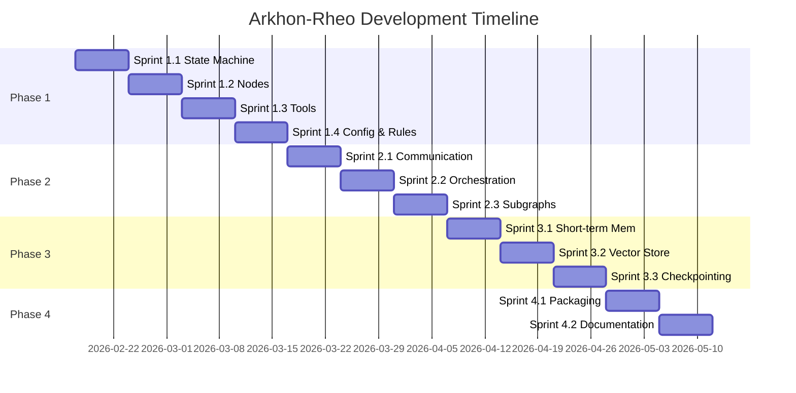

# Arkhon-Rheo + Arkhon-Rheo Development Roadmap

**Version**: 1.0.0  
**Status**: Active  
**Last Updated**: 2026-02-15  
**Project Duration**: 12 weeks

---

## Overview

This roadmap outlines the development path for Arkhon-Rheo from initial prototype to pip-installable framework. The project follows a 4-phase approach aligned with the technical specification:

1. **Phase 1**: Foundation (PEP8 + Docstring Production Version) - 4 weeks
2. **Phase 2**: Multi-Agent Architecture - 3 weeks
3. **Phase 3**: Memory & Storage Systems - 3 weeks
4. **Phase 4**: Framework Packaging & Release - 2 weeks

**Total Timeline**: 12 weeks

---

## 時間軸與里程碑總覽

| 階段 | 時間範圍 | 里程碑 | 測試通過標準 (累積制) |
| :--- | :--- | :--- | :--- |
| **PHASE 1** Foundation | 第 1-4 週 | **M1.1** 核心狀態機; **M1.2** 節點實作; **M1.3** 工具整合; **M1.4** YAML 配置與驗證 | ✅ **P1 測試標準**: Single-agent ReAct 循環端到端運行; 90%+ 測試覆蓋率; mypy --strict 零錯誤; 所有核心模組通過單元測試 |
| **PHASE 2** Multi-Agent | 第 5-7 週 | **M2.1** 代理通訊; **M2.2** 代理編排; **M2.3** 子圖支援 | ✅ **P1 + P2 測試標準**: **繼承 P1 所有測試**; 3+ 代理協作成功; 子圖嵌套深度達 3 層; 訊息傳遞與資源鎖定正常 |
| **PHASE 3** Memory Systems | 第 8-10 週 | **M3.1** 短期記憶; **M3.2** 向量存儲; **M3.3** 檢查點與回滾 | ✅ **P1 + P2 + P3 測試標準**: **繼承 P1、P2 所有測試**; 向量存儲處理 10k+ embeddings; 檢查點/回滾在故障場景下測試; 記憶系統整合測試通過 |
| **PHASE 4** Framework Release | 第 11-12 週 | **M4.1** 打包與分發; **M4.2** 文件與範例 | ✅ **P1 + P2 + P3 + P4 測試標準**: **繼承 P1、P2、P3 所有測試**; pip install 在 Linux/macOS/Windows 正常; 5+ 範例專案可運行; 文件完整並成功構建; CLI 命令功能正常 |

---

## 各階段詳細測試標準

### PHASE 1 測試標準 (基礎)

```yaml
test_requirements:
  coverage: "≥90%"
  type_checking: "mypy --strict passes"
  integration:
    - "Single ReAct loop: Thought → Action → Observation → Commit"
    - "All 6 node types functional"
    - "Tool registry discovery works"
    - "Config validation from YAML"
  
exit_criteria:
  - "pytest tests/core/ --cov=src/arkhon_rheo/core --cov-report=term-missing"
  - "mypy src/arkhon_rheo --strict"
  - "All builtin tools have valid JSON Schema"
```

### PHASE 2 測試標準 (累積 P1 + P2)

```yaml
inherited_from_p1:
  - "所有 PHASE 1 測試必須通過"
  
additional_requirements:
  multi_agent:
    - "2+ agents can exchange messages"
    - "Request-response correlation works"
    - "Resource locks prevent concurrent modification"
  orchestration:
    - "Coordinator routes tasks to 3 specialists"
    - "Parallel execution when tasks are independent"
    - "Results aggregated correctly"
  subgraph:
    - "Subgraphs nest 3 levels deep"
    - "Context propagation parent → child"
    - "Errors in subgraph propagate to parent"

exit_criteria:
  - "All PHASE 1 tests pass"
  - "pytest tests/agents/ tests/core/agent.py"
  - "E2E test: User request → 3 specialists → final result"
```

### PHASE 3 測試標準 (累積 P1 + P2 + P3)

```yaml
inherited_from_p1_p2:
  - "所有 PHASE 1 測試必須通過"
  - "所有 PHASE 2 測試必須通過"

additional_requirements:
  memory:
    - "Context stays under token limit (sliding window)"
    - "Summarization preserves key facts"
    - "Vector store handles 10k+ vectors"
    - "Query latency <500ms (p95)"
  checkpoint:
    - "Can rollback to any previous step"
    - "State consistency verified after rollback"
    - "Checkpoint overhead <5% execution time"
    - "E2E: Execute → interrupt → rollback → resume"

exit_criteria:
  - "All PHASE 1 + PHASE 2 tests pass"
  - "pytest tests/memory/ tests/runtime/checkpoint.py"
  - "Integration test with mock vector DB"
```

### PHASE 4 測試標準 (累積 P1 + P2 + P3 + P4)

```yaml
inherited_from_p1_p2_p3:
  - "所有 PHASE 1 測試必須通過"
  - "所有 PHASE 2 測試必須通過"
  - "所有 PHASE 3 測試必須通過"

additional_requirements:
  packaging:
    - "pip install arkhon-rheo works on Linux/macOS/Windows"
    - "CLI commands functional (init, run, migrate)"
    - "Migration tool tested on real LangGraph project"
  documentation:
    - "All examples run without errors"
    - "Documentation builds successfully"
    - "README has quickstart guide"
    - "Published to readthedocs.io"

exit_criteria:
  - "All PHASE 1 + PHASE 2 + PHASE 3 tests pass"
  - "pytest tests/ --cov=src/arkhon_rheo --cov-report=html"
  - "pip install arkhon-rheo && arkhon-rheo --version"
  - "sphinx-build docs/ docs/_build/"
  - "All 5+ examples execute successfully"
```

---

## Milestone 1: Foundation (Phase 1) - Weeks 1-4

### Goal

Build a production-ready single-agent ReAct engine with:

- Event-sourced state management
- YAML-driven configuration
- Pluggable tool system
- Rule engine for governance

### Phase 1 與 Skills 整合

詳細的 Sprint Skills 推薦請參考 [PHASE1_SKILLS.md](PHASE1_SKILLS.md)。

**必需 Skills** (根據 [workflows_ai-agentic-system-builder.md](workflows_ai-agentic-system-builder.md)):

- `ai-agents-architect` - 代理架構設計
- `python-pro` - Python 實作
- `agent-tool-builder` - 工具設計
- `context-manager` - 上下文管理
- `tdd-workflow` - 測試驅動開發

**Context 管理 Skills** (貫穿整個 Phase 1):

- `context-fundamentals` (Week 1)
- `context-window-management` (Week 2)
- `context-manager` (Week 3)
- `context-management-context-restore` (Week 4)

更多資訊請參考 [PHASE1_INDEX.md](PHASE1_INDEX.md)。

### Sprint 1.1: Core State Machine (Week 1)

Deliverables

- [ ] `src/arkhon-rheo/core/state.py`
  - `AgentState` dataclass with frozen=True
  - `ReasoningStep` immutable event log
  - State validation logic
  
- [ ] `src/arkhon-rheo/core/step.py`
  - Step factory methods
  - Step serialization/deserialization
  - Step status transitions
  
- [ ] `src/arkhon-rheo/core/graph.py`
  - `Graph` class
  - `add_node()` / `add_edge()` methods
  - Execution loop with termination conditions
  
- [ ] `src/arkhon-rheo/core/context.py`
  - `ContextManager` for thread-local state
  - Trace ID generation
  - Metadata management

**Exit Criteria**:

- ✅ All tests pass (`pytest tests/core/`)
- ✅ **90%+** code coverage（統一標準）
- ✅ mypy --strict passes
- ✅ Can execute simple thought → action → observation loop

---

### Sprint 1.2: Node Implementations (Week 2)

Deliverables

- [ ] `src/arkhon-rheo/nodes/base.py`
  - `BaseNode` abstract class
  - `run()` method signature
  - Node lifecycle hooks (before_run/after_run)
  
- [ ] `src/arkhon-rheo/nodes/thought_node.py`
  - LLM integration for thought generation
  - Prompt template management
  - Token usage tracking
  
- [ ] `src/arkhon-rheo/nodes/action_node.py`
  - Tool selection logic
  - Tool execution wrapper
  - Error handling & retries
  
- [ ] `src/arkhon-rheo/nodes/observation_node.py`
  - Result formatting
  - Observation truncation
  - Status updates
  
- [ ] `src/arkhon-rheo/nodes/validate_node.py`
  - Rule engine integration
  - Validation error reporting
  - Automatic retry on validation failure
  
- [ ] `src/arkhon-rheo/nodes/commit_node.py`
  - State persistence
  - Transition to next cycle

**Exit Criteria**:

- ✅ All 6 node types implement `BaseNode`
- ✅ Integration test: Thought → Validate → Action → Observation → Commit cycle
- ✅ Error scenarios handled gracefully
- ✅ Structured logging at each node

---

### Sprint 1.3: Tool Integration (Week 3)

#### Deliverables

- [ ] `src/arkhon-rheo/tools/base.py`
  - `Tool` base class
  - `ToolResult` dataclass
  - JSON Schema generation from type hints
  
- [ ] `src/arkhon-rheo/tools/registry.py`
  - `ToolRegistry` singleton
  - Dynamic tool discovery
  - Tool versioning
  
- [ ] `src/arkhon-rheo/tools/builtin/search.py`
  - Web search tool (using Tavily/SerpAPI)
  - Rate limiting
  - Result caching
  
- [ ] `src/arkhon-rheo/tools/builtin/calculator.py`
  - Safe math evaluation
  - Expression parsing
  - Unit conversion
  
- [ ] `src/arkhon-rheo/tools/builtin/file_ops.py`
  - Read/write/edit operations
  - Path sandboxing
  - Diff generation

**Exit Criteria**:

- ✅ ToolRegistry can discover all builtin tools
- ✅ Each tool has valid JSON Schema
- ✅ Integration test: Agent uses search → calculator → file_ops in sequence
- ✅ Tool documentation auto-generated

---

### Sprint 1.4: YAML Configuration & Validation (Week 4)

#### Sprint 1.4 Deliverables

- [ ] `src/arkhon-rheo/config/schema.py`
  - Pydantic models for config validation
  - `EngineConfig`, `LLMConfig`, `ToolConfig`, `RuleConfig`
  - Environment variable expansion
  
- [ ] `src/arkhon-rheo/config/loader.py`
  - YAML file loading
  - Config merging (default → user → env overrides)
  - Secrets management (env vars only)
  
- [ ] `config/templates/default.yaml`
  - Reference configuration
  - Inline documentation
  - Sensible defaults
  
- [ ] `src/arkhon-rheo/rules/base.py`
  - `Rule` abstract class
  - Rule evaluation protocol
  - Violation reporting
  
- [ ] `src/arkhon-rheo/rules/rule_engine.py`
  - `RuleEngine` class
  - Rule registration
  - Sequential rule execution
  
- [ ] 內建規則:
  - `MaxDepthRule` - Prevent infinite loops
  - `ForbidGuessingRule` - Require confidence thresholds
  - `CostLimitRule` - Cap LLM token spend

**Exit Criteria**:

- ✅ Config loaded from YAML validates against Pydantic schema
- ✅ Invalid configs raise clear error messages
- ✅ Secrets never logged or committed
- ✅ All builtin rules tested with fixtures

---

## Milestone 2: Multi-Agent Architecture (Phase 2) - Weeks 5-7

### Milestone 2 Goal

Enable multiple agents to collaborate through message passing and shared state.

### Sprint 2.1: Agent Communication (Week 5)

#### Sprint 2.1 Deliverables

- [ ] `src/arkhon-rheo/core/agent.py`
  - `Agent` class with ID and role
  - `send_message()` / `receive_message()` methods
  - Message queue per agent
  
- [ ] `src/arkhon-rheo/core/message.py`
  - `AgentMessage` dataclass
  - Message types: request/response/notification
  - Correlation ID for request-response tracking
  
- [ ] `src/arkhon-rheo/core/shared_state.py`
  - `SharedAgentState` with thread-safe access
  - Resource locking mechanism
  - Conflict resolution policies

**Exit Criteria**:

- ✅ Two agents can exchange messages
- ✅ Request-response correlation works
- ✅ Resource locks prevent concurrent modification
- ✅ Message delivery guaranteed (persistent queue)

---

### Sprint 2.2: Agent Orchestration (Week 6)

#### Sprint 2.2 Deliverables

- [ ] `src/arkhon-rheo/agents/coordinator.py`
  - Task decomposition
  - Agent selection based on capability
  - Result aggregation
  
- [ ] `src/arkhon-rheo/agents/specialist.py`
  - Planning specialist
  - Coding specialist
  - Review specialist
  
- [ ] `src/arkhon-rheo/runtime/scheduler.py`
  - Agent task scheduling
  - Dependency resolution
  - Parallel execution where possible

**Exit Criteria**:

- ✅ Coordinator can route tasks to specialists
- ✅ Specialists execute in parallel when independent
- ✅ Results aggregated correctly
- ✅ E2E test: User request → 3 specialists → final result

---

### Sprint 2.3: Subgraph Support (Week 7)

#### Sprint 2.3 Deliverables

- [ ] `src/arkhon-rheo/core/subgraph.py`
  - `SubGraph` class
  - `as_node()` conversion method
  - Context propagation from parent to child
  
- [ ] Nested execution:
  - Parent graph pauses at subgraph node
  - Subgraph executes to completion
  - Result returned to parent
  
- [ ] Examples:
  - Authentication subgraph (validate → generate_token)
  - Data processing subgraph (fetch → transform → validate)

**Exit Criteria**:

- ✅ Subgraphs can nest 3 levels deep
- ✅ Parent context accessible in subgraph
- ✅ Errors in subgraph propagate to parent
- ✅ Visualization tool shows nested structure

---

## Milestone 3: Memory Systems (Phase 3) - Weeks 8-10

### Milestone 3 Goal

Implement short-term and long-term memory with checkpointing.

### Sprint 3.1: Short-term Memory (Week 8)

#### Sprint 3.1 Deliverables

- [ ] `src/arkhon-rheo/memory/context_window.py`
  - Sliding window implementation
  - Token counting (tiktoken)
  - Automatic eviction of oldest messages
  
- [ ] `src/arkhon-rheo/memory/summarization.py`
  - Periodic context compression
  - LLM-based summarization
  - Preservation of critical information

**Exit Criteria**:

- ✅ Context stays under token limit
- ✅ Summarization preserves key facts
- ✅ Performance: <100ms for context management

---

### Sprint 3.2: Vector Store Integration (Week 9)

#### Sprint 3.2 Deliverables

- [ ] `src/arkhon-rheo/memory/vector_store.py`
  - `VectorStore` abstract class
  - `PineconeStore`, `WeaviateStore` implementations
  - Upsert / query / delete operations
  
- [ ] `src/arkhon-rheo/memory/embeddings.py`
  - OpenAI embeddings client
  - Batching for efficiency  
  - Caching of frequent queries
  
- [ ] Retrieval strategies:
  - Semantic search
  - Hybrid (keyword + semantic)
  - Time-weighted (recent = higher weight)

**Exit Criteria**:

- ✅ Can store/retrieve 10k+ vectors
- ✅ Query latency <500ms (p95)
- ✅ Integration test with mock vector DB

---

### Sprint 3.3: Checkpointing & Rollback (Week 10)

#### Sprint 3.3 Deliverables

- [ ] `src/arkhon-rheo/runtime/checkpoint.py`
  - `CheckpointManager` with SQLite backend
  - Incremental saves (every N steps)
  - Automatic cleanup of old checkpoints
  
- [ ] `src/arkhon-rheo/runtime/rollback.py`
  - Temporal rollback to step N
  - State reconstruction from checkpoint
  - Validation of rolled-back state
  
- [ ] Human approval gates:
  - Interrupt execution at critical points
  - Present state to user for review
  - Resume or rollback based on feedback

**Exit Criteria**:

- ✅ Can rollback to any previous step
- ✅ State consistency verified after rollback
- ✅ Checkpoint overhead <5% execution time
- ✅ E2E test: Execute → interrupt → rollback → resume

---

## Milestone 4: Framework Release (Phase 4) - Weeks 11-12

### Milestone 4 Goal

Package as pip-installable library with documentation and examples.

### Sprint 4.1: Packaging & Distribution (Week 11)

#### Sprint 4.1 Deliverables

- [ ] `pyproject.toml`
  - Package metadata
  - Dependencies
  - Entry points
  
- [ ] `src/arkhon_rheo/cli/main.py`
  - CLI interface (`arkhon-rheo init`, `arkhon-rheo run`)
  - Project scaffolding
  - Config validation command
  
- [ ] `src/arkhon_rheo/cli/migrate.py`
  - LangGraph → Arkhon-Rheo migration tool
  - AST transformation
  - Diff preview
  
- [ ] Distribution:
  - Build wheel and sdist
  - Upload to TestPyPI
  - Verify install: `pip install arkhon-rheo`

**Exit Criteria**:

- ✅ `pip install arkhon-rheo` works
- ✅ CLI commands functional
- ✅ Migration tool tested on real LangGraph project

---

### Sprint 4.2: Documentation & Examples (Week 12)

#### Sprint 4.2 Deliverables

- [ ] `docs/` (Sphinx/MkDocs)
  - Getting Started guide
  - API reference (autodoc)
  - Architecture diagrams
  - Configuration reference
  
- [ ] `examples/`
  - `examples/simple_agent/` - Basic ReAct loop
  - `examples/multi_agent/` - Coordinator + specialists
  - `examples/memory_agent/` - With vector store
  - `examples/langgraph_migration/` - Before/after comparison
  
- [ ] Tutorial Notebooks:
  - Building your first agent
  - Multi-agent workflows
  - Custom tools development
  - Debugging with checkpoints

**Exit Criteria**:

- ✅ All examples run without errors
- ✅ Documentation builds successfully
- ✅ README has quickstart guide
- ✅ Published to readthedocs.io or equivalent

---

## Timeline Gantt Chart



---

## Risk Management

| Risk | Probability | Impact | Mitigation |
| :--- | :--- | :--- | :--- |
| LLM API rate limits | High | Medium | Implement exp backoff, local caching |
| Vector DB costs | Medium | Medium | Use SQLite+pgvector for dev, Pinecone for prod |
| Scope creep | High | High | Strict adherence to 4-phase roadmap |
| Breaking changes in deps | Low | High | Pin versions, use dependabot |

---

## Success Metrics

### Phase 1

- [ ] Single-agent ReAct loop runs end-to-end
- [ ] 90%+ test coverage
- [ ] Zero mypy errors

### Phase 2

- [ ] 3+ agents collaborate successfully
- [ ] Subgraph nesting works to depth 3

### Phase 3

- [ ] Vector store handles 10k+ embeddings
- [ ] Checkpoint/rollback tested under failure scenarios

### Phase 4

- [ ] pip install works on Linux/macOS/Windows
- [ ] 5+ example projects
- [ ] Documentation complete

---

## Post-Release Roadmap (Optional)

### Version 0.2.0 (Weeks 13-16)

- [ ] Async execution (asyncio-based graph runner)
- [ ] Streaming output
- [ ] Web UI for debugging  
- [ ] Prometheus metrics

### Version 0.3.0 (Weeks 17-20)

- [ ] Distributed execution (Celery/Ray backend)
- [ ] Multi-modal tools (image/audio processing)
- [ ] Fine-tuning integration
- [ ] Enterprise features (RBAC, audit logs)

---

### End of Roadmap
