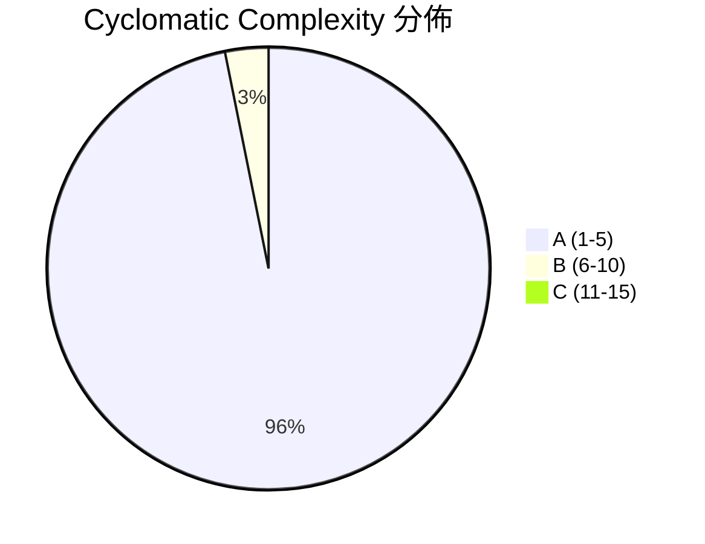

# Arkhon-Rheo Clean Code & Architecture Review

> 審查範圍：`src/arkhon_rheo/` — 41 個 Python 檔案 · 1,464 行程式碼 · 68 測試全過

---

## 總覽指標

| 指標 | 數值 | 評價 |
|------|------|------|
| Cyclomatic Complexity (avg) | **A (1.98)** | ✅ 極佳 |
| Maintainability Index | **全部 A** | ✅ 極佳 |
| Ruff Lint Violations | **14 F401** (未使用 imports) | ⚠️ 一鍵可修 |
| CC ≥ C 的 hotspot | **1** (`RuntimeScheduler.step` CC=13) | 🔴 需重構 |
| CC = B 的方法 | **5** | ⚠️ 可考慮簡化 |
| 測試 | **68 passed** (0.30s) | ✅ |

---

## 🔴 Critical：需要處理的問題

### 1. `RuntimeScheduler.step` — CC = 13 (C-rank)

[scheduler.py](file:///wk2/yaochu/github/arkhon-rheo/src/arkhon_rheo/core/runtime/scheduler.py#L16-L62)

這個方法塞了太多職責：node 執行、coroutine 偵測、delta 合併、error 捕獲、checkpoint 存取、conditional routing、static routing。

**建議拆分為 Strategy Pattern：**

```python
# 拆出 3 個方法
async def _execute_node(self, node_name: str, state: AgentState) -> dict | AgentState
async def _apply_delta(self, state: AgentState, result: dict) -> None
def _resolve_next(self, current_node: str, state: AgentState) -> str
```

預估重構後每個方法 CC ≤ 3。

---

### 2. 重複的模組層級 — 違反 DRY

| 概念 | 位置 1 (core layer) | 位置 2 (top-level layer) |
|------|---------------------|-------------------------|
| `BaseNode` | `core/nodes/base.py` (15 行) | `nodes/base.py` (44 行, 有 lifecycle hooks) |
| `ThoughtNode` | `core/nodes/thought_node.py` | `nodes/thought_node.py` |
| `ActionNode` | `core/nodes/action_node.py` | `nodes/action_node.py` |
| `BaseTool` | `core/tools/base.py` (22 行) | `tools/base.py` (較完整) |
| `ToolRegistry` | `core/tools/registry.py` (26 行) | `tools/registry.py` (含 singleton `get_registry()`) |

> [!CAUTION]
> 兩套平行的 class hierarchy 會讓開發者困惑：應該繼承哪一個？`core/nodes/action_node.py` 繼承 `core/nodes/base.py`，而 `nodes/action_node.py` 繼承 `nodes/base.py` — 兩者 interface 完全不同。

**建議：** 決定一個 canonical 的位置（推薦保留 `nodes/`、`tools/`），將 `core/nodes/` 和 `core/tools/` 標記為 deprecated 並 re-export，或直接刪除。

---

### 3. 靜默丟棄錯誤 — `pass` 反模式

以下位置在錯誤路徑用 bare `pass` 吞掉異常：

| 檔案 | 行號 | 情境 |
|------|------|------|
| [coordinator.py](file:///wk2/yaochu/github/arkhon-rheo/src/arkhon_rheo/agents/coordinator.py#L48) | L48, L70, L72 | 找不到路由 / 找不到 agent |
| [specialist.py](file:///wk2/yaochu/github/arkhon-rheo/src/arkhon_rheo/agents/specialist.py#L43) | L43 | 找不到 recipient |

**建議：** 至少 `logger.warning(...)` 或 raise custom exception。靜默失敗是 debug 黑洞。

---

## ⚠️ Warning：應改善的項目

### 4. Mutable Default Argument Bug

[step.py L22](file:///wk2/yaochu/github/arkhon-rheo/src/arkhon_rheo/core/step.py#L22)

```python
@dataclass
class ReActStep:
    timestamp: datetime = datetime.now()  # 🐛 所有實例共享同一時間
```

**修正：**

```python
timestamp: datetime = field(default_factory=datetime.now)
```

---

### 5. Circular Import Workaround

[agent.py](file:///wk2/yaochu/github/arkhon-rheo/src/arkhon_rheo/core/agent.py#L16-L18) 在 `__init__` 內 inline import `AgentRegistry`，[specialist.py L35](file:///wk2/yaochu/github/arkhon-rheo/src/arkhon_rheo/agents/specialist.py#L35) 和 [coordinator.py L55](file:///wk2/yaochu/github/arkhon-rheo/src/arkhon_rheo/agents/coordinator.py#L55) 也是。

這表示 `Agent ↔ AgentRegistry` 之間有循環依賴。目前的 inline import workaround 可以運作，但會：

- 隱藏依賴關係
- 讓 static analysis 工具（如 ty）無法完整追蹤

**建議：** 改用 event-based registration 或 dependency injection，讓 `Agent.__init__` 不直接呼叫 `AgentRegistry.register`。

---

### 6. 14 個未使用的 Import（F401）

全部都是 `typing.Dict`, `typing.Optional`, `typing.Any` 等舊式 type alias。

**一鍵修復：**

```bash
uv run ruff check src/arkhon_rheo --fix
```

---

### 7. `AgentRegistry` — Singleton 但用 Class Variable 共享狀態

[registry.py](file:///wk2/yaochu/github/arkhon-rheo/src/arkhon_rheo/core/registry.py)

`_agents` 是 class variable，意味著所有 instance（以及 `__new__` singleton）共享同一份 dict。目前有 `clear()` 給 test 用，但這個設計在多 test 並行跑時容易互相污染。

**建議：** 考慮用 `contextvars.ContextVar` 或 fixture-scoped injection 替代 global singleton。

---

## 💡 Architecture 觀察

### 優點 ✅

1. **層級清晰**：`core/` → `agents/` → `nodes/` → `tools/` → `config/` → `runtime/` → `cli/`，依賴方向一致
2. **Small classes**：大部分 class 在 20-50 行內，單一職責
3. **TypedDict + Pydantic**：State 用 `TypedDict`（LangGraph 相容），Config 用 `Pydantic` — 正確的分工
4. **Abstract base classes**：`BaseNode`, `BaseTool`, `Embeddings`, `VectorStore` 都有乾淨的 ABC interface
5. **Async-first**：Agent/Scheduler/Memory 都是 async，適合 I/O-bound workload
6. **Template Method Pattern**：`nodes/base.py` 的 `before_execute → execute → after_execute` lifecycle

### 引出的架構問題 ❓

1. **Graph vs LangGraph**：自建 `Graph` class 看起來是 LangGraph 的 lightweight 替代品，但 `pyproject.toml` 依賴了 `langgraph>=1.0.8`。兩者關係是什麼？是否預計切換？
2. **Two Node Systems**：`core/nodes/` 使用 `core/nodes/base.BaseNode`（無 lifecycle hooks），而 `nodes/` 使用 `nodes/base.BaseNode`（有 lifecycle hooks）。`GovernanceNode` 和 `DecisionNode` 用的是前者。
3. **`ContextManager` vs `SharedAgentState`**：兩者都是「跨模組共享資料」的機制，但一個是 `ContextVar`-based（per-async-task），一個是 `Lock`-based（global shared）。需要明確文件說明何時該用哪個。

---

## 複雜度分佈



B-rank 方法清單 (可考慮簡化)：

| 方法 | CC | 檔案 |
|------|----|----|
| `FileOpsTool.run` | 9 | `tools/builtin/file_ops.py` |
| `ActionNode.execute` | 8 | `core/nodes/action_node.py` |
| `CoordinatorAgent.process_message` | 7 | `agents/coordinator.py` |
| `ConfigLoader.load` | 6 | `config/loader.py` |
| `InformNode.execute` | 5 | `core/nodes/governance.py` |

---

## 建議優先順序

| # | 項目 | 影響 | 難度 |
|---|------|------|------|
| 1 | `ruff --fix` 清理 14 個 F401 | 衛生 | 🟢 30秒 |
| 2 | 修 `ReActStep.timestamp` mutable default | 正確性 Bug | 🟢 1分鐘 |
| 3 | `pass` → `logger.warning` | 可除錯性 | 🟢 5分鐘 |
| 4 | 統一 `BaseNode` / `BaseTool` 層級 | 架構清晰度 | 🟡 30分鐘 |
| 5 | 拆分 `RuntimeScheduler.step` | 複雜度降低 | 🟡 45分鐘 |
| 6 | 解決 circular import（DI 重構） | 架構健康 | 🔴 2小時+ |
