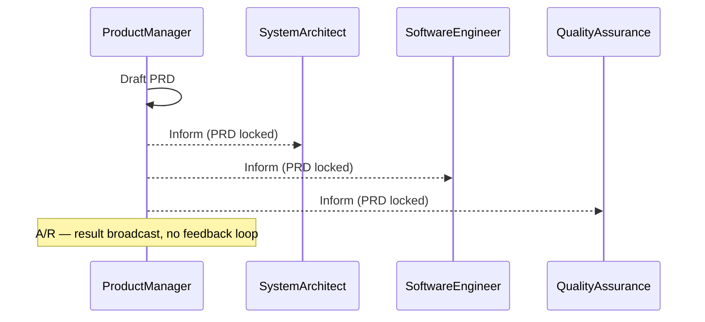
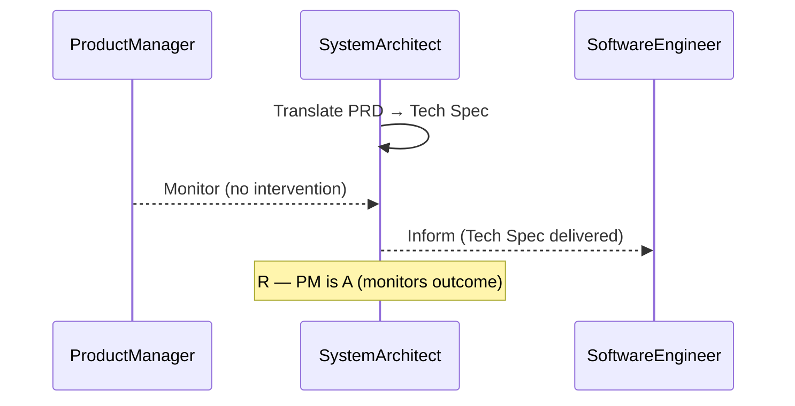
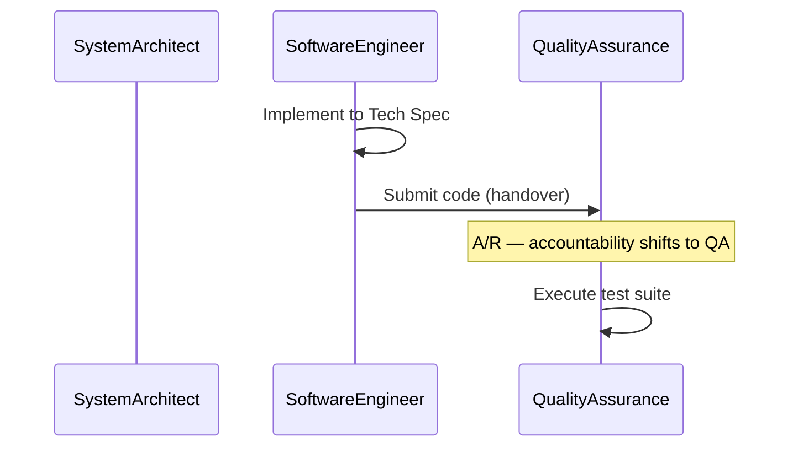
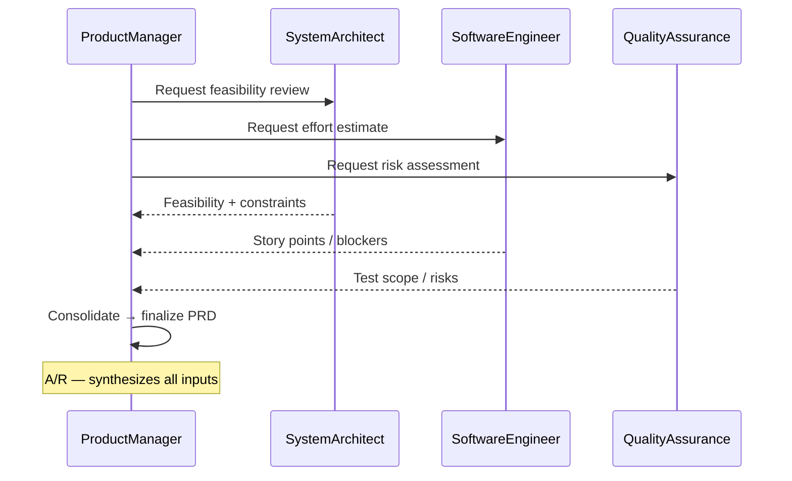
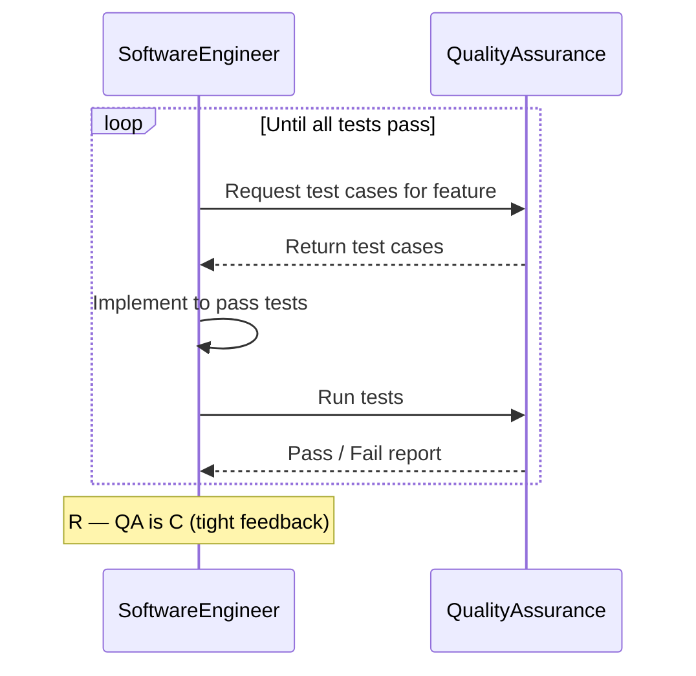
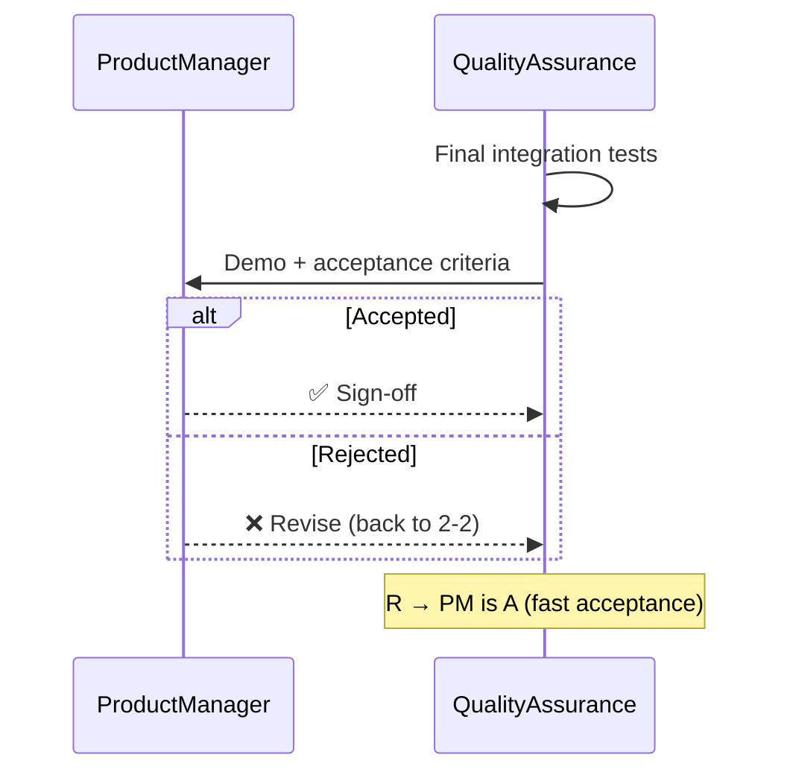
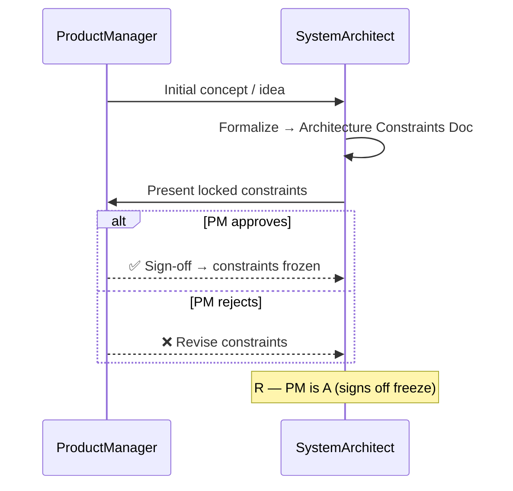
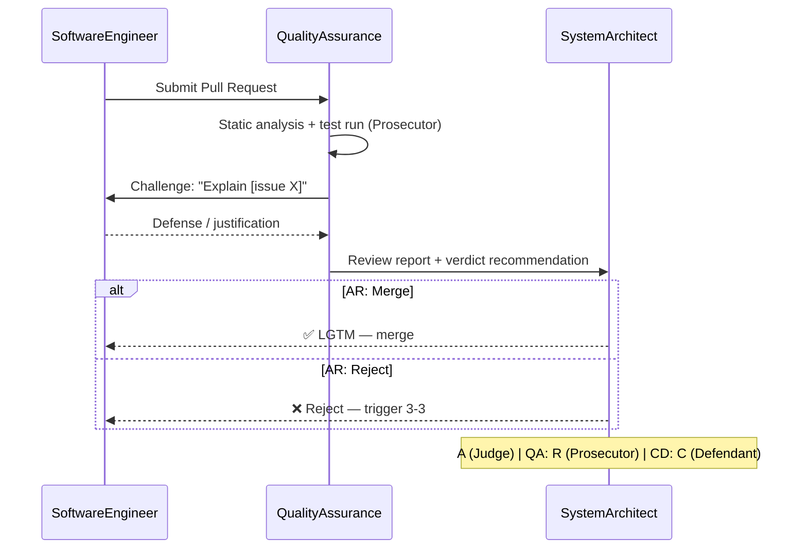
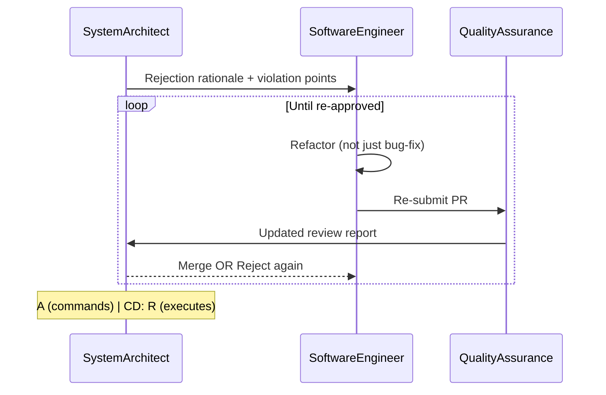
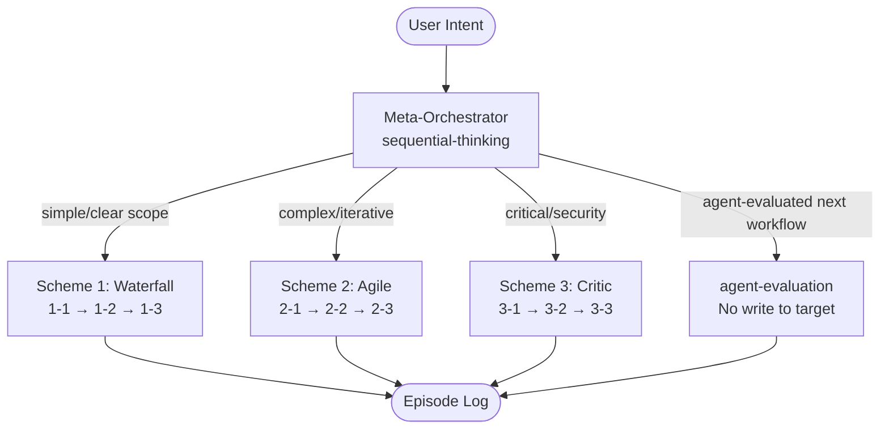

# RACI Workflows – Implementation Roadmap

## 1. Vision

Implement 9 RACI workflows in `arkhon-rheo`, each targeting a `DEV-TARGET` (`../dlamp`).
A **Meta-Orchestrator** with `sequential-thinking` selects the scheme; each agent carries a specific skill persona.

## 2. Agent Roles (from `config/workflow_context.yaml`)

| Role | Class | Model | Key Skills |
| --- | --- | --- | --- |
| PM | `ProductManager` | gemini-3-pro-preview | research-engineer, writing-plans, tdd-workflow |
| Architect | `SystemArchitect` | gemini-3-pro-preview | ai-agents-architect, architecture-patterns, langchain-architecture |
| Coder | `SoftwareEngineer` | gemini-3-flash-preview | clean-code, python-pro, langgraph, mcp-builder |
| QA | `QualityAssurance` | gemini-3-flash-preview | research-engineer, uv-package-manager, langgraph |

## 3. Memory Architecture

- **Workflow Context (Short-term)**: `AgentState.messages` — wiped on workflow end.
- **Project Memory (Long-term)**: RAG over `../dlamp` — persists across workflows.
- **Episode Log**: `.agent/episodes.json` — structured history of decisions.

## 4. Nine Workflow Diagrams

---

### Scheme 1 — Hierarchical / Waterfall

#### 1-1: Requirement Handover

#### 1-2: Design-to-Code Handover

#### 1-3: Code Delivery

---

### Scheme 2 — Collaborative / Agile

#### 2-1: Joint Requirement Analysis

#### 2-2: Dev-Test Loop (TDD)

#### 2-3: Agile Sign-off

---

### Scheme 3 — Critic / Supervisor

#### 3-1: Spec Lockdown

#### 3-2: Review Tribunal

#### 3-3: Refactoring Loop

---

## 5. Meta-Orchestration Flow

## 6. Implementation Phases

| Phase | Deliverable |
| --- | --- |
| 1 | `src/arkhon_rheo/roles/` — BaseRole + 4 role classes |
| 2 | `src/arkhon_rheo/workflows/hierarchical/` — 1-1, 1-2, 1-3 |
| 3 | `src/arkhon_rheo/workflows/collaborative/` — 2-1, 2-2, 2-3 |
| 4 | `src/arkhon_rheo/workflows/critic/` — 3-1, 3-2, 3-3 |
| 5 | `src/arkhon_rheo/orchestrator/` — Meta-Orchestrator + Memory |
