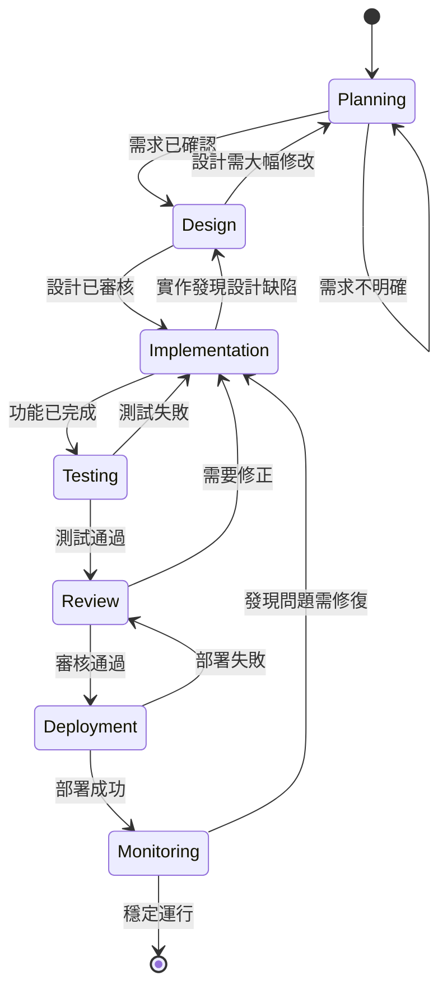
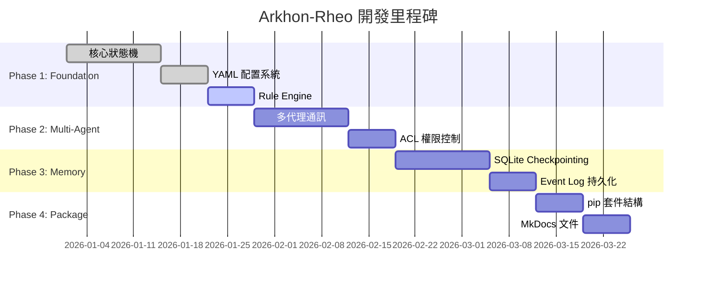

# Arkhon-Rheo 工作流程自動化系統

**版本**: 1.0.0  
**更新日期**: 2026-02-15  
**整合**: State Machine + Skills System + SDLC

---

## 📋 概述

本文件定義 Arkhon-Rheo 專案的**基於狀態機的工作流程自動化系統**，整合專案的核心哲學（State Machine Driven）、Skills 系統（800+ skills）和 SDLC 最佳實踐。

**核心特性**:

- 🔄 **狀態機驅動**: 明確的狀態轉換和檢查點
- 🤖 **AI Skills 整合**: 自動化 skill 選擇和組合
- 📊 **視覺化管理**: Mermaid 圖表呈現工作流程
- ⚙️ **可執行配置**: YAML 格式的工作流程定義
- 📏 **品質標準**: OOP 程式碼規範和複雜度控制

---

## 🔄 SDLC 狀態機模型

### 狀態轉換圖



## 🔄 SDLC 與 Agile 開發

**重要**: Arkhon-Rheo 採用 **Agile 開發方法**。

每個 Phase (如 Phase 1 Foundation) 並非對應單一 SDLC 循環，而是包含**多次迭代的完整 SDLC 循環**：

- **每個 Sprint** 都可能經歷多次 `Planning → Design → Implementation → Testing → Review` 循環
- **每個功能** 都應該經過完整的 SDLC 流程才算完成
- **持續整合** 確保每次循環後都能部署和監控
- **快速迭代** 允許根據測試結果快速調整設計

**關鍵概念**:

- **SDLC 狀態** = 工作流程狀態（當前正在做什麼）
- **Phase** = 時程里程碑（在開發的哪個階段）
- **Sprint** = 時間盒（一週為單位）
- 這三者是**正交的概念**，可以獨立變化

**例如**：在 Phase 1 Sprint 1.1 (核心狀態機開發) 期間：

- 設計 `ReActState` 類別時：處於 **Planning/Design** 狀態
- 實作 `ReActState` 時：處於 **Implementation** 狀態
- 寫單元測試時：處於 **Testing** 狀態
- Code Review 時：處於 **Review** 狀態
- 合併到主分支時：快速 **Deployment** 並 **Monitoring**

完成一個類別後，又回到 **Planning** 開始下一個類別的設計。

---

### 狀態定義表

| 狀態 | 目的 | 輸入 | 輸出 | 停留時間 |
| :--- | :--- | :--- | :--- | :--- |
| **Planning** | 需求分析、規劃 | Feature Request | Specification Doc | 2-4 天 |
| **Design** | 系統設計、架構 | Specification Doc | Design Doc + ADR | 1-3 天 |
| **Implementation** | 編碼實作 | Design Doc | Working Code + Tests | 3-10 天 |
| **Testing** | 測試驗證 | Code + Tests | Test Report | 1-2 天 |
| **Review** | 代碼審核 | Code + Tests + Docs | Approved PR | 0.5-1 天 |
| **Deployment** | 部署上線 | Approved PR | Deployed System | 0.5-1 天 |
| **Monitoring** | 監控觀察 | Deployed System | Metrics | 持續 |

---

## 🎯 基於 Skills 的狀態自動化

### Skills 自動選擇策略

基於 `skill_tags.yaml` 的分類系統，每個SDLC狀態自動推薦相關 skills：

#### 1. Planning 階段 Skills

**目標**: 從需求到可執行規劃

**推薦 Skills** (從 skill_tags.yaml 'Planning' 類別):

```yaml
primary_skills:
  - brainstorming          # 創意發想和需求探索
  - concise-planning       # 簡潔計劃生成
  - plan-writing           # 計劃文件撰寫
  - architecture           # 架構決策框架

supporting_skills:
  - product-manager-toolkit  # 產品需求管理
  - startup-analyst          # 市場分析
  - competitive-landscape    # 競品分析
```

**自動化流程**:

1. 輸入：Feature Request/User Story
2. 使用 `brainstorming` 探索需求
3. 使用 `concise-planning` 生成初步計劃
4. 使用 `plan-writing` 產出正式規劃文件
5. 輸出：Specification Document

---

#### 2. Design 階段 Skills

**目標**: 從規劃到可實作的設計

**推薦 Skills** (從 'Architecture' + 'Design' 類別):

```yaml
primary_skills:
  - architect-review        # 架構審核
  - architecture-decision-records  # ADR 撰寫
  - architecture-patterns   # 架構模式選擇
  - design-orchestration    # 設計協調

database_design:
  - database-architect      # 資料庫設計
  - database-design         # Schema 設計

api_design:
  - api-design-principles   # API 設計原則
  - api-patterns           # API 模式選擇
```

**自動化流程**:

1. 輸入：Specification Document
2. 使用 `architect-review` 審核架構需求
3. 使用 `architecture-patterns` 選擇設計模式
4. 使用 `database-architect` / `api-design-principles` 設計組件
5. 使用 `architecture-decision-records` 記錄決策
6. 輸出：Design Document + ADRs

---

#### 3. Implementation 階段 Skills

**目標**: 高品質代碼實作

**推薦 Skills** (從 'Coding' + 'Refactoring' 類別):

```yaml
coding_skills:
  - clean-code            # 代碼品質標準
  - software-architecture # 軟體架構實作
  - tdd-workflow          # 測試驅動開發

language_specific:
  - python-pro            # Python 專家
  - typescript-pro        # TypeScript 專家
  - golang-pro            # Go 專家

quality_assurance:
  - code-reviewer         # 代碼審核
  - production-code-audit # 生產級代碼稽核
  - systematic-debugging  # 系統化除錯
```

**自動化流程**:

1. 輸入：Design Document
2. 使用 `tdd-workflow` 開始 TDD 循環
3. 使用語言專家 skills (如 `python-pro`) 實作代碼
4. 使用 `clean-code` 審核代碼品質
5. 使用 `code-reviewer` 進行自我審核
6. 輸出：Working Code + Unit Tests

---

#### 4. Testing 階段 Skills

**目標**: 全面測試覆蓋

**推薦 Skills** (從 'Testing' + 'Debugging' 類別):

```yaml
testing_skills:
  - test-automator        # 測試自動化
  - e2e-testing-patterns  # E2E 測試模式
  - javascript-testing-patterns  # JS 測試模式
  - python-testing-patterns      # Python 測試模式

debugging_skills:
  - systematic-debugging  # 系統化除錯
  - debugger             # 除錯專家
  - error-detective      # 錯誤偵測

verification_skills:
  - verification-before-completion  # 完成前驗證
```

**自動化流程**:

1. 輸入：Code + Unit Tests
2. 使用 `test-automator` 建立自動化測試
3. 使用語言測試 skills 建立完整測試套件
4. 使用 `systematic-debugging` 解決測試失敗
5. 使用 `verification-before-completion` 驗證
6. 輸出：Test Report (Coverage > 90%)

---

#### 5. Review 階段 Skills

**目標**: 多維度審核

**推薦 Skills** (從 'Code Review' 類別):

```yaml
review_skills:
  - code-reviewer           # 綜合代碼審核
  - architect-review        # 架構審核
  - security-auditor        # 安全審核
  - performance-engineer    # 性能審核

specialized_reviews:
  - backend-security-coder  # 後端安全
  - frontend-security-coder # 前端安全
  - ui-visual-validator     # UI 驗證
```

**自動化流程**:

1. 輸入：Code + Tests + Docs
2. 並行執行多個審核 skills
3. 彙總審核報告
4. 使用 `receiving-code-review` 處理反饋
5. 輸出：Approved PR / Change Requests

---

#### 6. Deployment 階段 Skills

**目標**: 安全部署

**推薦 Skills** (從 'Deployment' 類別):

```yaml
deployment_skills:
  - deployment-engineer    # 部署工程師
  - deployment-procedures  # 部署流程
  - gitops-workflow       # GitOps 工作流程

infrastructure_skills:
  - cloud-architect       # 雲端架構
  - kubernetes-architect  # K8s 部署
  - terraform-specialist  # IaC 自動化
```

---

#### 7. Monitoring 階段 Skills

**目標**: 持續監控和改進

**推薦 Skills** (從 'Observability' 類別):

```yaml
monitoring_skills:
  - observability-engineer   # 可觀測性工程
  - incident-responder       # 事件響應
  - performance-engineer     # 性能監控

analytics_skills:
  - analytics-tracking       # 分析追蹤
  - data-storytelling        # 數據分析
```

---

## 📊 里程碑系統

### 與 ROADMAP.md 整合

基於 `docs/ROADMAP.md` 的4階段開發計劃：



### 里程碑檢查點

| 里程碑 | 完成標準 | 驗證方式 |
| :--- | :--- | :--- |
| **M1: Foundation** | 狀態機可執行 | pytest 通過 + demo 運行 |
| **M2: Multi-Agent** | ACL 系統運作 | 多代理通訊測試通過 |
| **M3: Memory** | Checkpoint 恢復 | 狀態恢復測試通過 |
| **M4: Package** | pip 可安裝 | `pip install arkhon-rheo` 成功 |

---

## 📏 OOP 程式碼規範

### 函數長度限制

**規則**: 單一函數/方法的純代碼行數（不計空行、不計 Docstring）

- ⚠️ **最大長度**: ≤ 400 行（硬性限制）
- ✅ **建議長度**: ≤ 100 行
- 🎯 **理想長度**: ≤ 50 行

### 複雜度限制

使用 `radon` 檢查：

| 指標 | 限制 | 說明 |
| :--- | :--- | :--- |
| **Cyclomatic Complexity** | ≤ 10 | 決策路徑數量 |
| **Maintainability Index** | ≥ 65 | 可維護性指數（0-100） |
| **Halstead Difficulty** | ≤ 20 | 程式理解難度 |

**檢查命令**:

```bash
# 循環複雜度
radon cc src/ -a -nc

# 可維護性指數
radon mi src/ -s

# Halstead 指標
radon hal src/
```

### 程式碼組織最佳實踐

**模組化設計原則**:

1. **單一職責原則 (SRP)**: 一個類/函數只做一件事
2. **最小知情原則**: 減少模組間依賴
3. **組合優於繼承**: 使用組合模式
4. **依賴注入**: 避免硬編碼依賴

**文件結構範例**:

```python
# src/arkhon_rheo/core/state.py

from dataclasses import dataclass, field, replace
from typing import Any


@dataclass(frozen=True)
class ReActState:
    """
    不可變狀態容器 (Event Sourcing).
    
    所有狀態更新透過 update() 方法建立新實例 (Copy-on-Write).
    """
    
    thought: str = ""
    action: dict[str, Any] | None = None
    observation: str | None = None
    metadata: dict[str, Any] = field(default_factory=dict)
    
    def update(self, **changes) -> "ReActState":
        """建立新狀態 (不可變更新)."""
        return replace(self, **changes)
    
    # ... 其他方法，每個 < 50 行
```

**函數拆分示例**:

❌ **壞的示例** (過長函數):

```python
def process_request(request):
    # 驗證 (50 行)
    # 解析 (100 行)
    # 業務邏輯 (150 行)
    # 格式化輸出 (50 行)
    # 錯誤處理 (50 行)
    pass  # 總計 400 行
```

✅ **好的示例** (拆分函數):

```python
def process_request(request):
    """主流程協調器 (< 20 行)."""
    validated_data = _validate_request(request)
    parsed_data = _parse_request(validated_data)
    result = _execute_business_logic(parsed_data)
    return _format_response(result)

def _validate_request(request):
    """驗證邏輯 (< 50 行)."""
    pass

def _parse_request(data):
    """解析邏輯 (< 80 行)."""
    pass

def _execute_business_logic(data):
    """業務邏輯 (< 100 行)."""
    pass

def _format_response(result):
    """格式化輸出 (< 40 行)."""
    pass
```

---

## ⚙️ 可執行工作流程 (YAML 格式)

### 工作流程定義範例

```yaml
# .agent/workflows/feature-implementation.yaml
---
name: "Feature Implementation Workflow"
version: "1.0.0"
description: "Complete SDLC workflow for implementing a new feature"

# 狀態機定義
states:
  - name: "planning"
    skills:
      - "brainstorming"
      - "concise-planning"
    entry_checks:
      - "user_story_exists"
    exit_criteria:
      - "specification_complete"
      - "stakeholder_approved"
    
  - name: "design"
    skills:
      - "architect-review"
      - "architecture-patterns"
      - "database-architect"
    entry_checks:
      - "specification_approved"
    exit_criteria:
      - "design_doc_complete"
      - "adrs_documented"
    
  - name: "implementation"
    skills:
      - "tdd-workflow"
      - "python-pro"
      - "clean-code"
    entry_checks:
      - "design_approved"
    exit_criteria:
      - "tests_passing"
      - "coverage_above_90"
      - "lint_checks_passing"
    
  - name: "testing"
    skills:
      - "test-automator"
      - "systematic-debugging"
    entry_checks:
      - "unit_tests_passing"
    exit_criteria:
      - "e2e_tests_passing"
      - "all_scenarios_covered"
    
  - name: "review"
    skills:
      - "code-reviewer"
      - "security-auditor"
    entry_checks:
      - "all_tests_passing"
    exit_criteria:
      - "pr_approved"
      - "no_blocking_issues"
    
  - name: "deployment"
    skills:
      - "deployment-engineer"
      - "gitops-workflow"
    entry_checks:
      - "pr_merged"
    exit_criteria:
      - "deployed_to_production"
      - "health_checks_passing"

# 狀態轉換規則
transitions:
  - from: "planning"
    to: "design"
    condition: "exit_criteria_met"
    
  - from: "design"
    to: "implementation"
    condition: "exit_criteria_met"
    
  - from: "implementation"
    to: "testing"
    condition: "exit_criteria_met"
    
  - from: "implementation"
    to: "design"
    condition: "design_flaw_found"
    
  - from: "testing"
    to: "review"
    condition: "all_tests_pass"
    
  - from: "testing"
    to: "implementation"
    condition: "tests_fail"
    
  - from: "review"
    to: "deployment"
    condition: "approved"
    
  - from: "review"
    to: "implementation"
    condition: "changes_requested"

# 檢查點配置
checkpoints:
  interval: 1  # 每個狀態轉換後儲存
  storage: "sqlite"
  retention_days: 30

# 通知配置
notifications:
  - event: "state_transition"
    channels: ["slack", "email"]
  - event: "gate_failed"
    channels: ["slack"]
  - event: "deployment_complete"
    channels: ["slack", "email"]
```

---

## 🚀 使用指南

### 啟動工作流程

```bash
# 使用 CLI 啟動工作流程
arkhon-rheo workflow run \
  --config .agent/workflows/feature-implementation.yaml \
  --input user_story.md

# 或使用 Python API
from arkhon_rheo.workflow import WorkflowEngine

engine = WorkflowEngine.from_yaml(".agent/workflows/feature-implementation.yaml")
result = engine.run(initial_state={"user_story": "..."})
```

### 監控工作流程

```bash
# 查看當前狀態
arkhon-rheo workflow status

# 查看狀態歷史
arkhon-rheo workflow history

# 恢復到檢查點
arkhon-rheo workflow restore --checkpoint <checkpoint_id>
```

---

## 📚 與現有系統整合

### 整合點

1. **.agent/workflows/**: 存放可執行工作流程定義
2. **skill_tags.yaml**: Skills 分類和自動選擇依據
3. **docs/ROADMAP.md**: 里程碑和時程規劃
4. **docs/STATE_MACHINE.md**: 狀態機實作細節
5. **DEPENDENCIES.md**: 工具鏈和環境配置

### 擴展方式

**新增自定義工作流程**:

1. 複製 `.agent/workflows/feature-implementation.yaml`
2. 修改狀態和技能配置
3. 定義自訂轉換規則
4. 使用 CLI 執行

**新增自定義 Skills**:

1. 在 `.agent/skills/` 建立新 skill
2. 更新 `skill_tags.yaml` 分類
3. 更新 `skills_index.json`
4. 在工作流程中引用

---

## 📖 參考文件

- [ARCHITECTURE.md](./docs/ARCHITECTURE.md) - 系統架構
- [STATE_MACHINE.md](./docs/STATE_MACHINE.md) - 狀態機設計
- [ROADMAP.md](./docs/ROADMAP.md) - 開發路線圖
- [DEPENDENCIES.md](./DEPENDENCIES.md) - 環境依賴
- [skill_tags.yaml](./.agent/skill_tags.yaml) - Skills 分類系統

---

**維護者**: Arkhon-Rheo Team  
**最後更新**: 2026-02-15  
**文件版本**: 1.0.0
