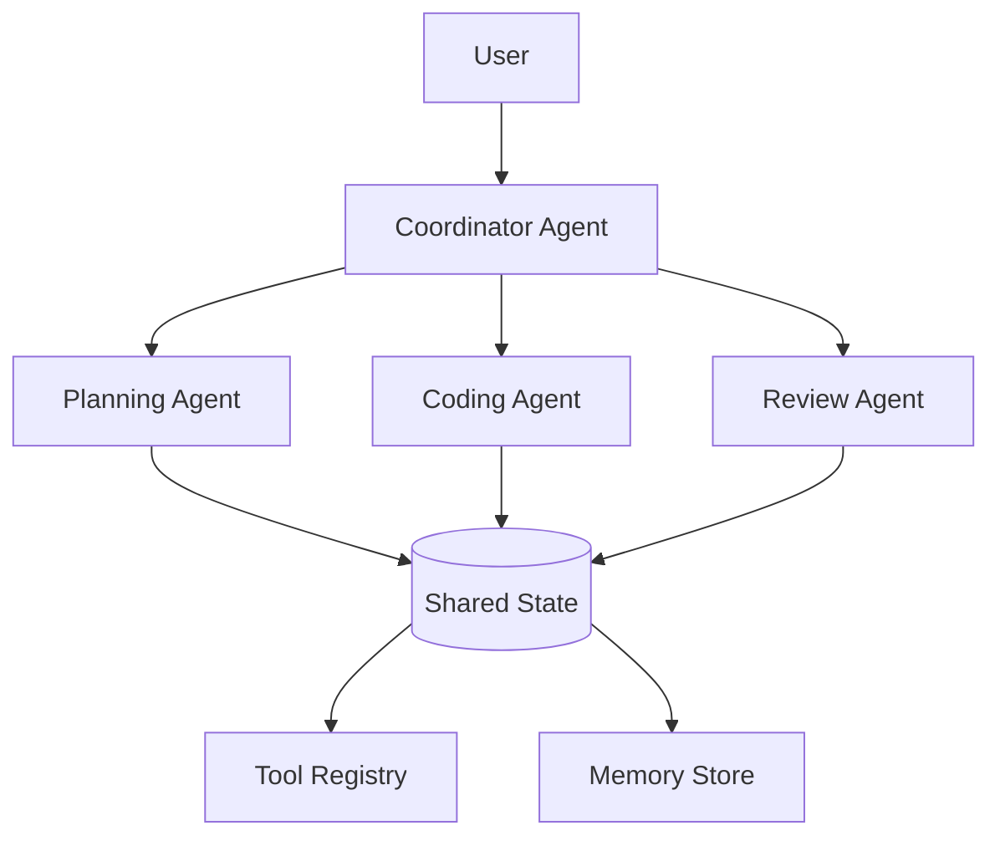
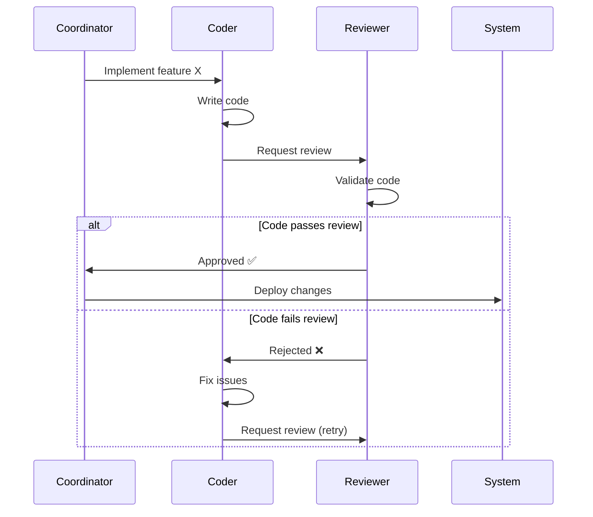

# Arkhon-Rheo + ReActEngine Multi-Agent Roles & Access Control

**Version**: 1.0.0  
**Status**: Draft  
**Last Updated**: 2026-02-14  
**Code Path**: `src/arkhon-rheo/`

---

## 1. Multi-Agent System Overview

### 1.1 Agent Hierarchy



### 1.2 Agent Roles

| Role | Responsibility | Capability | Constraints |
| :--- | :--- | :--- | :--- |
| **Coordinator** | Task decomposition & routing | All tools, all agents | Cannot write code |
| **Planning Agent** | Break tasks into steps | Read-only tools | Cannot execute tools |
| **Coding Agent** | Implement code changes | File I/O, Git tools | Cannot approve changes |
| **Review Agent** | Validate code quality | Read files, run tests | Cannot modify code |

---

## 2. Permission Model

### 2.1 Permission Matrix

| Agent | Read Files | Write Files | Execute Tools | Spawn Agents | Approve Work |
| :--- | :--- | :--- | :--- | :--- | :--- |
| Coordinator | ✅ | ❌ | ✅ (limited) | ✅ | ✅ |
| Planning | ✅ | ❌ | ❌ | ❌ | ❌ |
| Coding | ✅ | ✅ | ✅ (code tools) | ❌ | ❌ |
| Review | ✅ | ❌ | ✅ (test tools) | ❌ | ✅ |

### 2.2 Permission Enforcement

```python
from enum import Enum

class Permission(Enum):
    READ_FILES = \"read_files\"
    WRITE_FILES = \"write_files\"
    EXECUTE_TOOLS = \"execute_tools\"
    SPAWN_AGENTS = \"spawn_agents\"
    APPROVE_WORK = \"approve_work\"

@dataclass
class AgentRole:
    name: str
    permissions: set[Permission]
    allowed_tools: set[str]
    
# Define roles
ROLES = {
    \"coordinator\": AgentRole(
        name=\"coordinator\",
        permissions={
            Permission.READ_FILES,
            Permission.EXECUTE_TOOLS,
            Permission.SPAWN_AGENTS,
            Permission.APPROVE_WORK
        },
        allowed_tools={\"search\", \"summarize\"}
    ),
    \"coder\": AgentRole(
        name=\"coder\",
        permissions={
            Permission.READ_FILES,
            Permission.WRITE_FILES,
            Permission.EXECUTE_TOOLS
        },
        allowed_tools={\"file_read\", \"file_write\", \"git_commit\"}
    ),
    \"reviewer\": AgentRole(
        name=\"reviewer\",
        permissions={
            Permission.READ_FILES,
            Permission.EXECUTE_TOOLS,
            Permission.APPROVE_WORK
        },
        allowed_tools={\"file_read\", \"run_tests\", \"lint\"}
    )
}
```

### 2.3 Permission Checks

```python
class Agent:
    def __init__(self, agent_id: str, role: AgentRole):
        self.agent_id = agent_id
        self.role = role
        
    def can(self, permission: Permission) -> bool:
        \"\"\"Check if agent has permission.\"\"\"
        return permission in self.role.permissions
        
    def use_tool(self, tool_name: str, **kwargs) -> ToolResult:
        \"\"\"Execute tool with permission check.\"\"\"
        # Check tool permission
        if tool_name not in self.role.allowed_tools:
            raise PermissionDeniedError(
                f\"Agent {self.agent_id} cannot use tool '{tool_name}'\"
            )
            
        # Check capability permission
        if not self.can(Permission.EXECUTE_TOOLS):
            raise PermissionDeniedError(
                f\"Agent {self.agent_id} cannot execute tools\"
            )
            
        tool = ToolRegistry().get(tool_name)
        return tool.execute(**kwargs)
```

---

## 3. Inter-Agent Communication

### 3.1 Message Protocol

```python
@dataclass
class AgentMessage:
    sender: str  # Agent ID
    receiver: str  # Target agent ID or \"broadcast\"
    message_type: str  # \"request\" | \"response\" | \"notification\"
    payload: dict[str, Any]
    timestamp: datetime
    correlation_id: str  # For request-response tracking
    
class MessageBus:
    def send(self, message: AgentMessage) -> None:
        \"\"\"Send message to target agent's inbox.\"\"\"
        if message.receiver == \"broadcast\":
            for agent in self.agents.values():
                agent.inbox.append(message)
        else:
            self.agents[message.receiver].inbox.append(message)
            
    def receive(self, agent_id: str) -> list[AgentMessage]:
        \"\"\"Retrieve messages for an agent.\"\"\"
        agent = self.agents[agent_id]
        messages = agent.inbox.copy()
        agent.inbox.clear()
        return messages
```

### 3.2 Request-Response Pattern

```python
# Coordinator sends task to Coding Agent
coordinator.send_message(AgentMessage(
    sender=\"coordinator\",
    receiver=\"coder-001\",
    message_type=\"request\",
    payload={
        \"task\": \"implement_login_validation\",
        \"spec\": {...}
    },
    correlation_id=uuid.uuid4().hex
))

# Coding Agent processes and responds
coder.send_message(AgentMessage(
    sender=\"coder-001\",
    receiver=\"coordinator\",
    message_type=\"response\",
    payload={
        \"status\": \"completed\",
        \"diff\": \"...\",
        \"tests_pass\": True
    },
    correlation_id=original_message.correlation_id
))
```

---

## 4. Resource Locking

### 4.1 Preventing Concurrent Modification

```python
class ResourceLock:
    def __init__(self):
        self.locks: dict[str, str] = {}  # {resource_id: agent_id}
        
    def acquire(self, resource_id: str, agent_id: str) -> bool:
        \"\"\"Try to acquire lock on resource.\"\"\"
        if resource_id in self.locks:
            return self.locks[resource_id] == agent_id  # Already owns it
            
        self.locks[resource_id] = agent_id
        return True
        
    def release(self, resource_id: str, agent_id: str) -> None:
        \"\"\"Release lock on resource.\"\"\"
        if self.locks.get(resource_id) == agent_id:
            del self.locks[resource_id]
            
    def is_locked(self, resource_id: str) -> bool:
        return resource_id in self.locks
```

**Usage**:

```python
class CodingAgent(Agent):
    def modify_file(self, file_path: str, content: str) -> None:
        # Try to acquire lock
        if not self.resource_locks.acquire(file_path, self.agent_id):
            raise ResourceLockError(f\"File {file_path} is locked\")
            
        try:
            # Perform modification
            write_file(file_path, content)
        finally:
            # Always release lock
            self.resource_locks.release(file_path, self.agent_id)
```

---

## 5. Task Delegation

### 5.1 Coordinator Task Routing

```python
class CoordinatorAgent(Agent):
    def assign_task(self, task: dict) -> None:
        \"\"\"Route task to appropriate specialist agent.\"\"\"
        task_type = self._classify_task(task)
        
        if task_type == \"planning\":
            target_agent = self.planner
        elif task_type == \"coding\":
            target_agent = self.coder
        elif task_type == \"review\":
            target_agent = self.reviewer
        else:
            raise ValueError(f\"Unknown task type: {task_type}\")
            
        # Send task
        self.send_message(AgentMessage(
            sender=self.agent_id,
            receiver=target_agent.agent_id,
            message_type=\"request\",
            payload=task,
            correlation_id=uuid.uuid4().hex
        ))
        
    def _classify_task(self, task: dict) -> str:
        \"\"\"Classify task based on description.\"\"\"
        description = task.get(\"description\", \"\").lower()
        
        if any(kw in description for kw in [\"plan\", \"design\", \"outline\"]):
            return \"planning\"
        elif any(kw in description for kw in [\"implement\", \"code\", \"fix\"]):
            return \"coding\"
        elif any(kw in description for kw in [\"review\", \"test\", \"validate\"]):
            return \"review\"
        else:
            return \"unknown\"
```

---

## 6. Approval Workflows

### 6.1 Multi-Stage Approval



**Implementation**:

```python
class ReviewAgent(Agent):
    def review_code(self, diff: str) -> dict:
        \"\"\"Review code changes.\"\"\"
        # Run linter
        lint_result = self.use_tool(\"lint\", code=diff)
        
        # Run tests
        test_result = self.use_tool(\"run_tests\")
        
        # Check for common issues
        issues = self._static_analysis(diff)
        
        # Approval decision
        if lint_result.success and test_result.success and not issues:
            return {
                \"status\": \"approved\",
                \"comments\": \"All checks passed\"
            }
        else:
            return {
                \"status\": \"rejected\",
                \"comments\": \"Issues found\",
                \"issues\": issues
            }
```

---

## 7. Agent Lifecycle Management

### 7.1 Spawning & Terminating Agents

```python
class AgentLifecycleManager:
    def spawn_agent(
        self, 
        role: str, 
        config: dict
    ) -> Agent:
        \"\"\"Create and initialize a new agent instance.\"\"\"
        agent_id = f\"{role}-{uuid.uuid4().hex[:8]}\"
        agent_role = ROLES[role]
        
        agent = Agent(agent_id=agent_id, role=agent_role)
        agent.initialize(config)
        
        self.active_agents[agent_id] = agent
        logger.info(\"agent_spawned\", agent_id=agent_id, role=role)
        
        return agent
        
    def terminate_agent(self, agent_id: str) -> None:
        \"\"\"Gracefully shut down an agent.\"\"\"
        agent = self.active_agents.get(agent_id)
        if not agent:
            return
            
        # Release all locks
        for resource, lock_holder in list(self.resource_locks.locks.items()):
            if lock_holder == agent_id:
                self.resource_locks.release(resource, agent_id)
                
        # Cleanup agent resources
        agent.cleanup()
        
        del self.active_agents[agent_id]
        logger.info(\"agent_terminated\", agent_id=agent_id)
```

---

## 8. Shared State Management

### 8.1 Shared Context

```python
@dataclass
class SharedAgentState:
    \"\"\"State shared across all agents.\"\"\"
    messages: list[AgentMessage]
    context: dict[str, Any]  # Shared metadata
    locks: dict[str, str]  # {resource_id: agent_id}
    
class SharedStateManager:
    def __init__(self):
        self.state = SharedAgentState(
            messages=[],
            context={},
            locks={}
        )
        self._lock = threading.Lock()
        
    def update_context(self, key: str, value: Any) -> None:
        \"\"\"Thread-safe context update.\"\"\"
        with self._lock:
            self.state.context[key] = value
            
    def get_context(self, key: str) -> Any:
        \"\"\"Thread-safe context read.\"\"\"
        with self._lock:
            return self.state.context.get(key)
```

---

## 9. Audit Logging

### 9.1 Agent Action Auditing

```python
class AuditLogger:
    def log_action(
        self,
        agent_id: str,
        action: str,
        resource: str,
        outcome: str
    ) -> None:
        \"\"\"Log agent action for audit trail.\"\"\"
        entry = {
            \"timestamp\": datetime.now().isoformat(),
            \"agent_id\": agent_id,
            \"action\": action,
            \"resource\": resource,
            \"outcome\": outcome
        }
        
        # Write to append-only log
        with open(\"audit.jsonl\", \"a\") as f:
            f.write(json.dumps(entry) + \"\\n\")
            
        logger.info(\"audit_log\", **entry)
```

**Usage in Agent**:

```python
class Agent:
    def use_tool(self, tool_name: str, **kwargs) -> ToolResult:
        # Execute tool
        result = super().use_tool(tool_name, **kwargs)
        
        # Audit log
        self.audit_logger.log_action(
            agent_id=self.agent_id,
            action=f\"use_tool:{tool_name}\",
            resource=kwargs.get(\"file_path\", \"N/A\"),
            outcome=\"success\" if result.success else \"failure\"
        )
        
        return result
```

---

## 10. Example Multi-Agent Workflow

### 10.1 Complete Workflow

```python
# Setup
coordinator = CoordinatorAgent(\"coordinator-001\", ROLES[\"coordinator\"])
planner = PlanningAgent(\"planner-001\", ROLES[\"planning\"])
coder = CodingAgent(\"coder-001\", ROLES[\"coder\"])
reviewer = ReviewAgent(\"reviewer-001\", ROLES[\"reviewer\"])

# Step 1: User request to Coordinator
coordinator.receive_task({\"description\": \"Implement login validation\"})

# Step 2: Coordinator → Planning Agent
coordinator.send_message(AgentMessage(
    sender=\"coordinator-001\",
    receiver=\"planner-001\",
    message_type=\"request\",
    payload={\"task\": \"Create implementation plan\"}
))

# Step 3: Planning Agent creates plan
plan = planner.create_plan(...)
planner.send_message(AgentMessage(
    sender=\"planner-001\",
    receiver=\"coordinator-001\",
    message_type=\"response\",
    payload={\"plan\": plan}
))

# Step 4: Coordinator → Coding Agent
coordinator.send_message(AgentMessage(
    sender=\"coordinator-001\",
    receiver=\"coder-001\",
    message_type=\"request\",
    payload={\"plan\": plan}
))

# Step 5: Coding Agent implements
diff = coder.implement_plan(plan)
coder.send_message(AgentMessage(
    sender=\"coder-001\",
    receiver=\"reviewer-001\",
    message_type=\"request\",
    payload={\"diff\": diff}
))

# Step 6: Review Agent validates
review_result = reviewer.review_code(diff)

if review_result[\"status\"] == \"approved\":
    reviewer.send_message(AgentMessage(
        sender=\"reviewer-001\",
        receiver=\"coordinator-001\",
        message_type=\"response\",
        payload={\"approved\": True}
    ))
    coordinator.deploy_changes(diff)
else:
    # Loop back to Coder for fixes
    reviewer.send_message(AgentMessage(
        sender=\"reviewer-001\",
        receiver=\"coder-001\",
        message_type=\"response\",
        payload={\"approved\": False, \"issues\": review_result[\"issues\"]}
    ))
```

---

### End of Multi-Agent Roles & ACL Document
