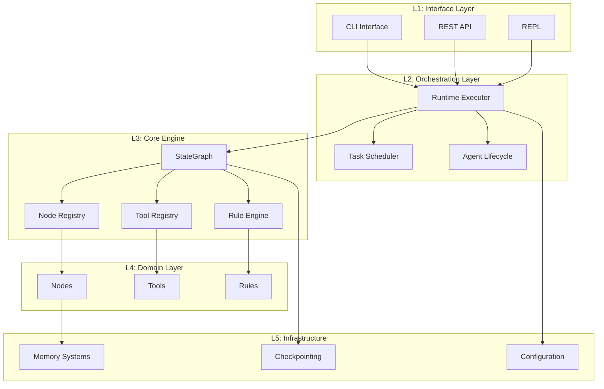
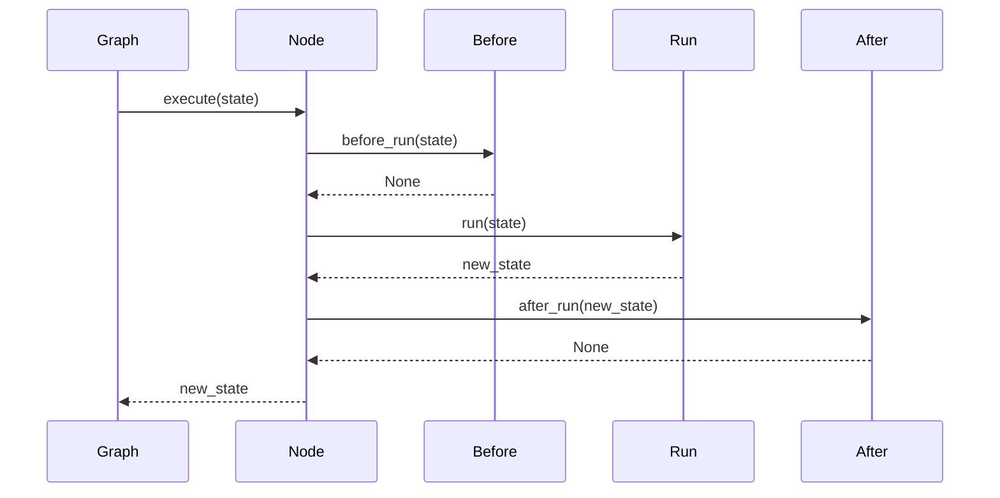
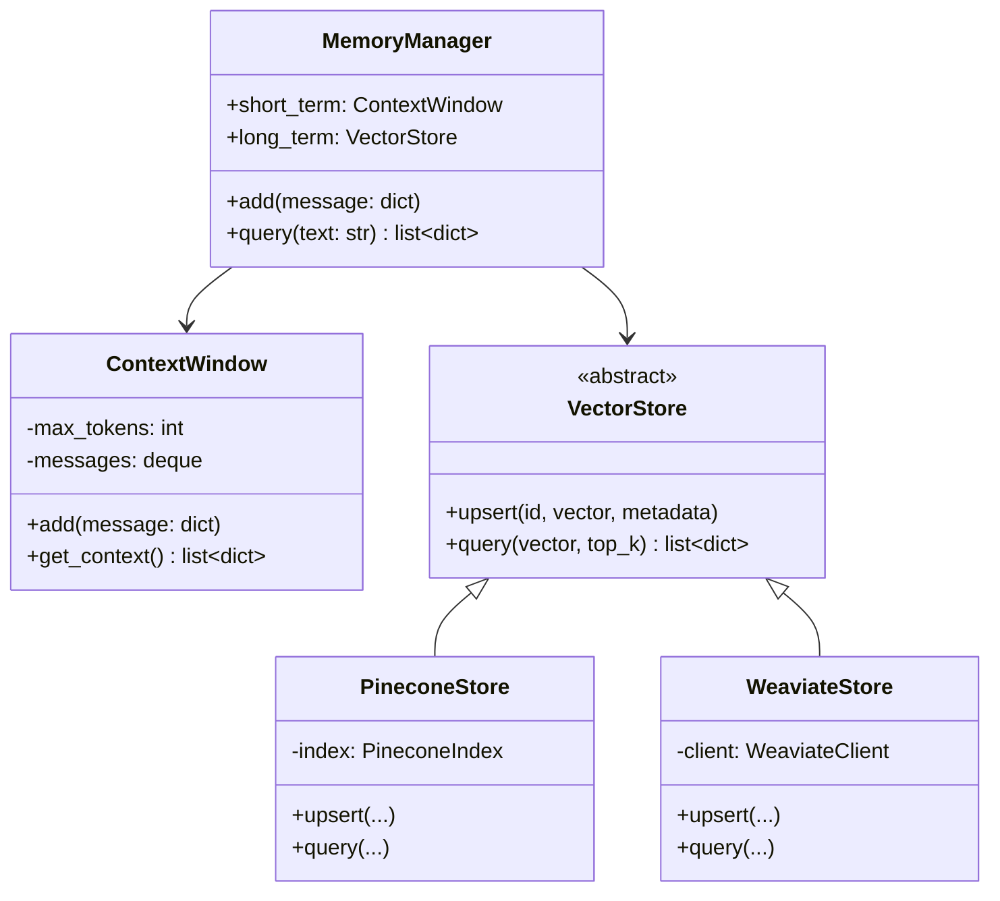
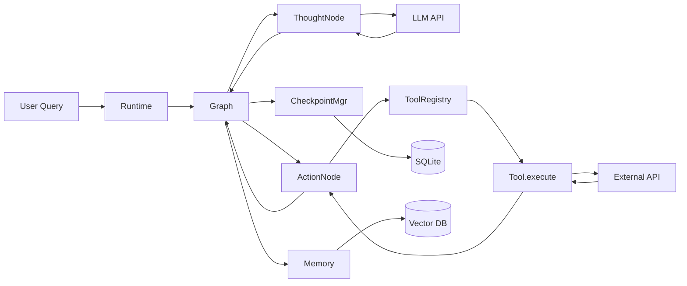
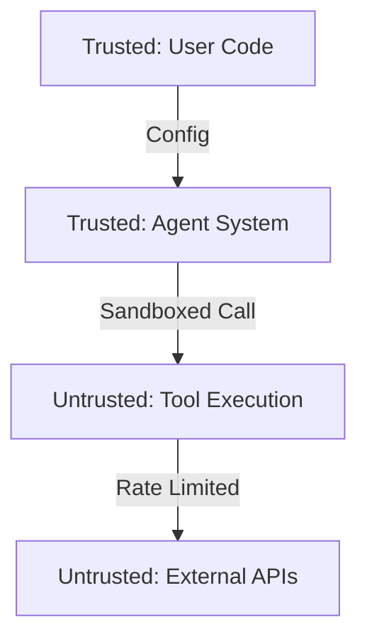
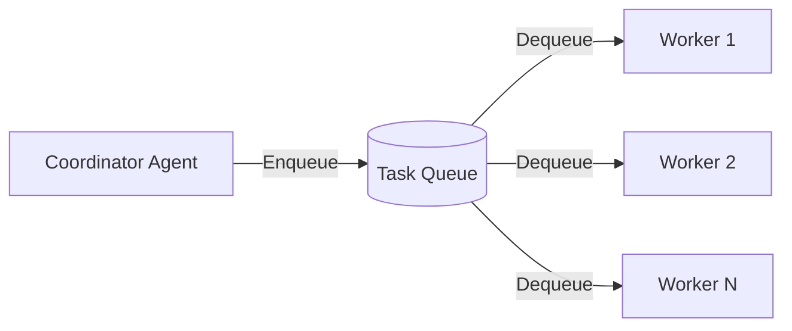

# Arkhon-Rheo + ReActEngine Architecture Overview

**Version**: 1.0.0  
**Status**: Draft  
**Last Updated**: 2026-02-14  
**Code Path**: `src/arkhon-rheo/`

---

## 1. Introduction

This document provides a comprehensive architectural overview of the Arkhon-Rheo agent system, detailing the component hierarchy, dependency relationships, and structural patterns that enable deterministic AI workflow execution.

**Audience**: Software architects, senior engineers, and technical stakeholders.

---

## 2. Architectural Principles

### 2.1 Core Tenets

1. **Event Sourcing First**: All state changes are immutable events
2. **Graph-based Execution**: Workflows modeled as directed graphs
3. **Rule-Driven Governance**: Explicit constraints via declarative rules
4. **Plugin Architecture**: Tools and memory backends are pluggable
5. **Zero Magic**: Explicit is better than implicit

### 2.2 Design Patterns

| Pattern | Usage | Location |
| :--- | :--- | :--- |
| **State Machine** | Execution flow control | `core/graph.py` |
| **Event Sourcing** | State management | `core/state.py` |
| **Registry** | Tool discovery | `tools/registry.py` |
| **Strategy** | Memory backend selection | `memory/vector_store.py` |
| **Chain of Responsibility** | Rule validation | `rules/rule_engine.py` |
| **Template Method** | Node execution lifecycle | `nodes/base.py` |

---

## 3. Component Hierarchy

### 3.1 Layered Architecture



### 3.2 Dependency Direction

**Rule**: Dependencies flow downward only (lower layers never depend on upper layers)

```mermaid
graph LR
Interface ──> Orchestration ──> Core ──> Domain ──> Infrastructure
```

**Benefits**:

- Clear separation of concerns
- Easier testing (mock lower layers)
- Modular replacement

---

## 4. Core Module Breakdown

### 4.1 `core/` - State Machine & Graph

**Purpose**: Deterministic execution engine

| Module | Responsibility | Key Classes |
| :--- | :--- | :--- |
| `state.py` | Immutable state management | `ReActState`, `ReasoningStep` |
| `graph.py` | Graph execution | `StateGraph`, `Edge` |
| `context.py` | Thread-local context | `ContextManager` |
| `step.py` | Step factory | `StepFactory` |

**Dependencies**:

```python
# core/graph.py
from arkhon_rheo.core.state import ReActState
from arkhon_rheo.nodes.base import BaseNode
from arkhon_rheo.rules.rule_engine import RuleEngine
```

**Invariants**:

- States are frozen dataclasses (immutable)
- Graph structure is acyclic (no infinite loops)
- Every edge has valid source and target nodes

---

### 4.2 `nodes/` - Execution Nodes

**Purpose**: Implement ReAct cycle phases

| Node | Input | Output | Side Effects |
| :--- | :--- | :--- | :--- |
| `ThoughtNode` | ReActState | State + thought | LLM API call |
| `ValidateNode` | State + thought | State (validated) | Rule checks |
| `ActionNode` | State + validated | State + action | Tool execution |
| `ObservationNode` | State + action | State + observation | Result formatting |
| `CommitNode` | State + observation | State (committed) | Checkpoint save |

**Node Lifecycle**:



**Example Node**:

```python
# nodes/thought_node.py
from arkhon_rheo.nodes.base import BaseNode
from arkhon_rheo.core.state import ReActState

class ThoughtNode(BaseNode):
    def before_run(self, state: ReActState) -> None:
        logger.info("entering_thought_node", step_count=len(state.steps))
        
    def run(self, state: ReActState) -> ReActState:
        thought = self.llm.generate(self._build_prompt(state))
        step = ReasoningStep(thought=thought, ...)
        return replace(state, steps=[*state.steps, step])
        
    def after_run(self, state: ReActState) -> None:
        logger.info("exiting_thought_node", thought_length=len(state.steps[-1].thought))
```

---

### 4.3 `tools/` - Tool Integration

**Purpose**: External API abstraction

**Structure**:

```text
tools/
├── base.py           # Tool, ToolResult
├── registry.py       # ToolRegistry
├── builtin/
│   ├── search.py
│   ├── calculator.py
│   └── file_ops.py
└── custom/           # User-defined tools
```

**Tool Interface**:

```python
from abc import ABC, abstractmethod

class Tool(ABC):
    @property
    @abstractmethod
    def name(self) -> str:
        """Unique tool identifier."""
        
    @property
    @abstractmethod
    def description(self) -> str:
        """Human-readable description for LLM."""
        
    @property
    def schema(self) -> dict:
        """JSON Schema generated from execute() signature."""
        return self._generate_schema()
        
    @abstractmethod
    def execute(self, **kwargs) -> ToolResult:
        """Execute tool with validated arguments."""
```

**Tool Registration**:

```python
# In user code
registry = ToolRegistry()

@registry.register
class CustomTool(Tool):
    name = "custom_action"
    description = "Performs custom action"
    
    def execute(self, param1: str, param2: int) -> ToolResult:
        result = do_work(param1, param2)
        return ToolResult(success=True, output=result)
```

---

### 4.4 `rules/` - Governance

**Purpose**: Enforce constraints on reasoning steps

**Rule Types**:

| Rule | Check | Violation Action |
| :--- | :--- | :--- |
| `MaxDepthRule` | `len(steps) < max_depth` | Terminate execution |
| `ForbidGuessingRule` | No "I guess" in thought | Retry thought |
| `CostLimitRule` | Total token cost < limit | Terminate execution |
| `RequireToolUseRule` | Action must be valid tool | Retry action selection |

**Rule Engine**:

```python
class RuleEngine:
    def __init__(self):
        self.rules: list[Rule] = []
        
    def add_rule(self, rule: Rule) -> None:
        self.rules.append(rule)
        
    def validate(self, step: ReasoningStep) -> None:
        """Run all rules. Raises RuleViolationError if any fail."""
        for rule in self.rules:
            if not rule.check(step):
                raise RuleViolationError(
                    rule=rule.name,
                    step=step,
                    reason=rule.violation_message
                )
```

**Custom Rule Example**:

```python
class NoHallucinationRule(Rule):
    name = "no_hallucination"
    
    def check(self, step: ReasoningStep) -> bool:
        """Fail if thought contains known hallucination indicators."""
        hallucination_phrases = [
            "I don't actually know",
            "I'm not sure but",
            "probably"
        ]
        return not any(
            phrase in step.thought.lower() 
            for phrase in hallucination_phrases
        )
        
    @property
    def violation_message(self) -> str:
        return "Thought contains uncertainty markers"
```

---

### 4.5 `memory/` - Memory Systems

**Purpose**: Short-term and long-term information storage

**Components**:



**Memory Hierarchy**:

1. **L1 - Context Window**: Last N messages (in-memory)
2. **L2 - Vector Store**: Semantic search over all history
3. **L3 - Checkpoints**: Full state snapshots on disk

---

### 4.6 `runtime/` - Execution Runtime

**Purpose**: Orchestrate graph execution

**Key Components**:

```python
class RuntimeExecutor:
    """Main execution coordinator."""
    
    def __init__(
        self,
        graph: StateGraph,
        config: EngineConfig,
        checkpoint_mgr: CheckpointManager
    ):
        self.graph = graph
        self.config = config
        self.checkpoint_mgr = checkpoint_mgr
        
    def run(
        self, 
        initial_state: ReActState,
        interrupt_fn: Callable | None = None
    ) -> ReActState:
        """Execute until termination or max steps."""
        state = initial_state
        
        for step in range(self.config.max_steps):
            # Checkpoint every N steps
            if step % self.config.checkpoint_interval == 0:
                self.checkpoint_mgr.save(state)
                
            # Human approval gate
            if interrupt_fn and interrupt_fn(state):
                user_decision = self._await_user_input()
                if user_decision == "abort":
                    return replace(state, terminated=True)
                    
            # Execute next node
            state = self.graph.step(state)
            
            if state.terminated:
                break
                
        return state
```

---

## 5. Data Flow

### 5.1 State Evolution

```mermaid
flowchart LR
    S0[Initial State<br/>steps: []] 
    S1[After Thought<br/>steps: [draft]]
    S2[After Validate<br/>steps: [validated]]
    S3[After Action<br/>steps: [executed]]
    S4[After Commit<br/>steps: [committed]]
    
    S0 -->|ThoughtNode| S1
    S1 -->|ValidateNode| S2
    S2 -->|ActionNode| S3
    S3 -->|CommitNode| S4
    S4 -->|Next cycle| S0
```

### 5.2 Information Flow



---

## 6. Extension Points

### 6.1 Custom Nodes

**How to Add**:

```python
from arkhon_rheo.nodes.base import BaseNode

class MyCustomNode(BaseNode):
    def run(self, state: ReActState) -> ReActState:
        # Custom logic
        return updated_state

# Register in graph
graph = StateGraph()
graph.add_node("custom", MyCustomNode())
```

### 6.2 Custom Tools

**How to Add**:

```python
from arkhon_rheo.tools.base import Tool, ToolResult

class MyTool(Tool):
    name = "my_tool"
    description = "Does X"
    
    def execute(self, arg1: str) -> ToolResult:
        result = perform_action(arg1)
        return ToolResult(success=True, output=result)

# Register
registry.register(MyTool())
```

### 6.3 Custom Rules

**How to Add**:

```python
from arkhon_rheo.rules.base import Rule

class MyRule(Rule):
    name = "my_rule"
    
    def check(self, step: ReasoningStep) -> bool:
        return custom_validation(step)
```

### 6.4 Custom Memory Backend

**How to Add**:

```python
from arkhon_rheo.memory.vector_store import VectorStore

class MyVectorStore(VectorStore):
    async def upsert(self, id, vector, metadata):
        # Custom implementation
        
    async def query(self, vector, top_k):
        # Custom implementation
```

---

## 7. Configuration System

### 7.1 Config Hierarchy

```yaml
# config/default.yaml (shipped with package)
engine:
  max_steps: 20
  checkpoint_interval: 5

# config/user.yaml (user's custom config)
engine:
  max_steps: 50  # Override default

# Environment variables (highest priority)
export ARKHON_RHEO_ENGINE_MAX_STEPS=100
```

**Resolution Order**: ENV > user.yaml > default.yaml

### 7.2 Config Schema

```python
from pydantic import BaseModel

class EngineConfig(BaseModel):
    max_steps: int = 20
    checkpoint_interval: int = 5
    interruptible: bool = False
    
class LLMConfig(BaseModel):
    provider: str
    model: str
    temperature: float = 0.0
    
class Config(BaseModel):
    engine: EngineConfig
    llm: LLMConfig
    tools: list[ToolConfig]
    rules: list[RuleConfig]
    memory: MemoryConfig
```

---

## 8. Security Architecture

### 8.1 Trust Boundaries



### 8.2 Sandboxing Strategy

**Principles**:

1. **Least Privilege**: Tools run with minimal permissions
2. **Timeout Enforcement**: All tool calls have 5s timeout
3. **Resource Limits**: Memory/CPU caps via cgroups
4. **Input Validation**: All tool inputs validated against JSON Schema

**Implementation**:

```python
import subprocess

def execute_sandboxed(tool: Tool, args: dict) -> ToolResult:
    # Validate inputs
    tool.validate_args(args)
    
    # Execute in subprocess with restrictions
    result = subprocess.run(
        ["python", "-c", tool.generate_code(args)],
        timeout=5,
        capture_output=True,
        env={"HOME": "/tmp/sandbox"},  # Isolated env
        user="sandbox_user",  # Non-root user
    )
    
    return parse_result(result)
```

---

## 9. Scalability Considerations

### 9.1 Vertical Scaling

**Current Bottlenecks**:

| Component | Bottleneck | Mitigation |
| :--- | :--- | :--- |
| LLM API | Network latency | Parallel calls, caching |
| Vector DB | Query latency | HNSW index, quantization |
| SQLite | Write throughput | WAL mode, batch writes |

### 9.2 Horizontal Scaling (Future)

**Distributed Execution** (v0.3.0):



**Technologies**:

- Task Queue: Celery / RQ
- Distributed State: Redis
- Coordination: Consul / etcd

---

## 10. Migration from LangGraph

### 10.1 Code Mapping

**LangGraph:**

```python
from langgraph.graph import StateGraph

class MyState(TypedDict):
    messages: list[dict]
    
def my_node(state: MyState) -> MyState:
    # Process
    return updated_state

graph = StateGraph(MyState)
graph.add_node("process", my_node)
graph.add_edge("process", END)
result = graph.compile().invoke(initial)
```

**Arkhon-Rheo:**

```python
from arkhon_rheo import StateGraph, FunctionNode
from dataclasses import dataclass

@dataclass
class MyState:
    messages: list[dict]
    
def my_node(state: MyState) -> MyState:
    # Process (same logic)
    return updated_state

graph = StateGraph()
graph.add_node("process", FunctionNode(my_node))
graph.add_edge("process", "__end__")
result = graph.run(initial)
```

**Key Differences**:

- Dataclasses instead of TypedDict (better type safety)
- `run()` instead of `compile().invoke()` (simpler API)
- Built-in rule engine (optional in LangGraph)

---

## 11. Observability Architecture

### 11.1 Logging Strategy

**Levels**:

| Level | Usage | Example |
| :--- | :--- | :--- |
| DEBUG | Step-by-step execution | "Entering ThoughtNode" |
| INFO | State transitions | "Step 3 completed" |
| WARNING | Recoverable errors | "Tool timeout, retrying" |
| ERROR | Unrecoverable errors | "Rule violation, terminating" |

**Structured Logging**:

```python
import structlog

logger = structlog.get_logger()

logger.info(
    "node_executed",
    node="ThoughtNode",
    step_id=5,
    tokens_used=120,
    duration_ms=850
)
```

### 11.2 Metrics

**Key Metrics**:

- `react_steps_total` - Counter of reasoning steps
- `node_latency_seconds` - Histogram of node execution time
- `tool_calls_total` - Counter by tool name
- `rule_violations_total` - Counter by rule name
- `llm_tokens_used` - Counter of token consumption

**Prometheus Export**:

```python
from prometheus_client import start_http_server, Counter

steps_counter = Counter("react_steps_total", "Total reasoning steps")

# In node execution
steps_counter.inc()

# Start metrics server
start_http_server(8000)
```

---

## 12. Testing Strategy

### 12.1 Test Architecture

```text
tests/
├── unit/              # Individual components
│   ├── test_state.py
│   ├── test_graph.py
│   └── test_rules.py
├── integration/       # Multi-component
│   ├── test_react_cycle.py
│   └── test_multi_agent.py
├── e2e/              # Full workflows
│   └── test_agent_workflow.py
└── fixtures/         # Shared test data
    └── conftest.py
```

### 12.2 Test Coverage Goals

- **Unit**: 95% line coverage
- **Integration**: All critical paths
- **E2E**: 3-5 realistic scenarios

---

### End of Architecture Document
