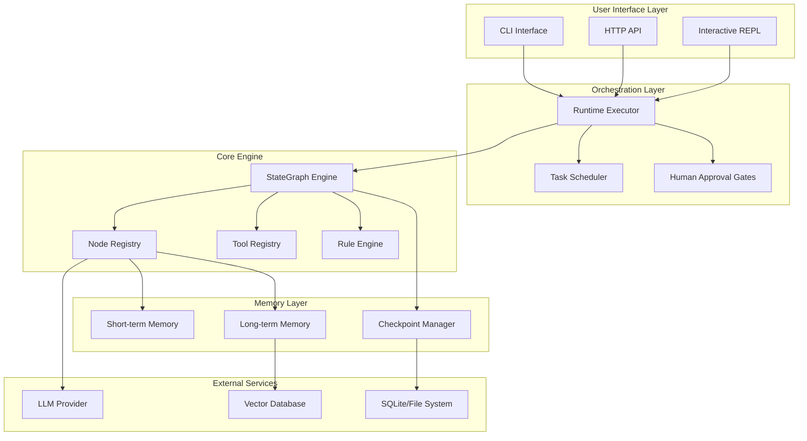
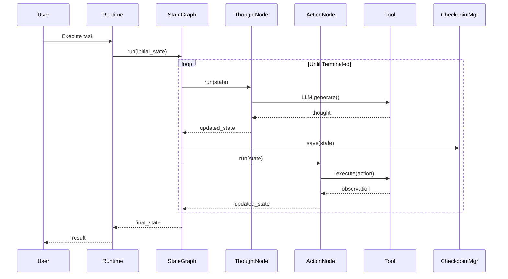
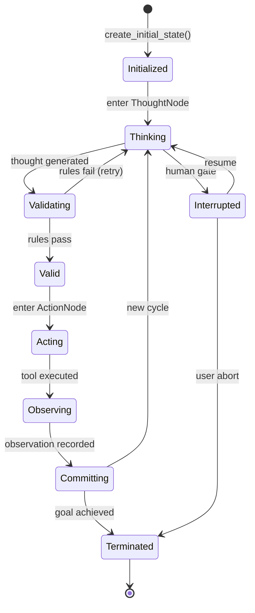
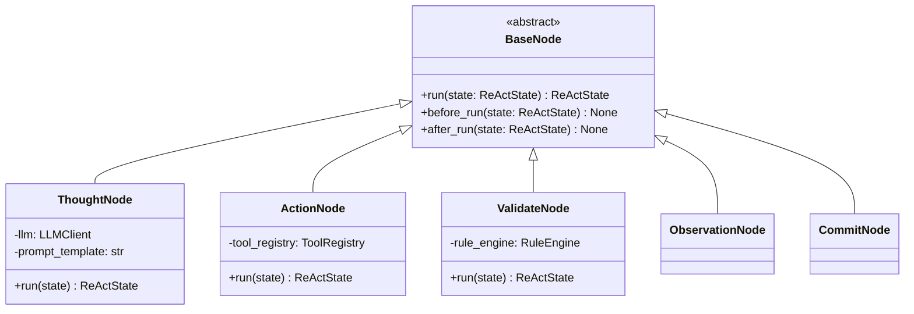
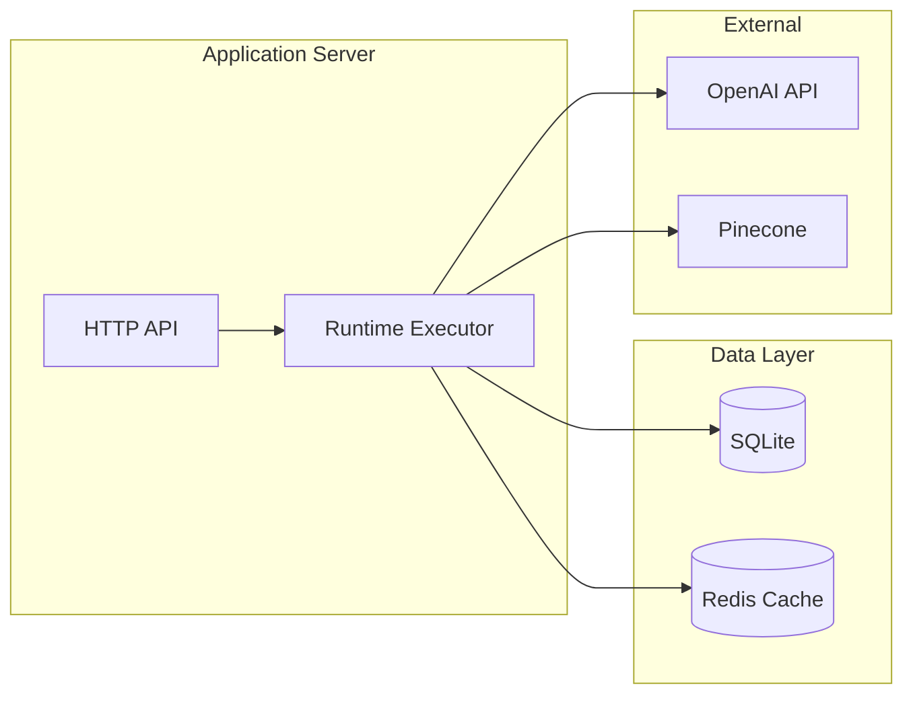

# Arkhon-Rheo + ReActEngine System Design

**Version**: 1.0.0  
**Status**: Draft  
**Last Updated**: 2026-02-14  
**Code Path**: `src/arkhon-rheo/`

---

## 1. System Architecture Overview

### 1.1 High-Level Architecture



### 1.2 Component Interaction Flow



---

## 2. Data Flow Analysis

### 2.1 State Lifecycle



### 2.2 Data Transformations

```python
# Initial State
ReActState(
    trace_id="abc123",
    steps=[],
    current_node="thought",
    metadata={},
    terminated=False
)

# After ThoughtNode
ReActState(
    trace_id="abc123",
    steps=[
        ReasoningStep(
            id=0,
            thought="I need to search for X",
            action=None,
            observation=None,
            status="draft"
        )
    ],
    current_node="validate",
    ...
)

# After ActionNode
ReActState(
    trace_id="abc123",
    steps=[
        ReasoningStep(
            id=0,
            thought="I need to search for X",
            action="search",
            action_input={"query": "X"},
            observation="Found: ...",
            status="executed"
        )
    ],
    current_node="commit",
    ...
)
```

---

## 3. Node Design Patterns

### 3.1 Node Architecture



### 3.2 ThoughtNode Implementation

```python
class ThoughtNode(BaseNode):
    """Generates reasoning thoughts using LLM."""
    
    def __init__(self, llm: LLMClient, prompt_template: str):
        self.llm = llm
        self.prompt_template = prompt_template
        
    def run(self, state: ReActState) -> ReActState:
        # Build prompt from state history
        prompt = self._build_prompt(state)
        
        # Get LLM response
        thought = self.llm.generate(
            prompt=prompt,
            max_tokens=500,
            temperature=0.0
        )
        
        # Create new reasoning step
        step = ReasoningStep(
            id=len(state.steps),
            thought=thought,
            action=None,
            action_input=None,
            observation=None,
            status="draft",
            timestamp=datetime.now()
        )
        
        # Append to state (immutable update)
        new_steps = [*state.steps, step]
        
        # Transition to validate node
        return replace(
            state,
            steps=new_steps,
            current_node="validate"
        )
        
    def _build_prompt(self, state: ReActState) -> str:
        """Build prompt from conversation history."""
        context = \"\\n\".join(
            f\"Thought: {s.thought}\\nAction: {s.action}\\nObservation: {s.observation}\"
            for s in state.steps[-5:]  # Last 5 steps
        )
        return self.prompt_template.format(context=context)
```

### 3.3 ActionNode with Error Handling

```python
class ActionNode(BaseNode):
    def run(self, state: ReActState) -> ReActState:
        step = state.steps[-1]
        
        # Extract action from thought
        action, action_input = self._parse_action(step.thought)
        
        # Execute tool with retry logic
        observation = self._execute_with_retry(
            action=action,
            args=action_input,
            max_retries=3
        )
        
        # Update step with results
        updated_step = replace(
            step,
            action=action,
            action_input=action_input,
            observation=observation,
            status="executed"
        )
        
        # Replace last step (immutable)
        new_steps = [*state.steps[:-1], updated_step]
        
        return replace(
            state,
            steps=new_steps,
            current_node="commit"
        )
        
    def _execute_with_retry(
        self, 
        action: str, 
        args: dict, 
        max_retries: int
    ) -> str:
        for attempt in range(max_retries):
            try:
                tool = self.tool_registry.get(action)
                result = tool.execute(**args)
                return result.output
            except ToolExecutionError as e:
                if attempt == max_retries - 1:
                    return f\"Error: {e}\"
                time.sleep(2 ** attempt)  # Exponential backoff
```

---

## 4. Error Handling Strategy

### 4.1 Error Categories

| Category | Example | Strategy |
| :--- | :--- | :--- |
| **Transient** | API rate limit | Retry with exponential backoff |
| **Invalid Input** | Malformed JSON | Fail fast, log, request retry |
| **Rule Violation** | Max depth exceeded | Terminate execution, notify user |
| **Resource Exhaustion** | Out of memory | Checkpoint, cleanup, resume |

### 4.2 Error Propagation

```python
class ErrorHandler:
    def handle_error(
        self, 
        error: Exception, 
        state: ReActState, 
        context: dict
    ) -> ReActState:
        if isinstance(error, RuleViolationError):
            # Log and terminate
            logger.error("rule_violation", rule=error.rule, state=state)
            return replace(state, terminated=True, metadata={
                \"error\": str(error),
                \"type\": \"rule_violation\"
            })
            
        elif isinstance(error, ToolExecutionError):
            # Add error to observation
            step = state.steps[-1]
            error_step = replace(
                step,
                observation=f\"Error: {error}\",
                status=\"failed\"
            end_text)
            return replace(state, steps=[*state.steps[:-1], error_step])
            
        else:
            # Unexpected error - checkpoint and raise
            CheckpointManager().save(state)
            raise
```

---

## 5. Performance Optimization

### 5.1 Latency Breakdown

| Component | Target Latency | Optimization |
| :--- | :--- | :--- |
| LLM API call | 500-2000ms | Parallel calls where possible |
| Tool execution | <100ms | Local tools preferred |
| State validation | <10ms | Cached rule evaluation |
| Checkpoint save | <50ms | Async writes to SQLite |

### 5.2 Caching Strategy

```python
from functools import lru_cache

class ToolRegistry:
    @lru_cache(maxsize=128)
    def get_schema(self, tool_name: str) -> dict:
        \"\"\"Cached tool schema lookup.\"\"\"
        tool = self.tools[tool_name]
        return tool.schema
        
class RuleEngine:
    def __init__(self):
        self._rule_cache: dict[str, bool] = {}
        
    def validate(self, step: ReasoningStep) -> None:
        cache_key = hash((step.thought, step.action))
        
        if cache_key in self._rule_cache:
            if not self._rule_cache[cache_key]:
                raise RuleViolationError(\"Cached violation\")
            return
            
        # Run validation
        for rule in self.rules:
            rule.check(step)
            
        self._rule_cache[cache_key] = True
```

### 5.3 Memory Management

```python
class ContextWindow:
    def __init__(self, max_tokens: int = 8000):
        self.max_tokens = max_tokens
        self.messages: deque = deque(maxlen=100)  # Cap message count
        
    def add(self, message: dict) -> None:
        self.messages.append(message)
        
        # Evict oldest if over token limit
        while self._token_count() > self.max_tokens:
            self.messages.popleft()
            
    def _token_count(self) -> int:
        # Fast approximate count
        return sum(len(m[\"content\"]) // 4 for m in self.messages)
```

---

## 6. Security & Sandboxing

### 6.1 Tool Sandboxing

```python
class SandboxedTool(Tool):
    \"\"\"Execute tools in restricted environment.\"\"\"
    
    ALLOWED_MODULES = {\"math\", \"json\", \"datetime\"}
    BLOCKED_FUNCTIONS = {\"eval\", \"exec\", \"__import__\"}
    
    def execute(self, **kwargs) -> ToolResult:
        # Validate no dangerous operations
        self._validate_args(kwargs)
        
        # Execute in subprocess with timeout
        result = subprocess.run(
            [\"python\", \"-c\", self._generate_code(kwargs)],
            timeout=5,
            capture_output=True,
            env={\"HOME\": \"/tmp/sandbox\"}  # Isolated environment
        )
        
        return ToolResult(
            success=result.returncode == 0,
            output=result.stdout.decode()
        )
        
    def _validate_args(self, args: dict) -> None:
        \"\"\"Check for injection attempts.\"\"\"
        for value in args.values():
            if any(blocked in str(value) for blocked in self.BLOCKED_FUNCTIONS):
                raise SecurityError(f\"Blocked function in input: {value}\")
```

### 6.2 Secrets Management

**Principles**:

1. **Never log secrets**: Redact API keys in logs
2. **Env vars only**: No secrets in code/config files
3. **Rotation**: Support key rotation without code changes

```python
import os
from dataclasses import dataclass

@dataclass
class SecretsManager:
    @staticmethod
    def get_secret(key: str) -> str:
        value = os.getenv(key)
        if not value:
            raise ValueError(f\"Missing required secret: {key}\")
        return value
        
    @staticmethod
    def redact_log(message: str) -> str:
        \"\"\"Redact API keys from log messages.\"\"\"
        patterns = [
            (r\"sk-[a-zA-Z0-9]{48}\", \"sk-***\"),  # OpenAI
            (r\"Bearer [a-zA-Z0-9-_]+\", \"Bearer ***\"),  # JWT
        ]
        for pattern, replacement in patterns:
            message = re.sub(pattern, replacement, message)
        return message
```

---

## 7. Testing Strategy

### 7.1 Test Pyramid

```text
     /\\
    /E2E\\       5 tests  - Full agent workflows
   /------\\
  /Integ  \\    30 tests - Multi-node scenarios
 /----------\\
/   Unit    \\  150 tests - Individual components
--------------
```

### 7.2 Test Fixtures

```python
# tests/conftest.py
import pytest

@pytest.fixture
def mock_llm():
    \"\"\"Mock LLM that returns predefined responses.\"\"\"
    class MockLLM:
        def generate(self, prompt: str, **kwargs) -> str:
            return \"I should search for information\"
    return MockLLM()

@pytest.fixture
def sample_state():
    return ReActState(
        trace_id=\"test-123\",
        steps=[],
        current_node=\"thought\",
        metadata={},
        terminated=False
    )

@pytest.fixture
def tool_registry():
    registry = ToolRegistry()
    registry.register(MockSearchTool())
    return registry
```

### 7.3 Integration Test Example

```python
def test_full_react_cycle(mock_llm, tool_registry):
    \"\"\"Test complete thought→action→observation cycle.\"\"\"
    # Setup
    graph = StateGraph()
    graph.add_node(\"thought\", ThoughtNode(mock_llm))
    graph.add_node(\"action\", ActionNode(tool_registry))
    graph.add_edge(\"thought\", \"action\")
    
    initial_state = ReActState(
        trace_id=\"test\",
        steps=[],
        current_node=\"thought\"
    )
    
    # Execute
    final_state = graph.run(initial_state, max_steps=3)
    
    # Assert
    assert len(final_state.steps) >= 1
    assert final_state.steps[0].thought is not None
    assert final_state.steps[0].observation is not None
```

---

## 8. Deployment Architecture

### 8.1 Local Development

```text
Developer Machine
├── src/arkhon-rheo/  (Development codebase)
├── .env               (Secrets)
├── config/dev.yaml    (Dev config)
└── .checkpoints.db    (State persistence)
```

### 8.2 Production Deployment



---

## 9. Observability

### 9.1 Structured Logging

```python
import structlog

logger = structlog.get_logger()

# In StateGraph.run()
logger.info(
    \"graph_execution_start\",
    trace_id=state.trace_id,
    initial_node=state.current_node
)

# In nodes
logger.debug(
    \"node_execution\",
    node=self.__class__.__name__,
    step_id=len(state.steps)
)

logger.info(
    \"graph_execution_complete\",
    trace_id=state.trace_id,
    total_steps=len(state.steps),
    duration_ms=(end - start) * 1000
)
```

### 9.2 Metrics Collection

```python
from prometheus_client import Counter, Histogram

# Define metrics
step_counter = Counter(\"react_steps_total\", \"Total reasoning steps executed\")
latency_histogram = Histogram(\"node_latency_seconds\", \"Node execution latency\")

# In node execution
with latency_histogram.time():
    result = self.run(state)
    step_counter.inc()
```

---

### End of Design Document
