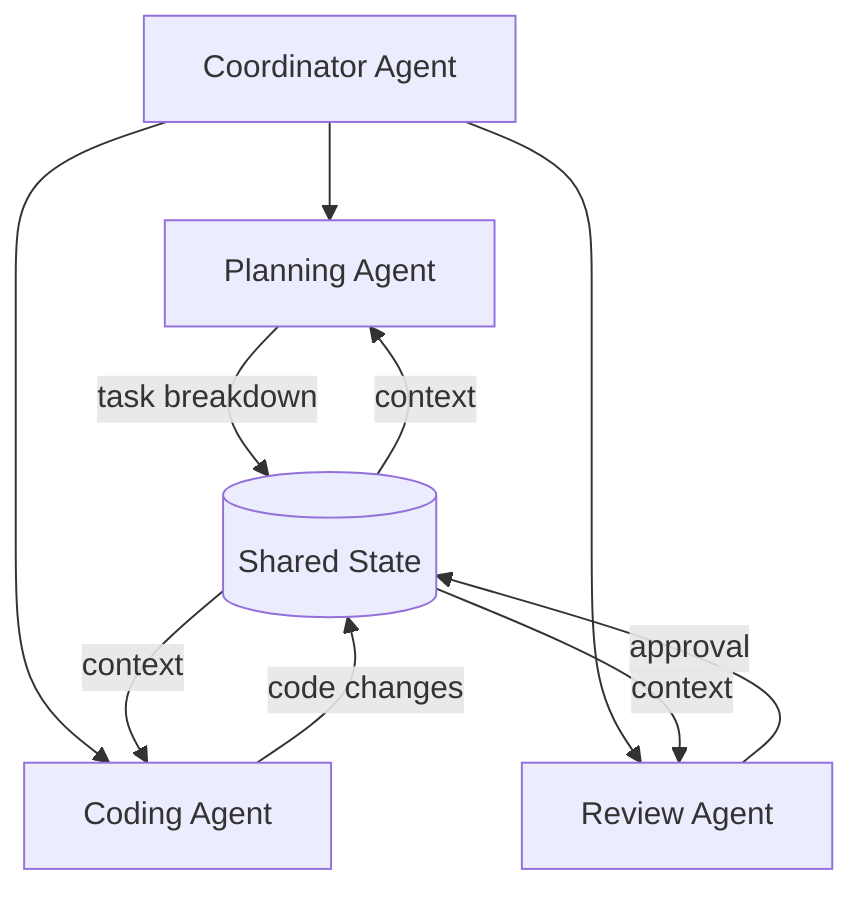

# Arkhon-Rheo + ReActEngine Technical Specification

**Version**: 1.0.0  
**Status**: Draft  
**Last Updated**: 2026-02-14  
**Target**: Python 3.12+

---

## Document Purpose

This specification defines the technical requirements, architecture, and implementation details for **Arkhon-Rheo**, a production-grade autonomous agent system built on the **ReActEngine** OOP architecture. The system is isomorphic to LangGraph's StateGraph model but provides full control, configurability, and extensibility through YAML-driven configuration and pluggable components.

**Core Philosophy**:

- **Arkhon-Rheo**: The philosophical framework and governance standards
- **ReActEngine**: The concrete OOP implementation
- **Integration**: Philosophy ⟺ Code Architecture

---

## 1. System Overview

### 1.1 Architecture Philosophy

Arkhon-Rheo is a **Deterministic AI Workflow Engine** combining:

```text
Deterministic AI Workflow Engine
+
Event Log (Event Sourcing)
+  
State Machine (Finite State Automation)
+
Policy Layer (Rule Engine)
```

**NOT** a prompt hack or simple LLM wrapper.

### 1.2 Core Principles

1. **State Machine Driven**: All agent behavior is governed by explicit state transitions
2. **Event Sourcing**: Every reasoning step is immutable and append-only  
3. **YAML Configuration**: Runtime behavior configured declaratively
4. **Tool Pluggability**: Tools are registered dynamically via JSON Schema
5. **Rule Engine Extensibility**: Custom governance rules via YAML
6. **LangGraph Isomorphism**: Structurally equivalent to LangGraph for easy migration

### 1.3 Code Location

```text
src/arkhon-rheo/                # Agent system root
├── core/                       # State machine & graph
├── nodes/                      # ReAct nodes (Thought/Action/Observation)
├── tools/                      # Tool registry & implementations  
├── rules/                      # Governance & validation
├── config/                     # YAML schema & loader
└── runtime/                    # Execution & checkpointing

# Execution entry point
python src/arkhon-rheo/dev.py  # Run agent system for DLAMP development
```

### 1.4 Design Constraints

| Constraint | Value | Rationale |
| :--- | :--- | :--- |
| Python Version | 3.12+ | Modern type hints (PEP 695), performance |
| Integration | Standalone | Temporary plugin, no DLAMP/Hydra coupling |
| Configuration | YAML | Human-readable, version-controllable |
| GPU Support | None | CPU-only inference |
| Deployment | Local/Edge | Development agent system |

---

## 2. Phase 1: Production Code Standards

### 2.1 PEP8 Compliance

All code MUST adhere to **PEP 8** with exceptions managed via `ruff.toml`:

```toml
# pyproject.toml
[tool.ruff]
line-length = 100
target-version = "py312"

[tool.ruff.lint]
select = ["E", "F", "I", "N", "W", "UP"]
ignore = ["E501"]  # Line too long (managed by formatter)
```

**Enforcement**:

```bash
ruff check src/arkhon-rheo/
ruff format src/arkhon-rheo/
```

### 2.2 Docstring Standards

**Google Style** docstrings for all public APIs:

```python
def create_state_graph(config: GraphConfig) -> StateGraph:
    """Create a StateGraph instance from configuration.
    
    Args:
        config: Graph configuration object containing nodes and edges.
        
    Returns:
        Initialized StateGraph ready for execution.
        
    Raises:
        ValidationError: If config contains invalid node/edge definitions.
        
    Example:
        >>> config = GraphConfig.from_yaml("graph.yaml")
        >>> graph = create_state_graph(config)
        >>> result = graph.run(initial_state)
    """
    ...
```

### 2.3 Type Hints Strategy (Python 3.12+)

**Modern type syntax** with PEP 695 (type parameter syntax):

```python
from collections.abc import Callable
from typing import Protocol

# Generic type aliases (PEP 695)
type NodeExecutor[T] = Callable[[T], T]
type StateTransformer[S] = Callable[[S], S | None]

# Protocols for structural typing
class Executable(Protocol):
    def execute(self, **kwargs) -> ToolResult: ...

# Dataclasses with frozen=True for immutability
from dataclasses import dataclass

@dataclass(frozen=True, slots=True)
class ReasoningStep:
    id: int
    thought: str | None
    action: str | None
    action_input: dict[str, Any] | None
    observation: str | None
    status: str  # "draft" | "validated" | "executed"
    timestamp: datetime
```

**Type checking**:

```bash
mypy --strict src/arkhon-rheo/
```

### 2.4 Error Handling Patterns

**Custom exception hierarchy**:

```python
class ReActEngineError(Exception):
    """Base exception for all ReActEngine errors."""
    
class StateTransitionError(ReActEngineError):
    """Illegal state transition attempted."""
    
class ToolExecutionError(ReActEngineError):
    """Tool execution failed."""
    
class RuleViolationError(ReActEngineError):
    """Governance rule violated."""
```

**Error handling guidelines**:

1. **Fail Fast**: Raise exceptions for invariant violations
2. **Context Preservation**: Use `raise ... from e` to preserve traceback
3. **Structured Logging**: Log errors with context before raising
4. **Recovery**: Implement retry logic for transient failures

```python
import structlog

logger = structlog.get_logger()

def execute_tool(tool: Tool, args: dict) -> ToolResult:
    try:
        result = tool.execute(**args)
    except KeyError as e:
        logger.error("tool_missing_param", tool=tool.name, error=str(e))
        raise ToolExecutionError(f"Missing parameter: {e}") from e
    except Exception as e:
        logger.exception("tool_execution_failed", tool=tool.name)
        raise ToolExecutionError(f"Tool '{tool.name}' failed") from e
    else:
        logger.info("tool_executed", tool=tool.name, success=True)
        return result
```

---

## 3. Phase 2: Multi-Agent Architecture

### 3.1 Agent Graph Topology

**Hierarchical multi-agent structure**:



**Roles**:

| Agent | Responsibility | Input | Output |
| :--- | :--- | :--- | :--- |
| Coordinator | Task routing & aggregation | User request | Subtask assignments |
| Planning Agent | Decompose tasks into steps | High-level goal | Task plan (JSON) |
| Coding Agent | Implement code changes | Task spec | Code diffs |
| Review Agent | Validate code quality | Code changes | Approval/rejection |

### 3.2 Inter-Agent Communication Protocol

**Message passing via shared state**:

```python
@dataclass
class AgentMessage:
    sender: str  # Agent ID
    receiver: str  # Target agent ID or "broadcast"
    message_type: str  # "request" | "response" | "notification"
    payload: dict[str, Any]
    timestamp: datetime
    correlation_id: str  # For request-response tracking

@dataclass
class SharedAgentState:
    messages: list[AgentMessage]
    context: dict[str, Any]
    locks: dict[str, str]  # Resource locks {resource_id: agent_id}
```

**Communication example**:

```python
# Coordinator sends task to Coding Agent
coordinator.send_message(AgentMessage(
    sender="coordinator",
    receiver="coder",
    message_type="request",
    payload={
        "task": "implement_login_validation",
        "spec": {...}
    },
    timestamp=datetime.now(),
    correlation_id=uuid.uuid4().hex
))

# Coding Agent responds
coder.send_message(AgentMessage(
    sender="coder",
    receiver="coordinator",
    message_type="response",
    payload={
        "status": "completed",
        "diff": "...",
        "tests_pass": True
    },
    correlation_id=original_message.correlation_id,
    timestamp=datetime.now()
))
```

### 3.3 Subgraph Nesting Mechanism

**Nested execution graphs**:

```python
class SubGraph:
    """A graph that can be embedded as a node in a parent graph."""
    
    def __init__(self, name: str):
        self.name = name
        self.graph = StateGraph()
        
    def as_node(self) -> BaseNode:
        """Convert this subgraph into a node executable by parent graph."""
        return SubGraphNode(subgraph=self)

# Usage
main_graph = StateGraph()
auth_subgraph = SubGraph("authentication")
auth_subgraph.graph.add_node("validate", ValidateCredentialsNode())
auth_subgraph.graph.add_node("generate_token", GenerateTokenNode())
auth_subgraph.graph.add_edge("validate", "generate_token")

main_graph.add_node("auth", auth_subgraph.as_node())
main_graph.add_node("process", ProcessRequestNode())
main_graph.add_edge("auth", "process")
```

### 3.4 Agent Lifecycle Management

**State transitions**:

```text
[Idle] --spawn--> [Initializing] --ready--> [Active] --task--> [Executing]
                                                 ^                  |
                                                 |--complete--------|
                                                 |
[Active] --shutdown--> [Terminating] --cleanup--> [Terminated]
```

**Implementation**:

```python
class AgentLifecycle:
    async def spawn(self, agent_id: str, config: AgentConfig) -> Agent:
        """Initialize and activate a new agent instance."""
        agent = Agent(id=agent_id, config=config)
        await agent.initialize()
        self.active_agents[agent_id] = agent
        return agent
        
    async def shutdown(self, agent_id: str) -> None:
        """Gracefully terminate an agent."""
        agent = self.active_agents.get(agent_id)
        if agent:
            await agent.cleanup()
            del self.active_agents[agent_id]
```

---

## 4. Phase 3: Memory & Storage

### 4.1 Short-term Memory (Context Window)

**Sliding window implementation**:

```python
class ContextWindow:
    """Manages recent conversation history within token limits."""
    
    def __init__(self, max_tokens: int = 8000):
        self.max_tokens = max_tokens
        self.messages: list[dict] = []
        
    def add(self, message: dict) -> None:
        """Add message and evict oldest if exceeding limit."""
        self.messages.append(message)
        while self._token_count() > self.max_tokens:
            self.messages.pop(0)
            
    def _token_count(self) -> int:
        # Approximate token count
        return sum(len(m["content"]) // 4 for m in self.messages)
```

### 4.2 Long-term Memory (Vector Store Integration)

**Pluggable vector store backends**:

```python
from abc import ABC, abstractmethod

class VectorStore(ABC):
    @abstractmethod
    async def upsert(self, id: str, vector: list[float], metadata: dict) -> None:
        """Insert or update a vector."""
        
    @abstractmethod
    async def query(self, vector: list[float], top_k: int = 5) -> list[dict]:
        """Retrieve top-k similar vectors."""

# Implementations
class PineconeStore(VectorStore):
    def __init__(self, api_key: str, index_name: str):
        import pinecone
        self.index = pinecone.Index(index_name)
        
class WeaviateStore(VectorStore):
    def __init__(self, url: str):
        import weaviate
        self.client = weaviate.Client(url)
```

**YAML configuration**:

```yaml
memory:
  short_term:
    type: sliding_window
    max_tokens: 8000
    
  long_term:
    type: pinecone
    api_key: ${PINECONE_API_KEY}
    index: agent-memory
    embedding_model: text-embedding-3-small
    
  retrieval:
    strategy: hybrid  # keyword + semantic
    top_k: 5
    min_score: 0.7
```

### 4.3 Checkpointing & State Persistence

**SQLite-backed checkpointing**:

```python
import sqlite3
import json

class CheckpointManager:
    def __init__(self, db_path: str = ".checkpoints.db"):
        self.conn = sqlite3.connect(db_path)
        self._init_schema()
        
    def _init_schema(self):
        self.conn.execute("""
            CREATE TABLE IF NOT EXISTS checkpoints (
                trace_id TEXT PRIMARY KEY,
                state BLOB,
                timestamp REAL
            )
        """)
        
    def save(self, state: ReActState) -> None:
        """Save state to checkpoint."""
        serialized = json.dumps(asdict(state))
        self.conn.execute(
            "INSERT OR REPLACE INTO checkpoints VALUES (?, ?, ?)",
            (state.trace_id, serialized, time.time())
        )
        self.conn.commit()
        
    def load(self, trace_id: str) -> ReActState | None:
        """Restore state from checkpoint."""
        row = self.conn.execute(
            "SELECT state FROM checkpoints WHERE trace_id = ?",
            (trace_id,)
        ).fetchone()
        return ReActState(**json.loads(row[0])) if row else None
```

### 4.4 Rollback Mechanism

**Temporal rollback to any previous step**:

```python
def rollback_to_step(state: ReActState, step_id: int) -> ReActState:
    """Rollback state to a specific reasoning step."""
    if step_id >= len(state.steps):
        raise ValueError(f"Invalid step_id: {step_id}")
        
    return replace(
        state,
        steps=state.steps[:step_id + 1],
        current_node="thought"  # Reset to thought node
    )
```

---

## 5. Phase 4: Framework Packaging

### 5.1 Package Structure

```text
arkhon-rheo/
├── pyproject.toml
├── README.md
├── LICENSE
├── src/
│   └── arkhon_rheo/
│       ├── __init__.py
│       ├── core/
│       ├── nodes/
│       ├── tools/
│       ├── rules/
│       ├── config/
│       ├── runtime/
│       └── cli/
├── tests/
├── examples/
└── docs/
```

### 5.2 `pyproject.toml` Configuration

```toml
[project]
name = "arkhon-rheo"
version = "0.1.0"
description = "Production-grade autonomous agent system with ReActEngine"
requires-python = ">=3.12"
dependencies = [
    "pydantic>=2.0",
    "pyyaml>=6.0",
    "structlog>=23.0",
]

[project.optional-dependencies]
dev = ["pytest", "ruff", "mypy"]
vectorstore = ["pinecone-client", "weaviate-client"]

[project.scripts]
arkhon-rheo = "arkhon_rheo.cli:main"

[build-system]
requires = ["hatchling"]
build-backend = "hatchling.build"

[tool.ruff]
line-length = 100
target-version = "py312"
```

### 5.3 Distribution Strategy

**PyPI publishing workflow**:

```bash
# Build
python -m build

# Test upload to TestPyPI
twine upload --repository testpypi dist/*

# Production upload
twine upload dist/*
```

### 5.4 CLI Scaffolding Tool

**Generate new agent projects**:

```bash
# Create new project
arkhon-rheo init my-agent --template basic

# Generated structure
my-agent/
├── config/
│   └── default.yaml
├── tools/
│   └── custom_tool.py
├── main.py
└── README.md
```

---

## 6. API Reference

### 6.1 Core Classes

#### `ReActState`

```python
@dataclass
class ReActState:
    """Immutable state container for agent execution."""
    
    trace_id: str  # Unique execution identifier
    steps: list[ReasoningStep]  # Append-only event log
    current_node: str  # Current state machine node
    metadata: dict[str, Any]  # Arbitrary metadata
    terminated: bool = False  # Execution complete flag
```

#### `BaseNode`

```python
class BaseNode(ABC):
    """Abstract base for all graph nodes."""
    
    @abstractmethod
    def run(self, state: ReActState) -> ReActState:
        """Execute node logic and return updated state."""
```

#### `StateGraph`

```python
class StateGraph:
    """Directed graph of nodes with conditional edges."""
    
    def __init__(self):
        self.nodes: dict[str, BaseNode] = {}
        self.edges: dict[str, str | Callable] = {}
        
    def add_node(self, name: str, node: BaseNode) -> None:
        """Register a node."""
        
    def add_edge(self, source: str, target: str) -> None:
        """Add unconditional edge."""
        
    def add_conditional_edge(
        self, 
        source: str, 
        condition: Callable[[ReActState], str]
    ) -> None:
        """Add conditional edge with routing function."""
        
    def run(self, initial_state: ReActState) -> ReActState:
        """Execute graph until termination."""
```

### 6.2 Tool Registry API

```python
class ToolRegistry:
    """Central registry for agent tools."""
    
    def register(self, tool: Tool) -> None:
        """Register a tool by name."""
        
    def get(self, name: str) -> Tool:
        """Retrieve a registered tool."""
        
    def list_tools(self) -> list[ToolSchema]:
        """Get JSON Schema for all tools."""
```

### 6.3 Rule Engine API

```python
class RuleEngine:
    """Validates reasoning steps against governance rules."""
    
    def add_rule(self, rule: Rule) -> None:
        """Register a validation rule."""
        
    def validate(self, step: ReasoningStep) -> None:
        """Run all rules against a step. Raises RuleViolationError if invalid."""
```

---

## 7. LangGraph Equivalence Mapping

| Arkhon-Rheo | LangGraph | Notes |
| :--- | :--- | :--- |
| `ReActState` | `State` | Type-safe dataclass vs dict |
| `BaseNode` | `Node` | Abstract class vs function |
| `StateGraph` | `StateGraph` | Identical concept |
| `add_edge` | `add_edge` | 1:1 mapping |
| `add_conditional_edge` | `add_conditional_edges` | Same semantics |
| `run()` | `invoke()` | Synchronous execution |
| `CheckpointManager` | `checkpointer` | SQLite vs MemorySaver |
| `RuleEngine` | (middleware) | Built-in vs custom |

**Migration from LangGraph**:

```python
# LangGraph
from langgraph.graph import StateGraph

graph = StateGraph(MyState)
graph.add_node("process", process_func)
graph.add_edge("process", "end")
result = graph.compile().invoke(initial)

# Arkhon-Rheo equivalent
from arkhon_rheo import StateGraph, FunctionNode

graph = StateGraph()
graph.add_node("process", FunctionNode(process_func))
graph.add_edge("process", "__end__")
result = graph.run(initial)
```

---

## 8. Configuration Schema (YAML)

**Complete example**:

```yaml
engine:
  max_steps: 20  # Maximum reasoning iterations
  checkpoint: true
  interruptible: true  # Allow human intervention
  
llm:
  provider: openai
  model: gpt-4o-mini
  temperature: 0.0
  
tools:
  - name: search
    module: arkhon_rheo.tools.builtin.search
    enabled: true
  - name: calculator
    module: arkhon_rheo.tools.builtin.calculator
    enabled: true
    
rules:
  - type: max_depth
    value: 10
  - type: forbid_guessing
    enabled: true
  - type: cost_limit
    value: 0.50  # Max $0.50 per execution
    
memory:
  short_term:
    max_tokens: 8000
  long_term:
    type: pinecone
    index: agent-memory
```

---

## 9. Testing Requirements

### 9.1 Unit Test Coverage

- **Target**: 90%+ line coverage
- **Framework**: pytest
- **Fixtures**: Shared test data in `tests/conftest.py`

### 9.2 Integration Testing

- Test multi-agent workflows end-to-end
- Validate checkpoint/restore cycles
- Test tool execution with mocked LLMs

### 9.3 Type Checking

```bash
mypy --strict src/arkhon-rheo/
```

---

## 10. Security Considerations

1. **Input Validation**: All tool inputs validated against JSON Schema
2. **Sandboxing**: Tools execute in restricted environments
3. **Secrets Management**: API keys via environment variables only
4. **Audit Logging**: All state transitions logged immutably

---

## Appendix A: Glossary

- **ReActState**: Immutable state container
- **ReasoningStep**: Single thought-action-observation cycle
- **StateGraph**: Directed graph of nodes
- **Tool**: External API wrapped in JSON Schema
- **Rule**: Governance constraint enforced by RuleEngine
- **Checkpoint**: Serialized state snapshot

---

## End **End of Specification**
