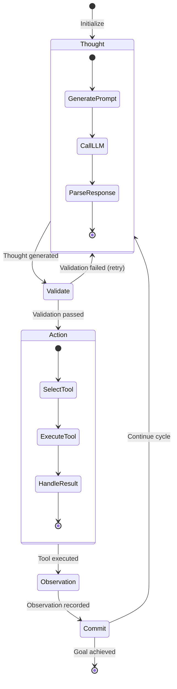
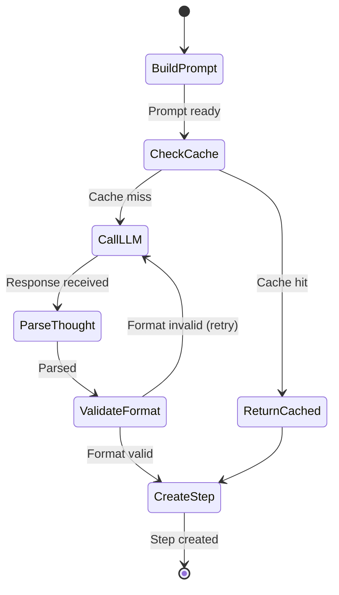
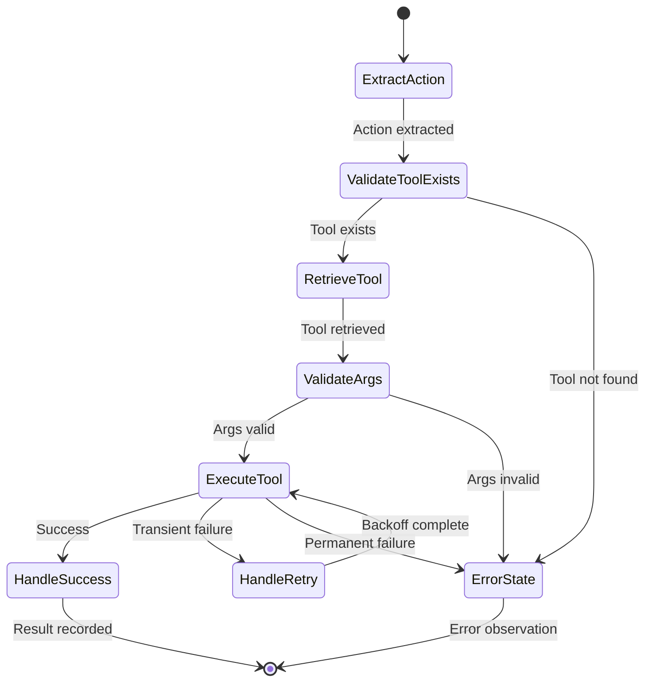
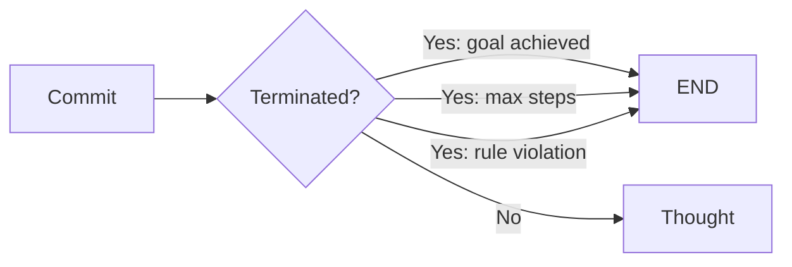
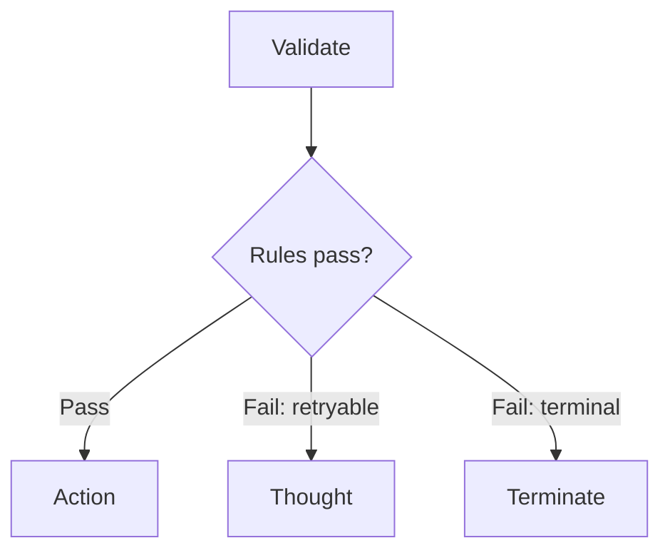
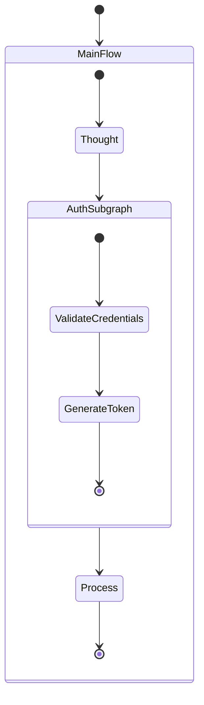
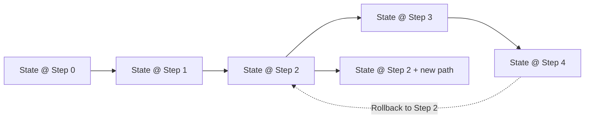

# Arkhon-Rheo + ReActEngine State Machine Design

**Version**: 1.0.0  
**Status**: Draft  
**Last Updated**: 2026-02-14  
**Code Path**: `src/arkhon-rheo/`

---

## 1. State Machine Overview

### 1.1 Purpose

The Arkhon-Rheo agent system is fundamentally a **Finite State Machine (FSM)** where:

- **States** = Nodes in the graph (Thought, Validate, Action, Observation, Commit)
- **Transitions** = Edges between nodes
- **Events** = Reasoning steps (immutable, append-only log)

### 1.2 State Machine Properties

| Property | Value | Significance |
| :--- | :--- | :--- |
| **Deterministic** | Yes | Same initial state + same inputs → same final state |
| **Acyclic** | No | Loops allowed (thought→action→thought) |
| **Bounded** | Yes | Max steps enforced via rules |
| **Resumable** | Yes | Via checkpointing |

---

## 2. Core State Machine

### 2.1 State Diagram



### 2.2 State Transitions

| From | To | Condition | Type |
| :--- | :--- | :--- | :--- |
| Thought | Validate | Always | Unconditional |
| Validate | Action | Rules pass | Unconditional |
| Validate | Thought | Rules fail | Retry |
| Action | Observation | Always | Unconditional |
| Observation | Commit | Always | Unconditional |
| Commit | Thought | Not terminated | Conditional |
| Commit | END | Terminated | Conditional |

---

## 3. Node State Machines

### 3.1 ThoughtNode FSM



**Implementation**:

```python
class ThoughtNode(BaseNode):
    def run(self, state: ReActState) -> ReActState:
        # State: BuildPrompt
        prompt = self._build_prompt(state)
        
        # State: CheckCache
        if cached := self.cache.get(prompt):
            thought = cached
        else:
            # State: CallLLM
            thought = self.llm.generate(prompt)
            self.cache.set(prompt, thought)
            
        # State: ParseThought
        parsed = self._parse_thought(thought)
        
        # State: ValidateFormat
        if not self._is_valid_format(parsed):
            raise InvalidFormatError(\"Retry\")
            
        # State: CreateStep
        step = ReasoningStep(thought=parsed, ...)
        return replace(state, steps=[*state.steps, step])
```

### 3.2 ActionNode FSM



**Implementation with Retry Logic**:

```python
class ActionNode(BaseNode):
    MAX_RETRIES = 3
    
    def run(self, state: ReActState) -> ReActState:
        step = state.steps[-1]
        
        # State: ExtractAction
        action, args = self._extract_action(step.thought)
        
        # State: ValidateToolExists
        if not self.tool_registry.has(action):
            return self._create_error_step(state, f\"Unknown tool: {action}\")
            
        # State: RetrieveTool
        tool = self.tool_registry.get(action)
        
        # State: ValidateArgs
        try:
            validated_args = tool.validate_args(args)
        except ValidationError as e:
            return self._create_error_step(state, str(e))
            
        # State: ExecuteTool with retry
        observation = self._execute_with_retry(tool, validated_args)
        
        # State: HandleSuccess
        return self._create_success_step(state, action, args, observation)
        
    def _execute_with_retry(self, tool: Tool, args: dict) -> str:
        for attempt in range(self.MAX_RETRIES):
            try:
                result = tool.execute(**args)
                return result.output
            except TransientError as e:
                if attempt == self.MAX_RETRIES - 1:
                    return f\"Error after {self.MAX_RETRIES} attempts: {e}\"
                time.sleep(2 ** attempt)  # Exponential backoff
```

---

## 4. Conditional Edges

### 4.1 Termination Condition



**Implementation**:

```python
def should_terminate(state: ReActState) -> bool:
    \"\"\"Check if execution should terminate.\"\"\"
    # Goal achieved (LLM outputs final answer)
    if state.steps and \"FINAL ANSWER\" in state.steps[-1].thought:
        return True
        
    # Max steps reached
    if len(state.steps) >= MAX_STEPS:
        logger.warning(\"max_steps_reached\", steps=len(state.steps))
        return True
        
    # Explicit termination flag
    if state.terminated:
        return True
        
    return False
```

### 4.2 Retry vs. Proceed



**Implementation**:

```python
class ValidateNode(BaseNode):
    def run(self, state: ReActState) -> ReActState:
        step = state.steps[-1]
        
        try:
            self.rule_engine.validate(step)
            # Rules passed → proceed to Action
            return replace(state, current_node=\"action\")
        except RetryableRuleViolation as e:
            # Retryable → back to Thought
            logger.info(\"retrying_thought\", reason=str(e))
            return replace(
                state,
                current_node=\"thought\",
                metadata={**state.metadata, \"retry_reason\": str(e)}
            )
        except TerminalRuleViolation as e:
            # Terminal → end execution
            logger.error(\"terminal_violation\", rule=e.rule_name)
            return replace(state, terminated=True, current_node=\"__end__\")
```

---

## 5. Extended State (Context Variables)

### 5.1 Metadata as Extended State

While the primary state is the `current_node`, the FSM also maintains **extended state** in `ReActState.metadata`:

```python
@dataclass
class ReActState:
    trace_id: str
    steps: list[ReasoningStep]
    current_node: str  # Primary FSM state
    metadata: dict[str, Any]  # Extended state
    terminated: bool
```

**Metadata Examples**:

```python
state.metadata = {
    \"goal\": \"Research topic X\",  # User intent
    \"retry_count\": 2,  # Retry tracking
    \"total_cost\": 0.05,  # Cost tracking
    \"tool_history\": [\"search\", \"calculator\"],  # Tool usage
    \"summary\": \"...\",  # Periodic summaries
    \"user_feedback\": {\"step_3\": \"approved\"}  # HITL inputs
}
```

### 5.2 Using Extended State in Transitions

```python
def compute_next_node(state: ReActState) -> str:
    \"\"\"Compute next node based on extended state.\"\"\"
    
    # If cost limit exceeded → terminate
    if state.metadata.get(\"total_cost\", 0) > COST_LIMIT:
        return \"__end__\"
        
    # If retry count too high → escalate to human
    if state.metadata.get(\"retry_count\", 0) > 3:
        return \"human_approval\"
        
    # Normal flow
    return \"thought\"
```

---

## 6. Hierarchical State Machines (Subgraphs)

### 6.1 Subgraph as Composite State



**Implementation**:

```python
class SubGraph:
    def __init__(self, name: str):
        self.name = name
        self.graph = StateGraph()
        
    def as_node(self) -> BaseNode:
        \"\"\"Convert subgraph to node that can be embedded in parent.\"\"\"
        return SubGraphNode(subgraph=self)
        
class SubGraphNode(BaseNode):
    def __init__(self, subgraph: SubGraph):
        self.subgraph = subgraph
        
    def run(self, state: ReActState) -> ReActState:
        # Execute subgraph to completion
        subgraph_result = self.subgraph.graph.run(state)
        
        # Merge results back to parent state
        return replace(
            state,
            metadata={
                **state.metadata,
                **subgraph_result.metadata
            }
        )
```

---

## 7. State Persistence

### 7.1 Checkpointing State

```python
class CheckpointManager:
    def save(self, state: ReActState) -> None:
        \"\"\"Save state to SQLite.\"\"\"
        serialized = json.dumps(asdict(state))
        self.conn.execute(
            \"INSERT OR REPLACE INTO checkpoints VALUES (?, ?, ?)\",
            (state.trace_id, serialized, time.time())
        )
        self.conn.commit()
        
    def load(self, trace_id: str) -> ReActState:
        \"\"\"Restore state from checkpoint.\"\"\"
        row = self.conn.execute(
            \"SELECT state FROM checkpoints WHERE trace_id = ?\",
            (trace_id,)
        ).fetchone()
        
        return ReActState(**json.loads(row[0])) if row else None
```

### 7.2 State Rollback



**Implementation**:

```python
def rollback_to_step(state: ReActState, step_id: int) -> ReActState:
    \"\"\"Rollback state to specific step, discarding all subsequent steps.\"\"\"
    if step_id >= len(state.steps):
        raise ValueError(f\"Invalid step_id: {step_id}\")
        
    return replace(
        state,
        steps=state.steps[:step_id + 1],
        current_node=\"thought\",  # Reset to beginning of cycle
        metadata={
            **state.metadata,
            \"rolled_back_from\": len(state.steps),
            \"rolled_back_to\": step_id
        }
    )
```

---

## 8. Interrupt Handling (Human-in-the-Loop)

### 8.1 Interrupt Points

```mermaid
stateDiagram-v2
    [*] --> Thought
    Thought --> InterruptGate: Every N steps
    InterruptGate --> AwaitUser{User decision}
    AwaitUser --> Thought: Resume
    AwaitUser --> [*]: Abort
    AwaitUser --> Rollback: Rollback N steps
    Rollback --> Thought
```

**Implementation**:

```python
class RuntimeExecutor:
    def run(
        self, 
        initial_state: ReActState,
        interrupt_fn: Callable[[ReActState], bool] | None = None
    ) -> ReActState:
        state = initial_state
        
        for step_num in range(MAX_STEPS):
            # Interrupt gate
            if interrupt_fn and interrupt_fn(state):
                decision = self._await_user_decision(state)
                
                if decision[\"action\"] == \"abort\":
                    return replace(state, terminated=True)
                elif decision[\"action\"] == \"rollback\":
                    state = rollback_to_step(state, decision[\"target_step\"])
                # else: resume (continue loop)
                
            # Execute next transition
            state = self.graph.step(state)
            
            if state.terminated:
                break
                
        return state
```

---

## 9. Error States

### 9.1 Error Handling FSM

```mermaid
stateDiagram-v2
    [*] --> ExecuteNode
    ExecuteNode --> Success: No error
    ExecuteNode --> ErrorHandler: Exception caught
    
    ErrorHandler --> Classify{Error type?}
    Classify --> Retry: Transient
    Classify --> RecordObservation: Recoverable
    Classify --> Terminate: Fatal
    
    Retry --> ExecuteNode: After backoff
    RecordObservation --> NextNode
    Terminate --> [*]
    Success --> NextNode
    NextNode --> [*]
```

**Implementation**:

```python
class ErrorHandlingNode(BaseNode):
    def run(self, state: ReActState) -> ReActState:
        try:
            return self._inner_run(state)
        except TransientError as e:
            # Retry with backoff
            return self._schedule_retry(state, e)
        except RecoverableError as e:
            # Record error as observation, continue
            return self._record_error_observation(state, e)
        except FatalError as e:
            # Terminate execution
            return replace(
                state,
                terminated=True,
                metadata={**state.metadata, \"fatal_error\": str(e)}
            )
```

---

## 10. Determinism & Reproducibility

### 10.1 Ensuring Determinism

**Sources of Non-determinism**:

1. LLM temperature > 0
2. Random tool selection
3. Concurrent execution
4. External API changes

**Mitigation**:

```python
# 1. Set temperature to 0
llm_config = {\"temperature\": 0.0}

# 2. Seed RNG
import random
random.seed(42)

# 3. Sequential execution (no parallelism)
graph.run(state, parallel=False)

# 4. Cache external API responses
@lru_cache(maxsize=1000)
def fetch_external_data(query: str) -> str:
    return api.get(query)
```

### 10.2 Replay from Checkpoint

```python
def replay_execution(trace_id: str, up_to_step: int) -> ReActState:
    \"\"\"Replay execution deterministically from checkpoint.\"\"\"
    checkpoint = CheckpointManager().load(trace_id)
    
    # Restore state at target step
    state = rollback_to_step(checkpoint, up_to_step)
    
    # Re-execute from that point (should be deterministic)
    return graph.run(state)
```

---

### End of State Machine Design
