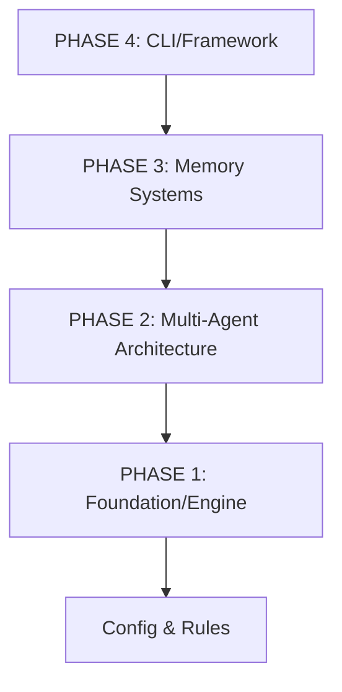

# Arkhon-Rheo OOP Architecture Design

本目錄包含了 Arkhon-Rheo 框架的完整物件導向設計 (OOP) 架構。該設計涵蓋了從基礎引擎到多代理協作、記憶系統以及最終發佈的所有階段。

---

## 🎯 設計目標

建立一個**企業級、生產就緒且高度可擴展**的 Python AI 框架。

- **高度解耦**: 基於 SOLID 原則，各模組職責明確。
- **類型安全**: 全面採用 Python 3.12+ 類型標註與 `mypy` 嚴格檢查。
- **可測試性**: 透過依賴注入與抽象基類確保核心邏輯易於單元測試。
- **事件驅動**: 核心狀態採用不可變對象與事件溯源 (Event Sourcing) 模式。

---

## 📚 文件清單與導覽

我們提供了多個維度的文檔來協助開發者理解與實作：

| 順序 | 文件名稱 | 描述 | 核心內容 |
|:---|:---|:---|:---|
| 01 | [**Walkthrough**](walkthrough.md) | **設計總結 (推薦首讀)** | 整體架構亮點、統計數據與實作步驟。 |
| 02 | [**Class Inventory**](class_inventory.md) | **類別清單** | 55 個類別的職責、所屬模組與設計模式。 |
| 03 | [**Methods & Properties**](methods_properties.md) | **API 參考** | 142 個方法與 99 個屬性的詳細簽名與說明。 |
| 04 | [**Class Diagram**](class_diagram.md) | **UML 類圖** | 使用 Mermaid 視覺化展示類別間的繼承與組合關係。 |
| 05 | [**CRC Cards**](crc_cards.md) | **職責卡片** | 12 個核心類別的詳細職責 (Responsibility) 與協作者 (Collaborator)。 |
| 06 | [**Typing Guide**](typing_guide.md) | **開發規範** | 關於 Type Hints 與 Google Style Docstrings 的最佳實踐。 |
| 07 | [**Task Tracking**](task.md) | **任務狀態** | 架構設計階段的任務完成進度追蹤。 |

---

## 🏗️ 架構摘要

### 設計模式應用

- **Template Method**: 用於 `BaseNode` 定義算法骨架。
- **Strategy**: 用於 `Tool` 與 `VectorStore` 的多樣化實現。
- **Mediator**: `Coordinator` 負責多代理間的訊息調度。
- **Memento**: `CheckpointManager` 負責狀態備份與回滾。

### 分層結構

---

## 🚀 快速實作指南 (Phase 1)

對於準備開始編寫程式碼的開發者，建議遵循以下順序：

1. **定義元數據**: 實作 `ReasoningStep` 與不可變的 `ReActState`。
2. **建立執行圖**: 實作 `StateGraph` 的節點管理與邊緣跳轉邏輯。
3. **抽象基類**: 定義 `BaseNode` 與 `Tool` 的協議 (Protocol)。
4. **規則驗證**: 實作 `RuleEngine` 以確保推理過程符合約束。

詳細實作細節請參考 [**Typing Guide**](typing_guide.md) 中的代碼範例。

---

**狀態**: ✅ 設計完成 | **版本**: 1.0.0
