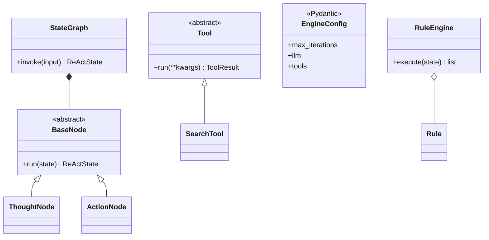
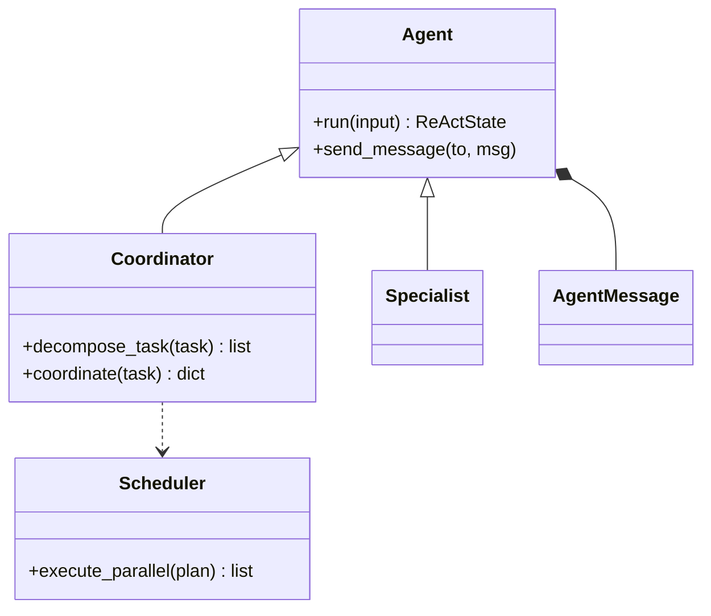
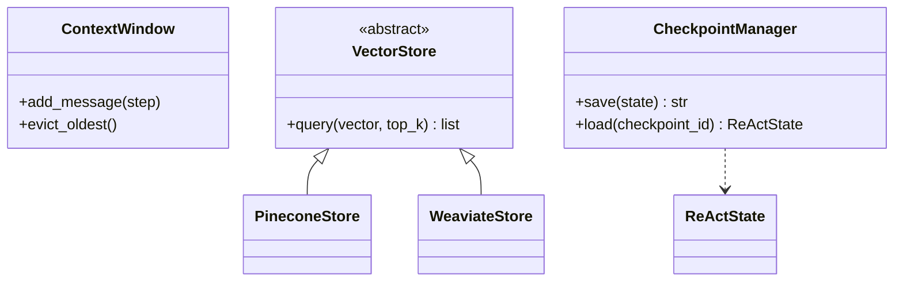
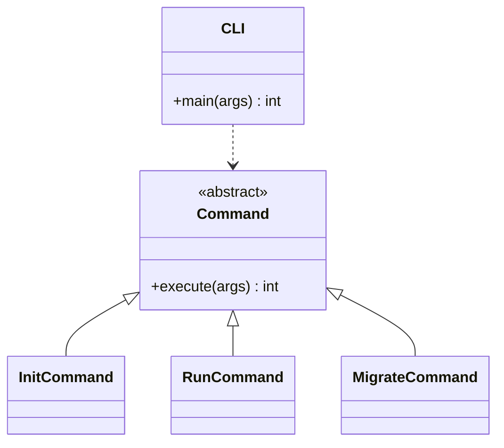
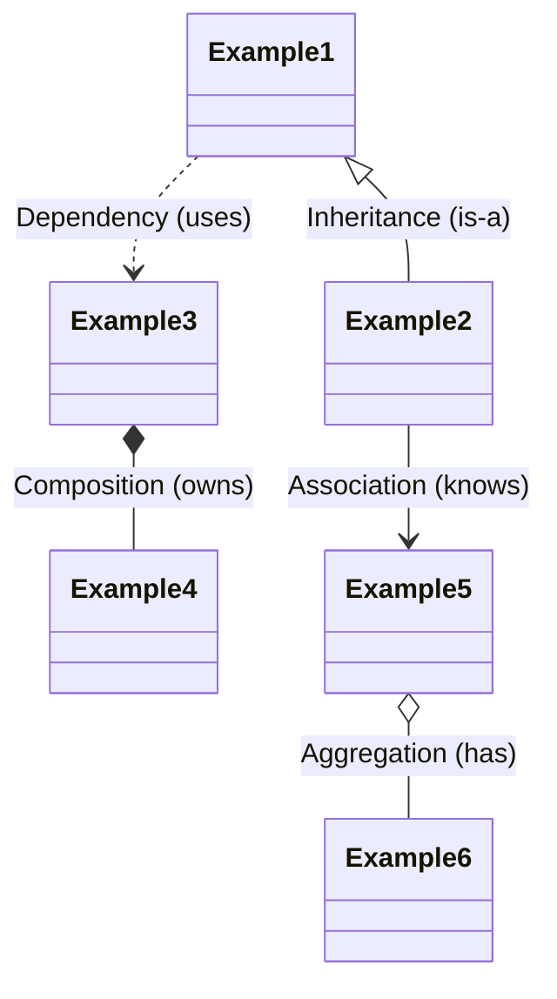

# Arkhon-Rheo UML Class Diagram

完整的類別關係圖，使用 Mermaid 繪製

---

## Complete Class Diagram (All Phases)

```mermaid
classDiagram
    %% ============================================
    %% PHASE 1: Foundation
    %% ============================================
    
    %% Core Module
    class ReActState {
        <<frozen dataclass>>
        +list~ReasoningStep~ steps
        +dict metadata
        +str trace_id
        +Literal status
        +add_step(step) Self
        +validate() bool
        +get_latest_step() ReasoningStep|None
        +to_dict() dict
    }
    
    class ReasoningStep {
        <<frozen dataclass>>
        +str step_id
        +Literal type
        +str content
        +str|None tool_name
        +dict|None tool_input
        +Any|None tool_output
        +datetime timestamp
        +dict metadata
        +to_event() dict
        +is_action() bool
        +is_thought() bool
    }
    
    class StateGraph {
        +dict~str,BaseNode~ nodes
        +dict~str,list~ edges
        +str|None entry_point
        +ReActState state
        +add_node(name, node) Self
        +add_edge(from, to) Self
        +set_entry_point(name) Self
        +compile() CompiledGraph
        +invoke(input) ReActState
        +stream(input) Iterator
        +validate_graph() bool
    }
    
    class ContextManager {
        -ContextVar _context
        +get(key, default) T|None
        +set(key, value) None
        +generate_trace_id()$ str
        +__enter__() Self
        +__exit__() None
    }
    
    %% Nodes Module
    class BaseNode {
        <<abstract>>
        +str name
        +run(state)* ReActState
        +before_run(state) None
        +after_run(state) None
        +__call__(state) ReActState
    }
    
    class ThoughtNode {
        +LLMClient llm_client
        +PromptTemplate prompt_template
        +TokenTracker token_tracker
        +run(state) ReActState
        +format_prompt(state) str
        +parse_response(response) str
    }
    
    class ActionNode {
        +ToolRegistry tool_registry
        +int max_retries
        +run(state) ReActState
        +select_tool(thought) Tool|None
        +execute_tool(tool, input) ToolResult
        +handle_error(error) ToolResult
    }
    
    class ObservationNode {
        +int max_length
        +Callable formatter
        +run(state) ReActState
        +truncate(text) str
        +format_result(result) str
    }
    
    class ValidateNode {
        +RuleEngine rule_engine
        +bool auto_retry
        +run(state) ReActState
        +collect_violations(state) list
        +format_error_report(violations) str
    }
    
    class CommitNode {
        +CheckpointManager|None checkpoint_manager
        +run(state) ReActState
        +persist_state(state) None
        +transition(state) ReActState
    }
    
    %% Tools Module
    class Tool {
        <<abstract>>
        +str name
        +str description
        +run(**kwargs)* ToolResult
        +get_schema() dict
        +validate_input(input) bool
    }
    
    class ToolResult {
        <<dataclass>>
        +bool success
        +Any output
        +str|None error
        +dict metadata
    }
    
    class ToolRegistry {
        <<singleton>>
        -dict~str,Tool~ _tools
        -ToolRegistry|None _instance
        +register(tool) None
        +get(name) Tool|None
        +list_tools() list
        +discover(package)$ None
    }
    
    class SearchTool {
        +run(**kwargs) ToolResult
    }
    
    class CalculatorTool {
        +run(**kwargs) ToolResult
    }
    
    class FileOpsTool {
        +run(**kwargs) ToolResult
    }
    
    %% Config Module
    class EngineConfig {
        <<Pydantic>>
        +int max_iterations
        +LLMConfig llm
        +list~ToolConfig~ tools
        +list~RuleConfig~ rules
        +bool debug
        +validate_llm_config(v) LLMConfig
        +to_yaml() str
    }
    
    class LLMConfig {
        <<Pydantic>>
        +Literal provider
        +str model
        +SecretStr api_key
        +float temperature
        +int max_tokens
    }
    
    class ToolConfig {
        <<Pydantic>>
        +str name
        +dict settings
    }
    
    class RuleConfig {
        <<Pydantic>>
        +str name
        +dict params
    }
    
    class ConfigLoader {
        +load_yaml(path)$ dict
        +merge_configs(*configs)$ dict
        +expand_env_vars(config)$ dict
        +load(path)$ EngineConfig
    }
    
    %% Rules Module
    class Rule {
        <<abstract>>
        +evaluate(state)* RuleViolation|None
        +name() str
    }
    
    class RuleEngine {
        +list~Rule~ rules
        +add_rule(rule) Self
        +execute(state) list
        +execute_until_violation(state) RuleViolation|None
    }
    
    class RuleViolation {
        <<dataclass>>
        +str rule_name
        +str message
        +Literal severity
        +str|None step_id
    }
    
    class MaxDepthRule {
        +evaluate(state) RuleViolation|None
    }
    
    class ForbidGuessingRule {
        +evaluate(state) RuleViolation|None
    }
    
    class CostLimitRule {
        +evaluate(state) RuleViolation|None
    }
    
    %% ============================================
    %% PHASE 2: Multi-Agent System
    %% ============================================
    
    class Agent {
        +str agent_id
        +str role
        +StateGraph graph
        +Queue message_queue
        +send_message(to, msg) None
        +receive_message(timeout) AgentMessage|None
        +process_message(msg) AgentMessage
        +run(input) ReActState
    }
    
    class AgentMessage {
        <<dataclass>>
        +str message_id
        +str from_agent
        +str to_agent
        +Literal type
        +dict payload
        +str|None correlation_id
        +datetime timestamp
    }
    
    class SharedAgentState {
        -dict _state
        -dict~str,Lock~ _locks
        +get(key) Any|None
        +set(key, value) None
        +acquire_lock(resource) Lock
        +release_lock(resource) None
    }
    
    class SubGraph {
        +StateGraph graph
        +str name
        +as_node() BaseNode
        +invoke(state) ReActState
        +propagate_context(parent_state) ReActState
    }
    
    class Coordinator {
        +decompose_task(task) list
        +select_agent(task) str
        +aggregate_results(results) Any
        +coordinate(task) dict
    }
    
    class PlanningSpecialist {
        +execute_specialty(input) dict
    }
    
    class CodingSpecialist {
        +execute_specialty(input) dict
    }
    
    class ReviewSpecialist {
        +execute_specialty(input) dict
    }
    
    class Scheduler {
        +PriorityQueue task_queue
        +dict~str,Agent~ agents
        +schedule(task) None
        +resolve_dependencies(tasks) ExecutionPlan
        +execute_parallel(plan) list
    }
    
    class Task {
        <<dataclass>>
        +str task_id
        +str description
        +str agent_role
        +list dependencies
        +int priority
    }
    
    %% ============================================
    %% PHASE 3: Memory Systems
    %% ============================================
    
    class ContextWindow {
        +int max_tokens
        +deque messages
        +add_message(step) None
        +evict_oldest() ReasoningStep|None
        +count_tokens() int
        +get_messages() list
    }
    
    class Summarization {
        +LLMClient llm_client
        +float compression_ratio
        +summarize(steps) str
        +preserve_critical_info(steps) list
    }
    
    class VectorStore {
        <<abstract>>
        +upsert(id, vector, metadata)* None
        +query(vector, top_k)* list
        +delete(id)* None
    }
    
    class PineconeStore {
        +Pinecone client
        +str index_name
        +upsert(id, vector, metadata) None
        +query(vector, top_k) list
        +delete(id) None
    }
    
    class WeaviateStore {
        +WeaviateClient client
        +str index_name
        +upsert(id, vector, metadata) None
        +query(vector, top_k) list
        +delete(id) None
    }
    
    class EmbeddingsClient {
        +Literal provider
        +int batch_size
        +dict cache
        +embed(text) list
        +embed_batch(texts) list
    }
    
    class CheckpointManager {
        +Path db_path
        +int checkpoint_interval
        +save(state) str
        +load(checkpoint_id) ReActState
        +list_checkpoints() list
        +cleanup_old(keep_n) None
    }
    
    class RollbackManager {
        +CheckpointManager checkpoint_manager
        +rollback_to_step(step_id) ReActState
        +rollback_to_checkpoint(checkpoint_id) ReActState
        +validate_rollback(state) bool
    }
    
    %% ============================================
    %% PHASE 4: CLI & Framework
    %% ============================================
    
    class CLI {
        +main(args)$ int
        +parse_args(args)$ Namespace
        +dispatch_command(command)$ Command
    }
    
    class InitCommand {
        +execute(args) int
        +scaffold_project(path, template) None
    }
    
    class RunCommand {
        +execute(args) int
        +load_graph(config) StateGraph
    }
    
    class MigrateCommand {
        +execute(args) int
        +analyze_langgraph(path) MigrationPlan
        +generate_diff(plan) str
        +apply_migration(plan) None
    }
    
    class ProjectScaffolder {
        +create_structure(path, template) None
        +render_template(template, context) str
    }
    
    %% ============================================
    %% Relationships
    %% ============================================
    
    %% Core relationships
    StateGraph *-- BaseNode : contains
    StateGraph o-- ReActState : manages
    ReActState *-- ReasoningStep : contains
    ContextManager ..> ReActState : manages
    
    %% Node inheritance
    BaseNode <|-- ThoughtNode
    BaseNode <|-- ActionNode
    BaseNode <|-- ObservationNode
    BaseNode <|-- ValidateNode
    BaseNode <|-- CommitNode
    
    %% Node dependencies
    ThoughtNode ..> LLMClient : uses
    ActionNode ..> ToolRegistry : uses
    ActionNode ..> Tool : executes
    Tool ..> ToolResult : returns
    ValidateNode ..> RuleEngine : uses
    CommitNode ..> CheckpointManager : uses
    
    %% Tool system
    Tool <|-- SearchTool
    Tool <|-- CalculatorTool
    Tool <|-- FileOpsTool
    ToolRegistry o-- Tool : registers
    
    %% Config system
    EngineConfig *-- LLMConfig : contains
    EngineConfig *-- ToolConfig : contains
    EngineConfig *-- RuleConfig : contains
    ConfigLoader ..> EngineConfig : creates
    
    %% Rule system
    Rule <|-- MaxDepthRule
    Rule <|-- ForbidGuessingRule
    Rule <|-- CostLimitRule
    RuleEngine o-- Rule : contains
    RuleEngine ..> RuleViolation : produces
    
    %% Multi-Agent relationships
    Agent o-- StateGraph : executes
    Agent *-- AgentMessage : sends/receives
    Agent ..> SharedAgentState : accesses
    Agent <|-- Coordinator
    Agent <|-- PlanningSpecialist
    Agent <|-- CodingSpecialist
    Agent <|-- ReviewSpecialist
    Coordinator ..> Agent : coordinates
    Scheduler o-- Agent : schedules
    Scheduler o-- Task : manages
    SubGraph *-- StateGraph : wraps
    SubGraph ..> BaseNode : converts to
    
    %% Memory relationships
    ContextWindow *-- ReasoningStep : stores
    Summarization ..> LLMClient : uses
    VectorStore <|-- PineconeStore
    VectorStore <|-- WeaviateStore
    EmbeddingsClient ..> VectorStore : provides vectors
    CheckpointManager ..> ReActState : saves/loads
    RollbackManager ..> CheckpointManager : uses
    
    %% CLI relationships
    CLI ..> InitCommand : dispatches
    CLI ..> RunCommand : dispatches
    CLI ..> MigrateCommand : dispatches
    InitCommand ..> ProjectScaffolder : uses
    RunCommand ..> StateGraph : creates
    RunCommand ..> ConfigLoader : uses
```

---

## Simplified View by Phase

### PHASE 1: Core Architecture

### PHASE 2: Multi-Agent Layer

### PHASE 3: Memory Layer

### PHASE 4: CLI Layer

---

## Design Pattern Annotations

| 設計模式 | 應用位置 | Mermaid 表示 |
|:---|:---|:---|
| **Template Method** | BaseNode → 子類 | 繼承 `<|--` |
| **Strategy** | Tool, VectorStore | 繼承 `<|--` |
| **Registry** | ToolRegistry | 組合 `o--` |
| **Singleton** | ToolRegistry | `<<singleton>>` |
| **Immutable Object** | ReActState, ReasoningStep | `<<frozen dataclass>>` |
| **Chain of Responsibility** | RuleEngine | 組合 `o--` Rule |
| **Mediator** | Coordinator | 依賴 `..>` Agent |
| **Composite** | SubGraph | 組合 `*--` StateGraph |
| **Memento** | CheckpointManager | 依賴 `..>` ReActState |
| **Command** | CLI Commands | 繼承 `<|--` Command |
| **Observer** | Agent messaging | 關聯 `*--` AgentMessage |
| **Abstract Factory** | VectorStore | 繼承 `<|--` |

---

## Relationship Legend

| 關係類型 | Mermaid 語法 | 說明 |
|:---|:---|:---|
| **繼承** | `<\|--` | 子類繼承父類 (is-a) |
| **組合** | `*--` | 強擁有關係，部分不能獨立存在 |
| **聚合** | `o--` | 弱擁有關係，部分可以獨立存在 |
| **依賴** | `..>` | 使用關係，通常是方法參數 |
| **關聯** | `-->` | 知道關係，通常是屬性引用 |

---

**下一步**: 查看 `crc_cards.md` 了解每個類別的 CRC 卡片設計
